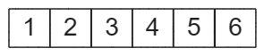
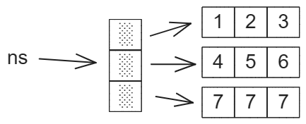
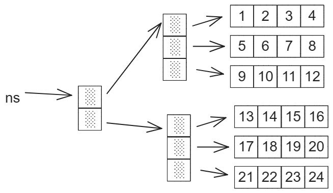

# 多维数组

**一维数组**

```c
int ns[] = {1, 2, 3,4,5,6};
```

实际上`ns` 在内存中的结构如下：



**二维数组**

二维数组就是数组的数组。定义一个二维数组如下：

```c
int ns[3][3] = {
    {1, 2, 3},
    {4, 5, 6},
    {7, 7, 7}
};
```

`ns`在内存中的结构如下：



**三维数组**

三维数组就是二维数组的数组。定义一个三维数组如下：

```c
int ns[2][3][4] = {
            {
                    {1, 2, 3, 4},
                    {5, 6, 7, 8},
                    {9, 10, 11, 12}
            },
            {
                    {13, 14, 15, 16},
                    {17, 18, 19, 20},
                    {21, 22, 23, 24}
            }
    };
```

`ns`在内存中的结构如下：



## 结构定义

```c
/* 宏定义 */
#define MAX_ARRAY_DIM 8 // 这里假设数组的最大维度为8

/* 数组元素类型 */
typedef int ElemType;

/* 数组的顺序存储表示 */
typedef struct {
    ElemType* base;     // 数组元素基址（存放数组元素）
    int dim;            // 数组维数
    int* bounds;        // 数组维界基址（存放数组行、列信息）
    int* constants;     // 数组映像函数常量基址（存储遍历某个维度时，每次需要越过的元素个数）
} Array;
```

## 初始化

::: tip 详解

初始化一个维度为<2,3,4>的三维数组

则`dim`为3，`elemtotal= 2 * 3 * 4 = 24` 个int类型的内存空间

`constants` 每次越过的数量

对于一个三维数组来说每一都需要包含`3*4*1=12`个一维

对于一个二维数组来说每一都需要包含`4*1`个一维

对于一个一维数组来说每一都需要包含`1`个一维

因此constants的值为<12,4,1>

:::

::: code-group

```c [Array.c]
/*
 * 初始化维数为dim的数组，可变参数指示各维度的大小。
 */
Status InitArray(Array* A, int dim, ...) {
    int elemtotal;  // 统计数组中总元素个数
    va_list ap;     // ap存放可变参数表信息，指示各维度的大小
    int i;

    // InitArray(&A, 3, 2, 3, 4);
    if(A == NULL) {
        return ERROR;
    }

    if(dim < 1 || dim > MAX_ARRAY_DIM) {    // 数组维数有限制
        return ERROR;
    }

    (*A).dim = dim;     // 初始化数组维度

    // 初始化数组维度信息表
    (*A).bounds = (int*) malloc(dim * sizeof(int));
    if((*A).bounds == NULL) {
        exit(-2);
    }

    // 若维度长度合法，则存入bounds，并求出A的元素总数elemtotal
    elemtotal = 1;

    // 使ap指向第一个可变参数，dim相当于起始标识
    va_start(ap, dim);

    for(i = 0; i < dim; i++) {
        // 记录当前维度的宽度
        (*A).bounds[i] = va_arg(ap, int);
        if((*A).bounds[i] <= 0) {
            return ERROR;
        }

        elemtotal *= A->bounds[i];
    }

    // 置空ap
    va_end(ap);

    // 初始化数组空间，以存放元素
    (*A).base = (ElemType*) malloc(elemtotal * sizeof(ElemType));
    if((*A).base == NULL) {
        exit(-2);
    }

    // 初始化数组映像函数常量信息表
    (*A).constants = (int*) malloc(dim * sizeof(int));
    if((*A).constants == NULL) {
        exit(-2);
    }

    // 遍历最后一个维度，每次总是需要跨越一个元素
    (*A).constants[dim - 1] = 1;
    for(i = dim - 2; i >= 0; i--) {
        (*A).constants[i] = (*A).bounds[i + 1] * (*A).constants[i + 1];
    }

    /*
     * 举例：
     * 对于三维数组[2,3,4]来说，bounds的值为<2,3,4>，constants的值为<12,4,1>
     * 分析bounds，第一维中包含2个元素，第二维中包含3个元素，第三维中包含4个元素
     * 分析constants，遍历第一维，每次需要跨过12个元素，遍历第二维，每次需要跨越4个元素，遍历第三维，每次需要跨越1个元素
     */

    return OK;
}
```

```c [main.c]
#include <stdio.h>
#include "Array.h"

int main() {

    Array A;
	
	InitArray(&A, 3, 2, 3, 4);
    return 0;
}

```

:::

## 销毁

只需要销毁`base`,`bounds`和`constants`对应的内存空间

```c
/*
 * 销毁数组占用的空间。
 */
Status DestroyArray(Array* A) {
    if(A == NULL || (*A).base == NULL || (*A).bounds == NULL || (*A).constants == NULL) {
        return ERROR;
    }

    free((*A).base);
    (*A).base = NULL;

    free((*A).bounds);
    (*A).bounds = NULL;

    free((*A).constants);
    (*A).constants = NULL;

    (*A).dim = 0;

    return OK;
}
```

## 取值

::: tip 详解

上面求得constants的值为<12,4,1>

获取`A[1][1][1]` 对应的值

1.先通过函数Locate求得偏移值off，`1*12 + 1*4 + 1*1 = 17 `

2.通过`*e = *(A.base + off);` 获取对应地址的值

:::

::: code-group

```c [Array.c]
/*
 * 获取指定下标处的元素值，可变参数为dim个下标值，指示待获取元素所在下标。
 */
Status Value(Array A, ElemType* e, ...) {
    va_list ap;
    Status result;
    int off;

    // 最后一个传递给函数的已知的固定参数,没有特殊含义并不是个数
    va_start(ap, e);

    // 计算从起点元素到目标元素需要跨越的元素数量
    result = Locate(A, ap, &off);

    va_end(ap);

    if(result == -2) {
        return result;
    }

    *e = *(A.base + off);

    return OK;
}

/*
 * 求出ap指示的值在数组A中的相对位置，
 * 即计算从起点元素到目标元素需要跨越的元素数量。
 */
static Status Locate(Array A, va_list ap, int* off) {
    int i, ind;

    *off = 0;

    for(i = 0; i < A.dim; i++) {
        ind = va_arg(ap, int);

        // 保证下标不越界
        if(ind < 0 || ind >= A.bounds[i]) {
            return -2;
        }

        // 某个维度的单位元素个数*需要跨过的单位
        *off += A.constants[i] * ind;
    }

    return OK;
}
```

```c [main.c]
ElemType x;

Value(A, &x, 1, 1, 1);
printf("A[1][1][1] = %d\n", x);
```

:::

## 赋值

::: tip 详解

上面求得constants的值为<12,4,1>

`A[1][1][1]=999`

1.先通过函数Locate求得偏移值off，`1*12 + 1*4 + 1*1 = 17 `

2.`e`的值为`999`通过`*(A.base + off) = e;`为指定地址赋值

:::

::: code-group

```c [Array.c]
/*
 * 为指定下标处的元素赋值，可变参数为dim个下标值，指示待赋值元素所在下标。
 */
Status Assign(Array* A, ElemType e, ...) {
    va_list ap;
    Status result;
    int off;

    va_start(ap, e);

    // 计算从起点元素到目标元素需要跨越的元素数量
    result = Locate(*A, ap, &off);

    va_end(ap);

    if(result == -2) {
        return result;
    }

    *(A->base + off) = e;

    return OK;
}
```

``` c [main.c]
ElemType e = 999;
Assign(&A, e, 1, 1, 1);
```

:::