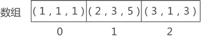

# 稀疏矩阵(三元组顺序表)

::: tip

如果矩阵中分布有大量的元素 0，即非 0 元素非常少，这类矩阵称为稀疏矩阵。

:::

稀疏矩阵的压缩存储，至少需要存储以下信息：

- 矩阵中各非 0 元素的值，以及所在矩阵中的行标和列标；
- 矩阵的总行数和总列数；


若对其进行压缩存储，矩阵中各非 0 元素的存储状态



`1` 对应第1行第1列，`(1,1,1)`

`5`对应第2行第3列，`(2,3,5)`

`3`对应第3行第1列，`(3,1,3)`

## 结构定义

```c
/* 宏定义 */
#define MAXSIZE 12500   // 非零元素的最大值

/* 三元组稀疏矩阵元素类型 */
typedef int ElemType;

/* 三元组类型定义，主要用来存储非零元 */
typedef struct {
    int i,j;     // 该三元组非零的行下标和列下标
    ElemType e;
} Triple;

/* 三元组稀疏矩阵类型定义 */
typedef struct {
    Triple data[MAXSIZE + 1];   // 非零元三元组表,data[0]未用
    int mu,nu,tu;               // 矩阵的行数、列数和非零元个数
} TSMatrix;
```

## 创建稀疏矩阵

::: info

行数`mu = 3` ,列数`nu = 3` ,非零元素个数` tu = 3`

对非零元素存储为`(1,1,1)`，`(2,3,5)`，`(3,1,3)`

:::


```c
/*
 * 创建稀疏矩阵M
 *
 * 从控制台读取数据。
 */
Status CreateSMatrix(TSMatrix* M){
    int k;

    printf("请输入行数:");
    scanf("%d",&(M->mu));

    printf("请输入列数:");
    scanf("%d",&(M->nu));

    printf("请输入非零元素个数:");
    scanf("%d",&(M->tu));

    printf("请输入%d个三元组信息\n",M->tu);
    for (k = 1; k<= M->tu; k++){
        printf("第%2d组",k);
        scanf("%d%d%d", &((*M).data[k].i), &((*M).data[k].j), &((*M).data[k].e));
    }

    return OK;
}
```

控制台输入

```c
请输入行数:3
请输入列数:3
请输入非零元素个数:3
请输入3个三元组信息
第 1组1 1 1
第 2组2 3 5
第 3组3 1 3
```

## 输出矩阵

```c
/*
 * 输出矩阵
 */
void PrintSMatrix(TSMatrix M) {
    int r, c;
    int k = 1;

    for(r = 1; r <= M.mu; r++) {
        for(c = 1; c <= M.nu; c++) {
            if(r == M.data[k].i && c == M.data[k].j) {
                printf("%3d ", M.data[k].e);
                k++;
            } else {
                printf("%3d ", 0);
            }
        }
        printf("\n");
    }
}
```

输出为

```c
  1   0   0 
  0   0   5 
  3   0   0
```

## 销毁稀疏矩阵

```c
/*
 *【注】
 * 三元组顺序表的结构无法销毁。
 */
Status DestroySMatrix(TSMatrix* M) {
    if(M == NULL){
        return ERROR;
    }

    M->mu = 0;
    M->nu = 0;
    M->tu = 0;

    return OK;
}
```

## 矩阵复制

::: info

结构体之间可以直接复制，即使内部包含数组也可以

:::

```c
/*
 * 创建一个新矩阵T，该矩阵包含了从矩阵M中包含的数据。
 */
Status CopySMatrix(TSMatrix M, TSMatrix* T){
    (*T) = M;  // 结构体之间可以直接复制，即使内部包含数组也可以

    return OK;
}
```

## 矩阵加法

::: tip

只有对于两个行数、列数分别相等的矩阵（即同型矩阵），加减法运算才有意义，即加减运算是可行的．

:::

两个矩阵相加，即它们相同位置的元素相加。Q=M+N

::: info M的值

行数：5
列数：5
非零元个数：10
三元组：(1,2,1),(1,4,5),(2,3,-3),(2,5,2),(3,1,2),(3,2,3),(3,3,4),(4,4,2),(5,1,3),(5,2,-1)

::: 

::: info N的值

行数：5 列数：5 非零元个数：8

三元组：(1,1,-3)(1,3,2)(2,4,-1)(3,2,4)(4,1,6)(4,5,5)(5,1,3)(5,3,2)

::: 

```
  0   1   0   5   0         -3   0   2   0   0        -3   1   2   5   0
  0   0  -3   0   2          0   0   0  -1   0         0   0  -3  -1   2
  2   3   4   0   0    +     0   4   0   0   0    =    2   5   4   0   0
  0   0   0   2   0          6   0   0   0   5         6   0   0   2   5
  3  -1   0   0   0          3   0   2   0   0         7  -1   2   0   0
```

先比较是否在同一行，如果不在同一行，行数小的直接赋值过去

如果在同一行，如果不在同一列的赋值过去，在同一列相加赋值过去。

```c
/*
 * 矩阵加法
 *
 * Q = M + N。
 */
Status AddSMatrix(TSMatrix M, TSMatrix N, TSMatrix* Q){
    int m,n,k;

    if(M.mu != N.mu || M.nu != N.nu){
        printf("两矩阵的行数、列数不满足相加条件！！\n");
        return ERROR;
    }

    // 初始化Q
    Q->mu = M.mu;
    Q->nu = M.nu;
    Q->tu = 0;

    m = n = k = 1;

    while (m <= M.tu && n <= N.tu){
        // M中的三元组行下标较小[说明N中当前行没有元素]
        if(M.data[m].i < N.data[n].i){
            Q->data[k] = M.data[m];
            m++;
            // N中的三元组行下标较小[说明M中当前行再也没有元素]
        }else if(M.data[m].i > N.data[n].i){
            Q->data[k] = N.data[n];
            n++;
            // M与N中的三元组行下标一致，需要进一步比较列坐标
        } else{
            // M中的三元组列下标较小
            if(M.data[m].j < N.data[n].j){
                Q->data[k] = M.data[m];
                m++;
                // N中的三元组列下标较小
            }else if(M.data[m].j > N.data[n].j){
                Q->data[k] = N.data[n];
                n++;
                // M与N中的三元组列下标一致，需要进行加法运算
            } else{
                // 值已经加为0的话，不需要存储该元素
                if(M.data[m].e + N.data[n].e == 0){
                    m++;
                    n++;
                    continue;
                } else{
                    Q->data[k].i = M.data[m].i;
                    Q->data[k].j = M.data[m].j;
                    Q->data[k].e = M.data[m].e + M.data[n].e;
                    m++;
                    n++;
                }
            }
        }

        // 结果下标++
        k++;
        // 数量+1
        Q->tu++;
    }

    // 遍历M中剩余的三元组
    while (m <= M.tu){
        Q->data[k] = M.data[m];
        m++;
        k++;
        Q->tu++;
    }

    // 遍历N中剩余的三元组
    while(n <= N.tu) {
        (*Q).data[k] = N.data[n];
        n++;
        k++;
        (*Q).tu++;
    }

    return OK;
}
```

## 矩阵减法

矩阵减法与加法原理类似

```c
/*
 * 矩阵减法
 *
 * Q = M - N。
 */
Status SubSMatrix(TSMatrix M, TSMatrix N, TSMatrix* Q) {
    int m, n, k;

    if(M.mu != N.mu || M.nu != N.nu) {
        printf("两矩阵的行数、列数不满足相减条件！！\n");
        return ERROR;
    }

    // 初始化Q
    (*Q).mu = M.mu;
    (*Q).nu = M.nu;
    (*Q).tu = 0;

    m = n = k = 1;

    // 依次遍历M与N的三元组
    while(m <= M.tu && n <= N.tu) {
        // M中的三元组行下标较小
        if(M.data[m].i < N.data[n].i) {
            (*Q).data[k] = M.data[m];
            m++;

            // N中的三元组行下标较小
        } else if(M.data[m].i > N.data[n].i) {
            (*Q).data[k].i = N.data[n].i;
            (*Q).data[k].j = N.data[n].j;
            (*Q).data[k].e = -N.data[n].e;  // 由于是相减，所以要对元素值取相反数
            n++;

            // M与N中的三元组行下标一致，需要进一步比较列坐标
        } else {
            // M中的三元组列下标较小
            if(M.data[m].j < N.data[n].j) {
                (*Q).data[k] = M.data[m];
                m++;

                // N中的三元组列下标较小
            } else if(M.data[m].j > N.data[n].j) {
                (*Q).data[k].i = N.data[n].i;
                (*Q).data[k].j = N.data[n].j;
                (*Q).data[k].e = -N.data[n].e;  // 由于是相减，所以要对元素值取相反数
                n++;

                // M与N中的三元组列下标一致，需要进行减法运算
            } else {
                // 值已经减为0的话，不需要存储该元素
                if((M.data[m].e - N.data[n].e) == 0) {
                    m++;
                    n++;
                    continue;
                } else {
                    (*Q).data[k].i = M.data[m].i;
                    (*Q).data[k].j = M.data[m].j;
                    (*Q).data[k].e = M.data[m].e - N.data[n].e;
                    m++;
                    n++;
                }
            }
        }

        k++;
        (*Q).tu++;
    }

    // 遍历M中剩余的三元组
    while(m <= M.tu) {
        (*Q).data[k] = M.data[m];
        m++;
        k++;
        (*Q).tu++;
    }

    // 遍历N中剩余的三元组
    while(n <= N.tu) {
        (*Q).data[k].i = N.data[n].i;
        (*Q).data[k].j = N.data[n].j;
        (*Q).data[k].e = -N.data[n].e;
        n++;
        k++;
        (*Q).tu++;
    }

    return OK;
}
```

## 矩阵乘法

::: tip

只有左矩阵的列数＝右矩阵的行数才能相乘

矩阵乘法不满足交换律

:::

对于AB，3行*3列 = 3行3列
$$
AB = \begin{bmatrix} a_1 \\ a_2 \\ a_3 \end{bmatrix} \begin{bmatrix} b_1 & b_2 & b_3 \end{bmatrix} =  \begin{bmatrix} a_1b_1 & a_1b_2 & a_1b_3 \\a_2b_1 & a_2b_2 & a_2b_3 \\ a_3b_1 & a_3b_2 & a_3b_3 \end{bmatrix}
$$
对于BA, 1行*1列 = 1行1列
$$
BA = \begin{bmatrix} b_1 & b_2 & b_3 \end{bmatrix} \begin{bmatrix} a_1 \\ a_2 \\ a_3 \end{bmatrix}  =  b_1a_1 + b_2a_2 + b_3a_3
$$
对于AB, 3行*3列 = 3行3列
$$
AB = \begin{bmatrix} a_{11} & a_{12} & a_{13} \\ a_{21} & a_{22} & a_{23}  \\ a_{31} & a_{32} & a_{33} \end{bmatrix} \begin{bmatrix} b_{11} & b_{12} & b_{13} \\ b_{21} & b_{22} & b_{23}\end{bmatrix} =  \begin{bmatrix} c_{11} & c_{12} & c_{13} \\c_{21} & c_{22} & c_{23} \\ c_{31} & c_{32} & c_{33} \end{bmatrix}
$$
结果$c_{ij}=a_{i1}b_{1j}+ a_{i2}b_{2j}+a_{i3}b_{3j}$

```	c
/*
 * 矩阵乘法
 *
 * Q = M * N，这里实现的是传统矩阵乘法。
 */
Status MultSMatrix(TSMatrix M, TSMatrix N, TSMatrix* Q) {
    int m, n, i, j, k;
    ElemType c, c1, c2;

    // M的列数需要等于N的行数
    if(M.nu != N.mu) {
        printf("两矩阵的行数、列数不满足相乘条件！！\n");
        return ERROR;
    }

    // 初始化Q
    (*Q).mu = M.mu;
    (*Q).nu = N.nu;
    (*Q).tu = 0;

    // 如果存在零矩阵
    if(M.tu * N.tu == 0) {
        return OK;
    }

    // 遍历矩阵M的行
    for(i = 1; i <= M.mu; i++) {
        // 遍历矩阵N的列
        for(j = 1; j <= N.nu; j++) {
            c = 0;
            for(k = 1; k <= M.nu; k++) {
                // 记录M[i][k]的值
                c1 = 0;
                // 依次寻找位于指定位置的M三元组
                for(m = 1; m <= M.tu; m++) {
                    if(M.data[m].i == i && M.data[m].j == k) {
                        c1 = M.data[m].e;
                        break;
                    }
                }

                // 记录N[k][j]的值
                c2 = 0;
                //依次寻找位于指定位置的N三元组
                for(n = 1; n <= N.tu; n++) {
                    if(N.data[n].i == k && N.data[n].j == j) {
                        c2 = N.data[n].e;
                        break;
                    }
                }

                // 计算Q[i][j]的值
                if(c1 && c2) {
                    c += c1 * c2;
                }
            }

            // 如果计算结果不为0，则进行存储
            if(c != 0) {
                (*Q).tu++;
                (*Q).data[(*Q).tu].i = i;
                (*Q).data[(*Q).tu].j = j;
                (*Q).data[(*Q).tu].e = c;
            }
        }
    }

    return OK;
}
```

## 矩阵转置

::: info

定义：将矩阵A的行换成同序号的列所得到的新矩阵称为矩阵A的转置矩阵，记作或$A^T$．

1.遍历列数`nu`

2.遍历所有存储元素`(1,1,1)`，`(2,3,5)`，`(3,1,3)`

:::

矩阵
$$
A=\begin{bmatrix}1&0&3&-1\\2&1&0&2\end{bmatrix}
$$


的转置矩阵为
$$
A^T=\begin{bmatrix}1&2\\0&1\\3&0\\-1&2\end{bmatrix}
$$

```c
/*
 * 矩阵转置
 */
Status TransposeSMatrix(TSMatrix M, TSMatrix* T) {
    int p, q, col;

    (*T).mu = M.nu;
    (*T).nu = M.mu;
    (*T).tu = M.tu;

    if((*T).tu != 0) {
        q = 1;  // q用于T中非零元的计数

        // col代表M的列，T的行
        for(col = 1; col <= M.nu; ++col) {
            // 在M中查找第j列的元素，依次将其转置到T中
            for(p = 1; p <= M.tu; ++p) {
                if(M.data[p].j == col) {
                    (*T).data[q].i = M.data[p].j;    // M的列变为T的行
                    (*T).data[q].j = M.data[p].i;    // M的行变为T的列
                    (*T).data[q].e = M.data[p].e;    // 每个三元组值不变
                    ++q;
                }
            }
        }
    }

    return OK;
}
```

## 矩阵快速转置

::: tip

1.计算num数组:每一列中不为0的个数

2.

:::


`num`数组中的数据表示，第一列有一个非 2 元素，第二列中0个非0元素，第三列有1个非零元素。[2,0,1]

```c
/*
 * 矩阵快速转置
 */
Status FastTransposeSMatrix(TSMatrix M, TSMatrix* T) {
    int col, t, p, q;
    int* num;       // num[col] 表示M第col列中非零元的个数
    int* copt;      // copt[col]表示M第col列第一个非零元在转置后矩阵中的位置

    (*T).mu = M.nu;
    (*T).nu = M.mu;
    (*T).tu = M.tu;

    // 提前返回
    if((*T).tu == 0) {
        return ERROR;
    }

    num  = (int*) malloc((M.nu + 1) * sizeof(int));
    copt = (int*) malloc((M.nu + 1) * sizeof(int));

    // 初始化数组num
    for(col = 1; col <= M.nu; ++col) {
        num[col] = 0;
    }

    // 统计M中的非零元，统计每列非零元的个数
    for(t = 1; t <= M.tu; ++t) {
        num[M.data[t].j]++;
    }

    // 第1列第1个非零元总是位于转置后矩阵中的首位
    copt[1] = 1;
    // 计算各列第1个非零元在转置矩阵中的位置
    for(col = 2; col <= M.nu; ++col) {
        copt[col] = copt[col - 1] + num[col - 1];
    }

    // 依次扫描M中的三元组
    for(p = 1; p <= M.tu; ++p) {
        col = M.data[p].j;                // 计算当前非零元所处的列
        q = copt[col];                    // 计算当前非零元在转置矩阵中的位置
        (*T).data[q].i = M.data[p].j;
        (*T).data[q].j = M.data[p].i;
        (*T).data[q].e = M.data[p].e;
        ++copt[col];                      // 再遇到此列元素时，其在转置矩阵中的位置应当增一（该步骤很重要）
    }

    return OK;
}
```

