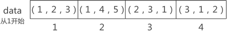
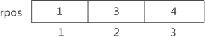

# 稀疏矩阵(行逻辑链接的顺序表)

行逻辑链接的顺序表。它可以看作是三元组顺序表的升级版，在三元组顺序表的基础上提高了查找某一行非 0 数据的效率。

若对其进行压缩存储，矩阵中各非 0 元素的存储状态

使用数组`rpos `记录矩阵中每行第一个非 0 元素在一维数组中的存储位置。

第1行第1个非零元素是`3`，对应1号下标(1,2,3)

第2行第1个非零元素是`1`，对应3号下标(2,3,1)

第3行第1个非零元素是`2`，对应4号下标(3,1,2)

