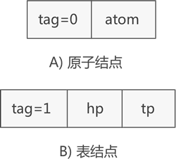

# 广义表的头尾链表存储表示

广义表（Generalized Table）是一种数据结构，它可以表示任何二维表，包括二进制表、三角表、矩阵、树形表、图表等。广义表的特点是可以表示任何二维表，并且广义表的表示方法与具体的二维表无关。

我们可以创建一个整形数组去存储`{1,2,3}`，我们也可以创建一个二维整形数组去存储<code>{{1,2,3},{4,5,6}}</code>，但数组不适合用来存储类似<code>{1,{1,2,3}}</code>这样的数据。

广义表的两种结点：原子结点用来存储数据，表结点用了存储表结点或原子结点

广义表`(a,(b,c,d))`：原子 a 和子表 (b,c,d) 构成，而子表 (b,c,d) 又是由原子 b、c 和 d 构成

::: info

对于 (a,(b,c,d)) 来说，原子 a 和子表 (b,c,d) 是并列的，而在子表 (b,c,d) 中原子 b、c、d 是并列的。

:::

