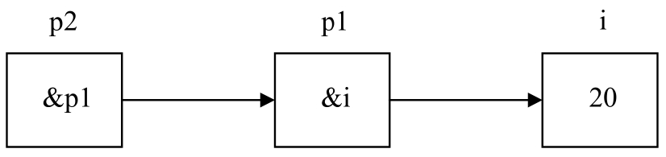
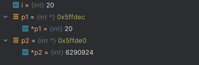
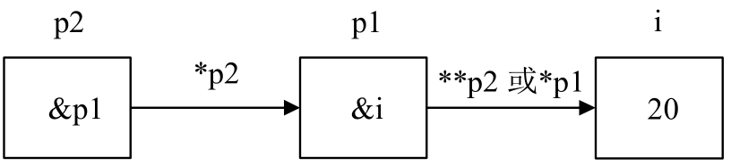
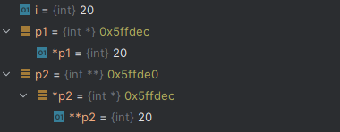
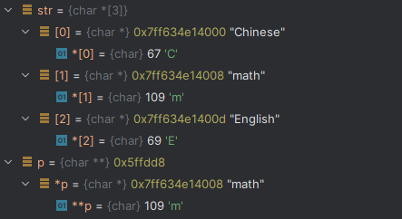

# 指针

## 指针的定义

```c
#include <stdio.h>
int main() {
    int var = 10;
    // 定义int 类型的指针
    int *p;
    // 获取变量var的地址
    p = &var;
    printf("变量地址：%p\n",p);
    return 0;
}
```

## 指针与数组

```c
int main() {
    int arr[5] = {1,2,3,4,5};
    int *p,*q;
    p = &arr[0];
    q = arr;
    printf("arr的地址是：%p\n",arr);
    printf("p指针的地址是: %p\n",p);
    printf("p指针的地址是: %p\n",q);
    return 0;
}
```

输出

```bash
arr的地址是：0000005e819ff650
p指针的地址是: 0000005e819ff650
p指针的地址是: 0000005e819ff650
```

### 示例二

```c
int main() {
    int arr[5] = {1,2,3,4,5};
    int *p;
    // 赋值数组第二个地址给p指针
    p = &arr[1];
    printf("arr[0]= %d\n",arr[0]);
    printf("arr[1]= %d\n",arr[1]);
    printf("p[0]= %d\n",p[0]);
    printf("p[1]= %d\n",p[1]);
    return 0;
}
```

输出

```bash
arr[0]= 1
arr[1]= 2
p[0]= 2
p[1]= 3
```

### 指针加法

```c
int main() {
    int arr[5] = {1,2,3,4,5};
    int *p;
    p = arr;
    // 指针加法
    printf("%d\n",*(p+1)); // 2
    printf("%d\n",*(p+2)); // 3
    return 0;
}
```

### 指针减法

```c
int main() {
    int arr[5] = {1,2,3,4,5};
    int *p;
    p = &arr[4];
    // 指针减法
    printf("%d\n",*(p-1)); // 4
    printf("%d\n",*(p-2)); // 3
    return 0;
}
```

### 指针自增

```c
int main() {
    int arr[5] = {1,2,3,4,5};
    int *p;
    p = arr;
    // 指针自增
    printf("%d\n",*p); // 1
    p++; // 自增
    printf("%d\n",*p); // 2
    p++; // 自增
    printf("%d\n",*p); // 3
    return 0;
}
```

### 指针自减

```c
int main() {
    int arr[5] = {1,2,3,4,5};
    int *p;
    p = &arr[4];
    // 指针自增
    printf("%d\n",*p); // 5
    p--; // 自增
    printf("%d\n",*p); // 4
    p--; // 自增
    printf("%d\n",*p); // 3
    return 0;
}
```

## 指针与字符串

```c
int main() {
    // 字符串与指针
    char *str1 = "hello world";
    // 等价于
    char str2[] = "hello world";
    char *p;
    p = str2;

    printf("%s\n",str1);  // hello world
    printf("%s",p);       // hello world
    return 0;
}
```

## 字符串复制

```c
void _strcopy(char *str1, char *str2){
    while (*str1 != '\0'){
        *str2 = *str1;
        str1++;
        str2++;
    }
    *str2 = '\0';
}

int main() {
    // 字符串与指针
    char str1[] = "hello world";
    char str2[12] = "";
    _strcopy(str1,str2);
    printf("%s\n",str1);  // hello world
    printf("%s\n",str2);  // hello world
    return 0;
}
```

## 指针数组

```c
#include <stdio.h>

int main() {
    // 指针数组
    char *str[] = {"Chinese","math","English"};

    // a--10,b--11,c--12,d--13
    // 字符串默认结尾有\n
    printf("%p\n",str[0]); // 00007ff7fb184000
    printf("%s\n",str[0]); // Chinese
    printf("%p\n",str[1]); // 00007ff7fb184008
    printf("%s\n",str[1]); // math
    printf("%p\n",str[2]); // 00007ff7fb18400d
    printf("%s\n",str[2]); // English

    return 0;
}
```

## 指向指针的指针

### 示例一



i 变量存放值 20

p1 指针变量存放 i 所在的地址&i

p2 指针变量存放 p1 变量所在的地址&p1

```c
#include <stdio.h>

int main() {
    int i = 20;
    int *p1,*p2;
    p1 = &i;
    p2 = (int *) &p1;

    printf("%p\n",p1);  // p1指向的地址                00000000005ffdec
    printf("%p\n",&p1); // 指向(p1指针变量存放)的地址    00000000005ffde0
    printf("%p\n",p2);  // p2指向的地址                00000000005ffde0
    printf("%p\n",&p2); // 指向(p2指针变量存放)的地址    00000000005ffdd8

    return 0;
}
```



### 示例二



```c
#include <stdio.h>

int main() {
    int i = 20;
    int *p1,**p2;
    p1 = &i;
    p2 = &p1;

    printf("%p\n",p1);  // p1指向的地址                00000000005ffdec
    printf("%p\n",&p1); // 指向(p1指针变量存放)的地址    00000000005ffde0
    printf("%p\n",p2);  // p2指向的地址                00000000005ffde0
    printf("%p\n",&p2); // 指向(p2指针变量存放)的地址    00000000005ffdd8
    printf("%d\n",**p2);// 20

    return 0;
}
```



### 示例三

```c
#include <stdio.h>

int main() {
    // 指针数组
    char *str[] = {"Chinese","math","English"};
    // 指向指针的指针
    char **p;
    // 将p赋值第二个元素的地址
    p =  str+1;

    printf("%p\n",&str[1]); // str[1]变量所在的地址 00000000005ffdd8
    printf("%p\n",p);       // str[1]变量所在的地址 00000000005ffdd8
    printf("%s\n",*p);      // math
    printf("%c\n",**p);     // m

    return 0;
}
```


