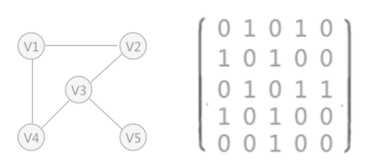
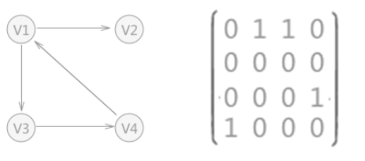
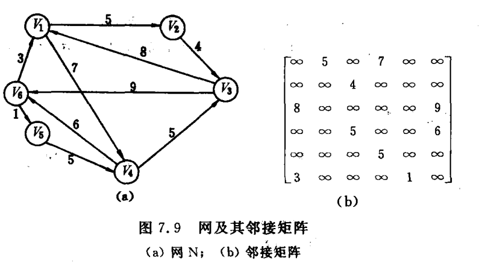
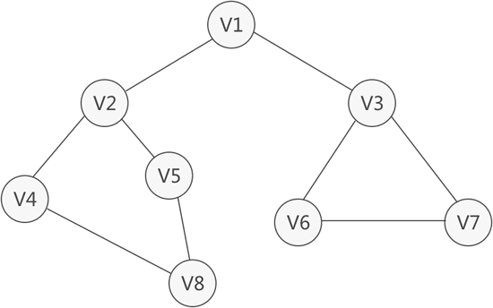

# 图的数组(邻接矩阵)存储表示

### 无向图存储



对于`V1`对应0 1 0 1 0 arcs\[0][1] = 1和arcs\[0][3]=1 `V2`和`V4`有边存在

对于`V2`对应1 0 1 0 0 arcs\[1][0] = 1和arcs\[1][2]=1 `V1`和`V3`有边存在

对于`V3`对应0 1 0 1 1 arcs\[2][1] = 1、arcs\[2][3]=1和arcs\[2][4]=1 `V2`、`V4`和`V5`有边存在

对于`V4`对应1 0 1 0 0 arcs\[3][0] = 1和arcs\[3][2]=1 `V1`和`V3`有边存在

对于`V5`对应0 0 1 0 0 arcs\[4][2] = 1`V3`有边存在

### 有向图存储



对于`V1`对应0 1 1 0 arcs\[0][1] = 1和arcs\[0][2]=1有出度 `V2`和`V3`

对于`V2`对应0 0 0 0 没有出度

对于`V3`对应0 0 0 1 arcs\[2][3] = 1 有出度`V4`

对于`V4`对应1 0 0 0 arcs\[4][0] = 1 有出度`V1`

### 有向网



两个结点之间有出度则填写对应的权值

## 结构定义

```c
/* 宏定义 */
#define INFINITE INT_MAX    // 最大值，用来表示网中的两个顶点不直接连接
#define MAX_VERTEX_NUM 26   // 最大顶点个数


// 图的类型
typedef enum {
    DG,     // 0-有向图
    DN,     // 1-有向网(带权值)
    UDG,    // 2-无向图
    UDN     // 3-无向网(带权值)
} GraphKind;

// 顶点类型
typedef char VertexType;

/*
 * 顶点关系类型
 *
 * 在无权图中，该值通常为0或1，表示两顶点是否直接连通；
 * 在有权图中，该值通常为权值。
 */
typedef int VRType;

// 边的相关附加信息
typedef struct {
    // 如果有的话，后续会添加相应的属性
} InfoType;

// 边的类型，每条边上可能有附加信息info
typedef struct ArcCell {
    VRType adj;  // 顶点关系，在有权图跟无权图中的含义不同
    InfoType* info; // 边的附加信息，通常忽略
} ArcCell;

/* 图/网的数组(邻接矩阵)存储表示类型定义 */
typedef struct {
    VertexType vexs[MAX_VERTEX_NUM];               // 顶点向量
    ArcCell arcs[MAX_VERTEX_NUM][MAX_VERTEX_NUM];  // 邻接矩阵
    int vexnum, arcnum;                            // 图/网的顶点数和弧数
    GraphKind kind;                                // 图的类型标志
} MGraph;


// 边/弧上是否存在附加信息
extern Boolean IncInfo;
```

## 创建图/表

```c
/*
 * 创建图/表
 */
Status CreateGraph(MGraph* G, char* path[]) {
    int kind;
    Status flag;

    printf("请输入图的类型(0-有向图 │ 1-有向网 │ 2-无向图 │ 3-无向网)：");
    scanf("%d", &kind);

    // 类型不合规
    if(kind < 0 || kind > 3) {
        return ERROR;
    }

    // 需要从文件读取
    // 打开文件，准备读取测试数据
    fp = fopen(path[kind], "r");
    if(fp == NULL) {
        return ERROR;
    }

    // 录入图的类型
    ReadData(fp, "%d", &((*G).kind));

    // 随机创建有向图/网或无向图/网的一种
    switch((*G).kind) {
        case DG:
            flag = CreateDG(G);
            break;
        case DN:
            flag = CreateDN(G);
            break;
        case UDG:
            flag = CreateUDG(G);
            break;
        case UDN:
            flag = CreateUDN(G);
            break;
        default:
            flag = ERROR;
            break;
    }

    if(fp != NULL) {
        fclose(fp);
        fp = NULL;
    }

    return flag;
}
```

## 查找

```c
/*
 * 返回顶点u在图/网中的位置
 */
int LocateVex(MGraph G, VertexType u) {
    int i;

    for(i = 0; i < G.vexnum; i++){
        if(G.vexs[i] == u){
            return i;
        }
    }

    return -1;
}
```

## 构造有向图

::: tip

`vexnum` 顶点数6

`arcnum` 弧数14

1.录入顶点集[A，X，B，C，D，E]

2.初始化有向图的邻接矩阵为全0

3.录入弧的信息

```c
(*G).arcs[i][j].adj = 1;
```

:::

::: code-group

```c [MGraph.c] {37}
/*
 * 构造有向图
 */
static Status CreateDG(MGraph* G) {
    int i, j, k;
    ArcCell arcs = {0, NULL};   // 有向图每条边的初始值
    VertexType v1, v2;

    ReadData(fp, "%d", &((*G).vexnum)); // 录入顶点数
    ReadData(fp, "%d", &((*G).arcnum)); // 录入弧数
    ReadData(fp, "%d", &IncInfo);       // 判断弧上是否包含附加信息

    // 录入顶点集
    for(i = 0; i < (*G).vexnum; i++) {
        // 跳过空白，寻找下一个"可读"符号
        skipBlank(fp);
        ReadData(fp, "%c", &((*G).vexs[i]));
    }

    // 初始化有向图的邻接矩阵
    for(i = 0; i < (*G).vexnum; i++) {
        for(j = 0; j < (*G).vexnum; j++) {
            (*G).arcs[i][j] = arcs;
        }
    }

    // 录入弧的信息
    for(k = 0; k < (*G).arcnum; k++) {
        // 跳过空白，寻找下一个可读符号
        skipBlank(fp);
        ReadData(fp, "%c%c", &v1, &v2);

        i = LocateVex(*G, v1);  // 获取顶点v1在顶点集中的位置
        j = LocateVex(*G, v2);  // 获取顶点v2在顶点集中的位置

        // 将指定的顶点关系设置为1，指示这两个顶点是直接连接的(注：这里没有验证下标是否越界)
        (*G).arcs[i][j].adj = 1;
    }

    // 从文件中读取数据时，最后其实应当判断一下是否读到了足够的信息
    return OK;
}
```

```[TestData_DG.txt]
图类型→0（有向图）
顶点数→6
弧数→14
弧是否带有其他信息→0
顶点集→【A，X，B，C，D，E】
弧的集合→【A，B】【A，C】【A，D】【B，C】【B，D】【B，E】【C，B】【C，E】【C，X】【E，A】【E，D】【E，X】【X，A】【X，D】
```

:::

输出

```
    A  X  B  C  D  E
A   -  -  1  1  1  -
X   1  -  -  -  1  -
B   -  -  -  1  1  1
C   -  1  1  -  -  1
D   -  -  -  -  -  -
E   1  1  -  -  1  -
```

## 构造无向图

::: tip

`vexnum` 顶点数6

`arcnum` 边数13

1.录入顶点集[A，X，B，C，D，E]

2.初始化有向图的邻接矩阵为全0

3.录入弧的信息(无向图是双向的需要双向录入)

```c
/ 将指定的顶点关系设置为1，指示这两个顶点是直接连接的(注：这里没有验证下标是否越界)
(*G).arcs[i][j].adj = 1;

// 填充对称点
(*G).arcs[j][i] = (*G).arcs[i][j];
```

:::

::: code-group

```c [MGraph.c]
/*
 * 构造无向图
 */
static Status CreateUDG(MGraph* G) {
    int i, j, k;
    ArcCell arcs = {0, NULL};   // 无向图每条边的初始值
    VertexType v1, v2;

    ReadData(fp, "%d", &((*G).vexnum)); // 录入顶点数
    ReadData(fp, "%d", &((*G).arcnum)); // 录入边数
    ReadData(fp, "%d", &IncInfo);       // 判断边上是否包含附加信息

    // 录入顶点集
    for(i = 0; i < (*G).vexnum; i++) {
        // 跳过空白，寻找下一个"可读"符号
        skipBlank(fp);
        ReadData(fp, "%c", &((*G).vexs[i]));
    }

    // 初始化无向图的邻接矩阵
    for(i = 0; i < (*G).vexnum; i++) {
        for(j = 0; j < (*G).vexnum; j++) {
            (*G).arcs[i][j] = arcs;
        }
    }

    // 录入边的信息
    for(k = 0; k < (*G).arcnum; k++) {
        // 跳过空白，寻找下一个可读符号
        skipBlank(fp);
        ReadData(fp, "%c%c", &v1, &v2);
        i = LocateVex(*G, v1);  // 获取顶点v1在顶点集中的位置
        j = LocateVex(*G, v2);  // 获取顶点v2在顶点集中的位置

        // 将指定的顶点关系设置为1，指示这两个顶点是直接连接的(注：这里没有验证下标是否越界)
        (*G).arcs[i][j].adj = 1;

        // 填充对称点
        (*G).arcs[j][i] = (*G).arcs[i][j];
    }

    // 从文件中读取数据时，最后其实应当判断一下是否读到了足够的信息
    return OK;
}
```

```[TestData_UDG.txt]
图类型→2（无向图）
顶点数→6
边数→13
边是否带有其他信息→0
顶点集→【A，X，B，C，D，E】
边的集合→【A，B】【A，C】【A，D】【B，C】【B，D】【B，E】【C，E】【C，X】【E，A】【E，D】【E，X】【X，A】【X，D】
```

:::

输出

```
    A  X  B  C  D  E
A   -  1  1  1  1  1
X   1  -  -  1  1  1
B   1  -  -  1  1  1
C   1  1  1  -  -  1
D   1  1  1  -  -  1
E   1  1  1  1  1  -
```

## 构造有向网

::: tip

`vexnum` 顶点数6

`arcnum` 弧数14

1.录入顶点集[A，X，B，C，D，E]

2.初始化有向网的邻接矩阵为全INFINITE

3.录入弧的信息(值为权值)

```c
// 在指定的顶点关系上记录权值(注：这里没有验证下标是否越界)
(*G).arcs[i][j].adj = w;
```

:::

::: code-group

```c [MGraph.c]
/*
 * 构造有向网
 */
static Status CreateDN(MGraph* G) {
    int i, j, k;
    ArcCell arcs = {INFINITE, NULL};    // 有向网每条弧的初始值
    VertexType v1, v2;
    VRType w;

    ReadData(fp, "%d", &((*G).vexnum)); // 录入顶点数
    ReadData(fp, "%d", &((*G).arcnum)); // 录入弧数
    ReadData(fp, "%d", &IncInfo);       // 判断弧上是否包含附加信息

    // 录入顶点集
    for(i = 0; i < (*G).vexnum; i++) {
        // 跳过空白，寻找下一个"可读"符号
        skipBlank(fp);
        ReadData(fp, "%c", &((*G).vexs[i]));
    }

    // 初始化有向网的邻接矩阵
    for(i = 0; i < (*G).vexnum; i++) {
        for(j = 0; j < (*G).vexnum; j++) {
            (*G).arcs[i][j] = arcs;
        }
    }

    // 录入弧的信息
    for(k = 0; k < (*G).arcnum; k++) {
        // 跳过空白，寻找下一个可读符号
        skipBlank(fp);
        ReadData(fp, "%c%c%d", &v1, &v2, &w);

        i = LocateVex(*G, v1);  // 获取顶点v1在顶点集中的位置
        j = LocateVex(*G, v2);  // 获取顶点v2在顶点集中的位置

        // 在指定的顶点关系上记录权值(注：这里没有验证下标是否越界)
        (*G).arcs[i][j].adj = w;
    }

    // 从文件中读取数据时，最后其实应当判断一下是否读到了足够的信息
    return OK;
}
```

```[TestData_DN.txt]
图类型→1（有向网）
顶点数→6
弧数→14
弧是否带有其他信息→0
顶点集→【A，X，B，C，D，E】
弧的集合→【A，B，3】【A，C，8】【A，D，11】【B，C，7】【B，D，4】【B，E，1】【C，B，5】【C，E，17】【C，X，3】【E，A，6】【E，D，4】【E，X，2】【X，A，8】【X，D，10】
```

:::

输出

```
    A  X  B  C  D  E
A   -  -  3  8 11  -
X   8  -  -  - 10  -
B   -  -  -  7  4  1
C   -  3  5  -  - 17
D   -  -  -  -  -  -
E   6  2  -  -  4  -
```

## 构造无向网

::: tip

`vexnum` 顶点数6

`arcnum` 边数13

1.录入顶点集[A，X，B，C，D，E]

2.初始化有无网的邻接矩阵为全INFINITE

3.录入弧的信息(值为权值)

```c
// 在指定的顶点关系上记录权值(注：这里没有验证下标是否越界)
(*G).arcs[i][j].adj = w;

// 填充对称点
(*G).arcs[j][i] = (*G).arcs[i][j];
```

:::

::: code-group

```c [MGraph.c]
/*
 * 构造无向网
 */
static Status CreateUDN(MGraph* G) {
    int i, j, k;
    ArcCell arcs = {INFINITE, NULL};    // 无向网每条边的初始值
    VertexType v1, v2;
    VRType w;

    ReadData(fp, "%d", &((*G).vexnum)); // 录入顶点数
    ReadData(fp, "%d", &((*G).arcnum)); // 录入边数
    ReadData(fp, "%d", &IncInfo);       // 判断边上是否包含附加信息

    // 录入顶点集
    for(i = 0; i < (*G).vexnum; i++) {
        // 跳过空白，寻找下一个"可读"符号
        skipBlank(fp);
        ReadData(fp, "%c", &((*G).vexs[i]));
    }

    // 初始化无向网的邻接矩阵
    for(i = 0; i < (*G).vexnum; i++) {
        for(j = 0; j < (*G).vexnum; j++) {
            (*G).arcs[i][j] = arcs;
        }
    }

    // 录入边的信息
    for(k = 0; k < (*G).arcnum; k++) {
        // 跳过空白，寻找下一个可读符号
        skipBlank(fp);
        ReadData(fp, "%c%c%d", &v1, &v2, &w);

        i = LocateVex(*G, v1);  // 获取顶点v1在顶点集中的位置
        j = LocateVex(*G, v2);  // 获取顶点v2在顶点集中的位置

        // 在指定的顶点关系上记录权值(注：这里没有验证下标是否越界)
        (*G).arcs[i][j].adj = w;

        // 填充对称点
        (*G).arcs[j][i] = (*G).arcs[i][j];
    }

    // 从文件中读取数据时，最后其实应当判断一下是否读到了足够的信息
    return OK;
}
```

```[TestData_UDN.txt]
图类型→3（无向网）
顶点数→6
边数→13
边是否带有其他信息→0
顶点集→【A，X，B，C，D，E】
边的集合→【A，B，3】【A，C，8】【A，D，11】【B，C，7】【B，D，4】【B，E，1】【C，E，17】【C，X，3】【E，A，6】【E，D，4】【E，X，2】【X，A，8】【X，D，10】
```

:::

输出

```
    A  X  B  C  D  E
A   -  8  3  8 11  6
X   8  -  -  3 10  2
B   3  -  -  7  4  1
C   8  3  7  -  - 17
D  11 10  4  -  -  4
E   6  2  1 17  4  -
```

## 销毁

```c
/*
 * 邻接矩阵存储的图无需释放内存，只需重置相关遍历即可。
 */
Status DestroyGraph(MGraph* G) {
    (*G).vexnum = 0;
    (*G).arcnum = 0;
    IncInfo = 0;

    return OK;
}
```

## 取值

::: tip

返回索引v处的顶点值

顶点集[A，X，B，C，D，E]

:::

```c
/*
 * 返回索引v处的顶点值
 */
VertexType GetVex(MGraph G, int v){
    if(v < 0 || v >= G.vexnum){
        return '\0';    // 指定的顶点不存在
    }

    return G.vexs[v];
}
```

## 赋值

::: tip

顶点集[A，X，B，C，D，E]

将B赋值为W

顶点集[A，X，W，C，D，E]

:::

```c
/*
 * 将顶点v赋值为value
 */
Status PutVex(MGraph* G, VertexType v, VertexType value){
    int k;

    // 首先需要判断该顶点是否存在
    k = LocateVex((*G),v);
    if(k == -1){
        return ERROR;    // 指定的顶点不存在
    }

    (*G).vexs[k] = value;

    return OK;
}
```

## 首个邻接点

::: info

首个邻接点的`vexs`索引

```c
    A  X  B  C  D  E
A   -  -  1  1  1  -
X   1  -  -  -  1  -
B   -  -  -  1  1  1
C   -  1  1  -  -  1

// 顶点A的第一个邻接顶点为
int k = FirstAdjVex(G, 'A');
printf("%c\n", G.vexs[k]); // B
```

:::

```c
/*
 * 首个邻接点
 *
 * 返回顶点v的首个邻接点
 */
int FirstAdjVex(MGraph G, VertexType v) {
    int kv, j;
    VRType adj;

    // 查找所在行
    kv = LocateVex(G, v);
    if(kv == -1) {
        return -1;    // 指定的顶点不存在
    }

    // 确定一个非连通标记
    if(G.kind == DG || G.kind == UDG) {
        adj = 0;            // 图
    } else if(G.kind == DN || G.kind == UDN) {
        adj = INFINITE;     // 网
    } else {
        return -1;
    }

    // 从头开始查找
    for(j = 0; j < G.vexnum; j++) {
        // 找到与v直接连接的顶点
        if(G.arcs[kv][j].adj != adj) {
            return j;
        }
    }

    return -1;
}
```

## 下一个邻接点

::: info

首个邻接点的`vexs`索引

```c
    A  X  B  C  D  E
A   -  -  1  1  1  -
X   1  -  -  -  1  -
B   -  -  -  1  1  1
C   -  1  1  -  -  1

// 顶点A的下一个邻接顶点为(从C开始查找)
k = NextAdjVex(G, 'A', 'C');
printf("%c\n", G.vexs[k]);  // D
```

:::

```c
/*
 * 下一个邻接点
 *
 * 返回顶点v的(相对于w的)下一个邻接点
 */
int NextAdjVex(MGraph G, VertexType v, VertexType w) {
    int kv, kw, j;
    VRType adj;

    kv = LocateVex(G, v);
    if(kv == -1) {
        return -1;    // 指定的顶点不存在
    }

    kw = LocateVex(G, w);
    if(kw == -1) {
        return -1;    // 指定的顶点不存在
    }

    // 确定一个非连通标记
    if(G.kind == DG || G.kind == UDG) {
        adj = 0;        // 图
    } else if(G.kind == DN || G.kind == UDN) {
        adj = INFINITE; // 网
    } else {
        return -1;
    }

    // 从顶点w后开始查找
    for(j = kw + 1; j < G.vexnum; j++) {
        // 找到与v直接连接的顶点
        if(G.arcs[kv][j].adj != adj) {
            return j;
        }
    }

    return -1;
}
```

## 插入顶点

1.判断是否存在

2.在顶点集中添加顶点

3.在邻接矩阵中补上0或INFINITE

```c
/*
 * 插入顶点
 *
 * 将指定的顶点v追加到顶点集中，未建立该顶点与其他顶点的关系
 */
Status InsertVex(MGraph* G, VertexType v) {
    int i, k;
    VRType adj;

    // 顶点数过多
    if((*G).vexnum == MAX_VERTEX_NUM) {
        return ERROR;
    }

    // 首先需要判断该顶点是否存在
    k = LocateVex(*G, v);
    if(k >= 0) {
        return ERROR;    // 指定的顶点存在时，无需重复添加
    }

    // 确定一个非连通标记
    if((*G).kind == DG || (*G).kind == UDG) {
        adj = 0;        // 图
    } else if((*G).kind == DN || (*G).kind == UDN) {
        adj = INFINITE; // 网
    } else {
        return ERROR;
    }

    (*G).vexs[(*G).vexnum] = v;
    (*G).vexnum++;

    // 补上0或INFINITE
    for(i = 0; i < (*G).vexnum; i++) {
        (*G).arcs[i][(*G).vexnum - 1].adj = adj;
        (*G).arcs[(*G).vexnum - 1][i].adj = adj;
    }

    return OK;
}
```

## 删除顶点

::: info

1.更新边/弧数量

2.将邻接矩阵中的顶点关系左移；将邻接矩阵中的顶点关系上移

3.从顶点集中删除当前元素

4.顶点数量减一

```c
// 删除顶点X
DeleteVex(&G,'X');


    A  X  B  C  D  E              A  B  C  D  E
A   -  -  1  1  1  -          A   -  1  1  1  -
X   1  -  -  -  1  -          B   -  -  1  1  1
B   -  -  -  1  1  1    ===>  C   -  1  -  -  1
C   -  1  1  -  -  1          D   -  -  -  -  -
D   -  -  -  -  -  -          E   1  -  -  1  -
E   1  1  -  -  1  -
```

:::

```c
/*
 * 删除顶点
 *
 * 从顶点集中删除指定的顶点v，注意需要更新相关的顶点关系
 */
Status DeleteVex(MGraph* G, VertexType v) {
    int i, j, k;
    VRType adj;

    k = LocateVex(*G, v);
    if(k == -1) {
        return ERROR;    // 指定的顶点不存在
    }

    // 确定一个非连通标记
    if((*G).kind == DG || (*G).kind == UDG) {
        adj = 0;        // 图
    } else if((*G).kind == DN || (*G).kind == UDN) {
        adj = INFINITE; // 网
    } else {
        return ERROR;
    }

    // 更新边/弧的数量
    for(i = 0; i < (*G).vexnum; i++) {
        // 如果存在从顶点v出发的边，则边的数量减一
        if((*G).arcs[k][i].adj != adj) {
            (*G).arcnum--;
        }

        // 如果这是有向的图/网，依然需要更新边/弧的数量
        if((*G).kind == DG || (*G).kind == DN) {
            // 如果存在到达顶点v的边，则边的数量减一
            if((*G).arcs[i][k].adj != adj) {
                (*G).arcnum--;
            }
        }
    }

    // 将邻接矩阵中的顶点关系左移
    for(j = k + 1; j < (*G).vexnum; j++) {
        for(i = 0; i < (*G).vexnum; i++) {
            (*G).arcs[i][j - 1] = (*G).arcs[i][j];    // 右边的列挪到左边的列
        }
    }

    // 将邻接矩阵中的顶点关系上移
    for(i = k + 1; i < (*G).vexnum; i++) {
        // 注，由于上面进行左移的关系，所以这里的j是小于(*G).vexnum - 1
        for(j = 0; j < (*G).vexnum - 1; j++) {
            (*G).arcs[i - 1][j] = (*G).arcs[i][j];    // 下一行挪到上一行
        }
    }

    // 将该顶点从顶点集中移除
    for(i = k + 1; i < (*G).vexnum; i++) {
        (*G).vexs[i - 1] = (*G).vexs[i];
    }

    // 顶点数减一
    (*G).vexnum--;

    return OK;
}
```

## 插入边/弧

::: tip

有权值的需要设置邻接矩阵的值为权值

:::

```c
// 插入边
if(G.kind == DG || G.kind == UDG) {
    // 插入无权值的边：<E, C>
    InsertArc(&G, 'E', 'C');
    // 网
} else if(G.kind == DN || G.kind == UDN) {
    // 插入带权值的边：<E, C, 8>
    InsertArc(&G, 'E', 'C', 8);
}
```

```c
/*
 * 插入边/弧<v, w>
 *
 * 如果当前图/网是无向的，则插入一条弧需要增加两个顶点关系，但弧的数量只增一。
 *
 * 对于图来说，可以在可变参数中列出边/弧的附加信息；
 * 对于网来说，可以在可变参数中依次列出边/弧的权值以及附加信息。
 */
Status InsertArc(MGraph* G, VertexType v, VertexType w, ...) {
    int kv, kw;
    VRType adj;                 // 顶点关系
    Boolean overlay = FALSE;    // 是否为覆盖添加
    InfoType* info = NULL;      // 边/弧的附加信息
    va_list ap;

    kv = LocateVex(*G, v);
    if(kv == -1) {
        return ERROR;    // 指定的顶点不存在
    }

    kw = LocateVex(*G, w);
    if(kw == -1) {
        return ERROR;    // 指定的顶点不存在
    }

    // 拒绝环
    if(kv == kw) {
        return ERROR;
    }

    /* 确定一个顶点关系 */

    // 对于图来说，连通关系用1表示
    if((*G).kind == DG || (*G).kind == UDG) {
        adj = 1;

        // 如果边/弧上存在附加信息
        if(IncInfo) {
            va_start(ap, w);                // 在w后查询首个可变参数
            info = va_arg(ap, InfoType*);   // 获取附加信息
            va_end(ap);
        }

        overlay = (*G).arcs[kv][kw].adj != 0;

        // 对于网来说，此处需要从可变参数中获取权值信息
    } else if((*G).kind == DN || (*G).kind == UDN) {
        va_start(ap, w);    // 在w后查询首个可变参数

        adj = va_arg(ap, VRType);   // 获取权值信息

        // 如果边/弧上存在附加信息
        if(IncInfo) {
            info = va_arg(ap, InfoType*);   // 获取附加信息
        }

        va_end(ap);

        overlay = (*G).arcs[kv][kw].adj != INFINITE;
    } else {
        return ERROR;
    }

    (*G).arcs[kv][kw].adj = adj;    // 记录顶点关系

    // 如果边/弧上存在附加信息，则记录附加关系
    if(IncInfo) {
        (*G).arcs[kv][kw].info = info;
    }

    // 如果是无向图/网，需要考虑对称性
    if((*G).kind == UDG || (*G).kind == UDN) {
        (*G).arcs[kw][kv] = (*G).arcs[kv][kw];
    }

    // 在非覆盖的情形下，才考虑更新边/弧的数量
    if(!overlay) {
        (*G).arcnum++;  // 不论有向无向，边/弧数只增一
    }

    return OK;
}
```

输出

```
==== 有向图 ====

    A  B  C  D  E               A  B  C  D  E
A   -  1  1  1  -           A   -  1  1  1  -
B   -  -  1  1  1           B   -  -  1  1  1
C   -  1  -  -  1   ===>    C   -  1  -  -  1
D   -  -  -  -  -           D   -  -  -  -  -
E   1  -  -  1  -           E   1  -  1  1  -

==== 有向网 ====

    A  B  C  D  E               A  B  C  D  E
A   -  3  8 11  -           A   -  3  8 11  -
B   -  -  7  4  1           B   -  -  7  4  1
C   -  5  -  - 17   ===>    C   -  5  -  - 17
D   -  -  -  -  -           D   -  -  -  -  -
E   6  -  -  4  -           E   6  -  8  4  -
```

## 删除边/弧

::: tip

标记边/弧为0或INFINITE

边/弧数量-1

删除<A,B>边`DeleteArc(&G,'A','B')`

:::

```c
/*
 * 删除边/弧
 *
 * 此删除只是更新边/弧的连通关系
 */
Status DeleteArc(MGraph* G, VertexType v, VertexType w) {
    int kv, kw;
    VRType adj;
    Boolean found = FALSE;  // 是否存在待删除的边/弧

    kv = LocateVex(*G, v);
    if(kv == -1) {
        return ERROR;    // 指定的顶点不存在
    }

    kw = LocateVex(*G, w);
    if(kw == -1) {
        return ERROR;    // 指定的顶点不存在
    }

    // 确定一个非连通标记
    if((*G).kind == DG || (*G).kind == UDG) {
        adj = 0;        // 图

        found = (*G).arcs[kv][kw].adj != 0;
    } else if((*G).kind == DN || (*G).kind == UDN) {
        adj = INFINITE; // 网

        found = (*G).arcs[kv][kw].adj != INFINITE;
    } else {
        return ERROR;
    }

    // 标记这两个顶点已断开连接
    (*G).arcs[kv][kw].adj = adj;

    // 如果是无向图/网，需要考虑对称性
    if((*G).kind == UDG || (*G).kind == UDN) {
        (*G).arcs[kw][kv] = (*G).arcs[kv][kw];
    }

    // 在找到了指定的弧时，才考虑更新边/弧的数量
    if(found) {
        (*G).arcnum--;  // 不论有向无向，边/弧数只减一
    }

    return OK;
}
```

## 深度优先遍历(DFS)



从`V1`顶点开始访问[V1,V2,V4,V8,V5,V3,V6,V7]

::: tip

1.设置所有的访问状态为false

2.从第一个顶点开始访问调用`DFS`

3.对尚未访问的顶点调用`DFS`

:::

```c
/*
 * 深度优先遍历(此处借助递归实现)
 */
void DFSTraverse(MGraph G, Status(Visit)(VertexType)) {
    int v;

    // 使用全局变量VisitFunc，使得DFS不必设置函数指针参数
    VisitFunc = Visit;

    // 访问标志数组初始化
    for(v = 0; v < G.vexnum; v++) {
        visited[v] = FALSE;
    }

    // 此处需要遍历的原因是并不能保证所有顶点都连接在了一起
    for(v = 0; v < G.vexnum; v++) {
        if(!visited[v]) {
            DFS(G, v);  // 对尚未访问的顶点调用DFS
        }
    }
}
/*
 * 深度优先遍历核心函数
 */
static void DFS(MGraph G, int v) {
    int w;

    // 从第v个顶点出发递归地深度优先遍历图G
    visited[v] = TRUE;

    // 访问第v个顶点
    VisitFunc(G.vexs[v]);

    for(w = FirstAdjVex(G, G.vexs[v]);w >= 0;w = NextAdjVex(G, G.vexs[v], G.vexs[w]))    {
        if(!visited[w]) {
            DFS(G, w);  // 对尚未访问的顶点调用DFS
        }
    }
}
```

## 广度优先遍历(BFS)


从`V1`顶点开始访问[V1,V2,V3,V4,V5,V6,V7,V8]

```
    A  B  C  D  E
A   -  1  1  1  -
B   -  -  1  1  1
C   -  1  -  -  1
D   -  -  -  -  -
E   1  -  1  1  -
```

A入队，队列Q=[A]

A出队，u = A；访问顶点A。队列Q=[]

访问A的首个邻接点B,访问B结点，B结点入队Q=[B]

w=2(从B开始查找的邻接点C所在下标),访问C结点，C结点入队Q=[B,C]

w=3(从C开始查找的邻接点D所在下标),访问D结点，D结点入队Q=[B,C,D]

w=-1(从D开始查找的邻接点查找失败)

队列不为空，弹出B

B的首个邻接点C，C已被访问

w=2(从C开始查找的邻接点D所在下标)，D已被访问

w=3(从D开始查找的邻接点E所在下标)，访问E结点

访问顺序为ABCDE

```c
/*
 * 广度优先遍历(此处借助队列实现)
 */
void BFSTraverse(MGraph G, Status(Visit)(VertexType)) {
    int v, w;
    LinkQueue Q;
    QElemType u;

    // 初始化为未访问
    for(v = 0; v < G.vexnum; v++) {
        visited[v] = FALSE;
    }

    // 置空辅助队列
    InitQueue(&Q);

    for(v = 0; v < G.vexnum; v++) {
        // 如果该顶点已访问过，则直接忽略
        if(visited[v]) {
            continue;
        }

        // 标记该顶点已访问
        visited[v] = TRUE;

        // 访问顶点
        Visit(G.vexs[v]);

        EnQueue(&Q, v);

        while(!QueueEmpty(Q)) {
            DeQueue(&Q, &u);

            // 先集中访问顶点v的邻接顶点，随后再访问邻接顶点的邻接顶点
            for(w = FirstAdjVex(G, G.vexs[u]);w >= 0;w = NextAdjVex(G, G.vexs[u], G.vexs[w])) {
                if(!visited[w]) {
                    visited[w] = TRUE;
                    Visit(G.vexs[w]);
                    EnQueue(&Q, w);
                }
            }
        }
    }
}
```


