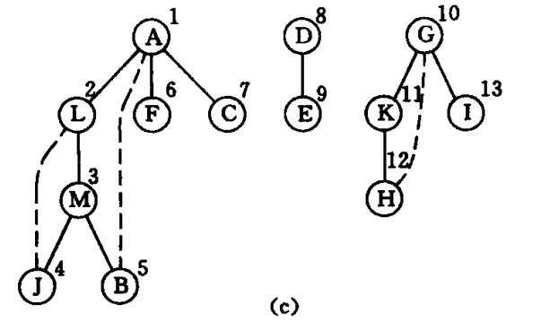

# 无向图的生成树


图的邻接矩阵


首先访问`A`，A的下一个邻接点为11即`L`，L的下一个邻接点为12即`M`，M的下一个邻接点为11即`L`，`L`已经被访问，访问M的下一个邻接点9即`J`依次遍历得到第一颗生成树




::: tip

`DFSForest` 创建每一颗树二叉树(兄弟结点存储)

```c
for(v = 0; v < G.vexnum; v++) {
    // 跳过已访问过的顶点
    if(visited[v]) {
        continue;
    }
}
```

`DFSTree` 通过深度遍历创建


:::

::: code-group

```c [SpanningTree.c]
/*==================
 * 无向图的生成树
 *
 * 包含算法: 7.7、7.8
 ===================*/

#include "SpanningTree.h"

// 访问标志数组，记录访问过的顶点
static Boolean visited[MAX_VERTEX_NUM];

/*
 * 构造无向图的生成树(森林)
 */
void DFSForest(MGraph G, CSTree* T) {
    int v;
    CSTree p, q;

    InitTree(T);

    for(v = 0; v < G.vexnum; v++) {
        visited[v] = FALSE;
    }

    for(v = 0; v < G.vexnum; v++) {
        // 跳过已访问过的顶点
        if(visited[v]) {
            continue;
        }

        p = (CSTree) malloc(sizeof(CSNode));    // 分配根结点
        if(!p) {
            exit(-2);
        }
        p->data = GetVex(G, v);
        p->firstchild = p->nextsibling = NULL;

        if(!(*T)) {                            // 是第一棵生成树的根
            *T = p;
        } else {                               // 是其他生成树的根（前一棵树根的兄弟）
            q->nextsibling = p;
        }

        q = p;                                 // q指示当前生成树的根

        DFSTree(G, v, &p);                     // 建立以p为根的生成树
    }
}
/*
 * 通过深度优先遍历各结点，构造结点v起始的树
 */
void DFSTree(MGraph G, int v, CSTree* T) {
    Status first;
    int w;
    CSTree p, q;

    visited[v] = TRUE;
    first = TRUE;

    // for循环的意义在于找出v结点的所有孩子
    for(w = FirstAdjVex(G, G.vexs[v]); w>=0; w = NextAdjVex(G, G.vexs[v], G.vexs[w]))     {
        // 跳过已访问过的顶点
        if(visited[w]) {
            continue;
        }

        // 构造孩子结点
        p = (CSTree) malloc(sizeof(CSNode));
        if(!p) {
            exit(-2);
        }
        p->data = GetVex(G, w);
        p->firstchild = p->nextsibling = NULL;

        // 如果是第一个孩子
        if(first) {
            (*T)->firstchild = p;
            first = FALSE;

            // 如果不是第一个孩子，则添加为兄弟结点
        } else {
            q->nextsibling = p;
        }

        q = p;

        // 递归获取子树
        DFSTree(G, w, &q);
    }
}


```

```c [main.c]
#include <stdio.h>
#include "MGraph.h"
#include "SpanningTree.h"

int main() {

    MGraph G;

    char* path[4];

    path[0] = "";
    path[1] = "";
    path[2] = "TestData_UDG.txt";
    path[3] = "";

    // 创建图
    CreateGraph(&G, path);
    PrintGraph(G);

    CSTree T;

    printf("构造无向图的生成树（森林）... \n");
    DFSForest(G, &T);


    PrintTree(T);


    return 0;
}
```

``` [TestData_UDG.txt]
图类型→2（无向图）
顶点数→13
边数→13
边是否带有其他信息→0
顶点集→【A，L，M，J，B，F，C，D，E，G，K，H，I】
边的集合→【A，L】【A，B】【A，F】【A，C】【L，M】【L，J】【M，J】【M，B】【D，E】【G，K】【G，H】【G，I】【K，H】
```

:::
