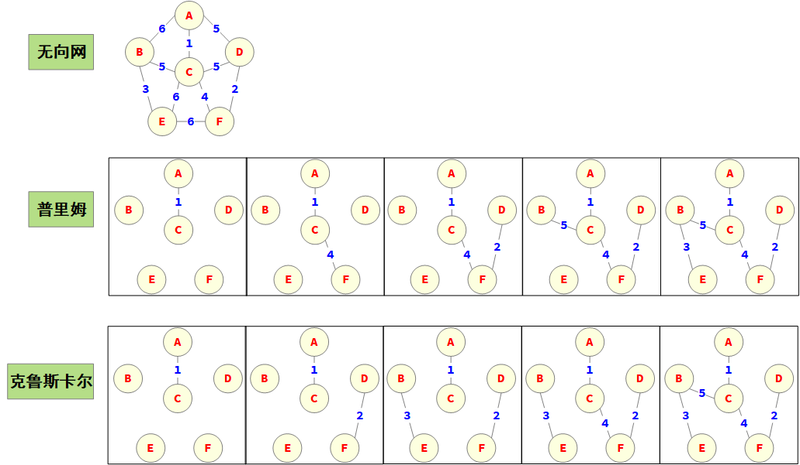
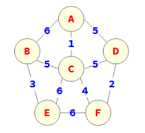
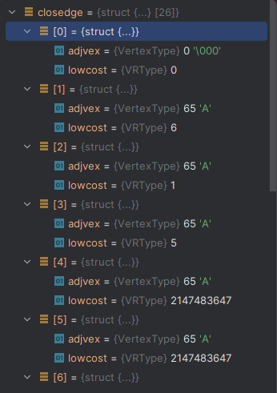
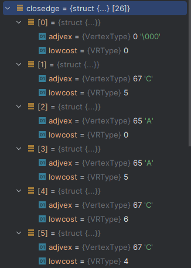
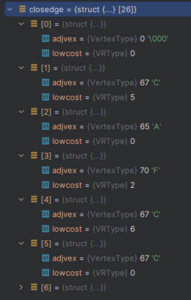
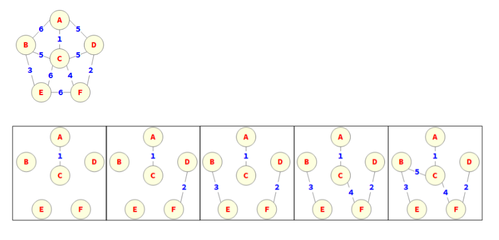

# 最小生成树

假设要在 个城市之间建立通信联络网，则连通 个城市只需要 n-1 条线路。这 时，自然会考虑这样一个问题，如何在最节省经费的前提下建立这个通信网。

对于给定的连通网，求最小生成树常用的算法有两个，分别叫做普里姆Prim算法和克鲁斯卡尔Kruskal算法。



## Prim算法

该算法的耗时部分是对顶点的遍历，与网中的边数无关，因为适用于边比较稠密的网



获取A结点到V-U的代价最小的边

```c
// 返回顶点u在无向网中的位置
k = LocateVex(G, u);

// 辅助数组初始化，将顶点u加入了顶点子集U
for(j = 0; j < G.vexnum; j++) {
    if(j != k) {
        closedge[j].adjvex = u;
        closedge[j].lowcost = G.arcs[k][j].adj;
    }
}

// 赋值为0意味着顶点k已进入顶点子集U
closedge[k].lowcost = 0;
```




获取**最小值**结点索引`k = minimum(G)` = 2 对应值C

```c
// 将顶点k加入到顶点子集U
closedge[k].lowcost = 0;

// 新顶点进入顶点子集U后，需要更新顶点子集U与顶点子集V-U的边的信息
for(j = 0; j < G.vexnum; j++) {
    if(G.arcs[k][j].adj < closedge[j].lowcost) {
        closedge[j].adjvex = G.vexs[k];
        closedge[j].lowcost = G.arcs[k][j].adj;
    }
}
```



[0]A已经被访问

C到[1]B的权为5

[2]C已经被访问

C到[3]D的权为5和A到D的权相对不用修改

C到[4]E的权为6

C到[5]F的权为4

获取**最小值**结点索引`k = minimum(G)` = 5 对应值F



[0]A已经被访问

F到[1]B的权为无穷，保持之前C到B的值5

[2]C已经被访问

F到[3]D的权为2

F到[4]E权为6和C到E的权相同，保持之前

F到[5]已经被访问

```c
/*
 * 普里姆算法中用到的辅助数组，
 * 用来记录从顶点子集U到顶点子集V-U的代价最小的边
 */
static struct {
    VertexType adjvex;      // 顶点子集U中的顶点
    VRType lowcost;         // 顶点子集V-U到当前顶点的边的权值
} closedge[MAX_VERTEX_NUM]; // 辅助数组


/*
 * 普里姆算法
 *
 * 从第u个顶点出发构造无向网G的最小生成树T，输出T的各条边。
 * 该算法的耗时部分是对顶点的遍历，与网中的边数无关，因为适用于边比较稠密的网
 *
 * 注：预设图的权值均大于0，允许调整
 */
void MinSpanTree_PRIM(MGraph G, VertexType u) {
    int i, j, k;

    // 返回顶点u在无向网中的位置
    k = LocateVex(G, u);

    // 辅助数组初始化，将顶点u加入了顶点子集U
    for(j = 0; j < G.vexnum; j++) {
        if(j != k) {
            closedge[j].adjvex = u;
            closedge[j].lowcost = G.arcs[k][j].adj;
        }
    }

    // 赋值为0意味着顶点k已进入顶点子集U
    closedge[k].lowcost = 0;

    // 选择其余G.vexnum-1个顶点
    for(i = 1; i < G.vexnum; i++) {
        // 从顶点子集V-U中选出下一个候选顶点以便后续加入到最小生成树
        k = minimum(G);

        // 打印顶点和边的信息
        printf("%c --%d-- %c\n", closedge[k].adjvex, closedge[k].lowcost, G.vexs[k]);

        // 将顶点k加入到顶点子集U
        closedge[k].lowcost = 0;

        // 新顶点进入顶点子集U后，需要更新顶点子集U与顶点子集V-U的边的信息
        for(j = 0; j < G.vexnum; j++) {
            if(G.arcs[k][j].adj < closedge[j].lowcost) {
                closedge[j].adjvex = G.vexs[k];
                closedge[j].lowcost = G.arcs[k][j].adj;
            }
        }

    }
}

/*
 * 获取权值最小的边
 */
static int minimum(MGraph G) {
    int i, k = -1;
    int min = INT_MAX;

    // 从权值不为0的边中选择拥有最小权值的边
    for(i = 0; i < G.vexnum; i++) {
        if(closedge[i].lowcost != 0 && closedge[i].lowcost < min) {
            min = closedge[i].lowcost;
            k = i;
        }
    }

    return k;
}
```

输出

```
A --1-- C
C --4-- F
F --2-- D
C --5-- B
B --3-- E
```

## Kruskal算法

该算法的耗时部分是对边的遍历，与网中的顶点无关，因为适用于边比较稀疏的网



对于第5次遍历时有3条边的权值为5，但是其它权值会形成回路被舍弃

```c
/*
 * 克鲁斯卡尔算法
 *
 * 从第u个顶点出发构造无向网G的最小生成树T，输出T的各条边
 * 该算法的耗时部分是对边的遍历，与网中的顶点无关，因为适用于边比较稀疏的网
 *
 * 可以改进之处：对已有边排序时可以采用第9章介绍的堆排序
 */
void MinSpanTree_KRUSKAL(MGraph G) {
    int i, j, k;
    int s1, s2;

    // 边集
    struct Edge {
        int v1;         // 顶点1的下标
        int v2;         // 顶点2的下标
        VRType adj;     // 权值
    } * edges, tmp;

    // 记录已经加入到最小生成树的顶点集，这里使用集合的目的是快速判断候选顶点是否会造成环路
    MFSet S;
    Relation relation;

    // 边集的容量就是边的数量
    edges = (struct Edge*)malloc(G.arcnum* sizeof(struct Edge));

    // 对边计数
    k = 0;

    // 获取所有的边
    for(i = 0; i < G.vexnum; i++) {
        // 由于网是无向的，所以只遍历一半的边就可以
        for(j = 0; j <= i; j++) {
            // 只对有效的边进行统计
            if(G.arcs[i][j].adj != INFINITE) {
                edges[k].v1 = i;
                edges[k].v2 = j;
                edges[k].adj = G.arcs[i][j].adj;
                k++;
            }
        }
    }

    // 根据权值从小到大对边进行排序，这里只是简单使用了效率较低的冒泡排序
    for(i = 0; i < G.arcnum - 1; i++) {
        for(j = 0; j < G.arcnum - i - 1; j++) {
            // 每轮遍历都将权值大的往后挪
            if(edges[j].adj > edges[j + 1].adj) {
                tmp = edges[j];
                edges[j] = edges[j + 1];
                edges[j + 1] = tmp;
            }
        }
    }

    // 初始化顶点集合
    initial_mfset(&S, G.vexnum);

    // 从边集中依次选择权值最小，且不构成环路的边加入到最小生成树
    for(i = 0; i < G.arcnum; i++) {
        s1 = find_mfset(S, edges[i].v1);
        s2 = find_mfset(S, edges[i].v2);

        // 如果这两个端点位于同一个集合，则跳过该条边
        if(s1 == s2) {
            continue;
        }

        // 构造二元关系
        relation.n = 1;
        relation.pairs[0].i = edges[i].v1;
        relation.pairs[0].j = edges[i].v2;

        build_mfset(&S, relation);

        // 打印顶点和边的信息
        printf("%c --%d-- %c\n", GetVex(G, edges[i].v1), edges[i].adj, GetVex(G, edges[i].v2));
    }
}
```

