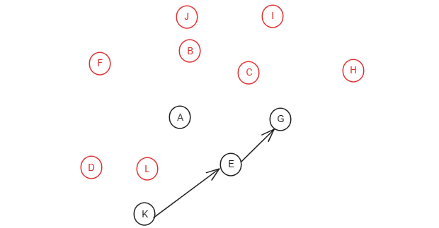

# AOV-网(有向图)的拓扑排序


**AOV网络与拓扑排序**

- 在网络中选择一个入度为0的顶点输出；
- 在图中删除该顶点及所有以该顶点为起点的边；
- 重复上述过程，直至所有边均被输出。

## **算法图解**


选择一个入度为0的顶点输出`F`，删除该顶点及所有以该顶点为起点的边


选择一个入度为0的顶点输出`J`，删除该顶点及所有以该顶点为起点的边


选择一个入度为0的顶点输出`B`，删除该顶点及所有以该顶点为起点的边


选择一个入度为0的顶点输出`C`，删除该顶点及所有以该顶点为起点的边


选择一个入度为0的顶点输出`I`，删除该顶点及所有以该顶点为起点的边


选择一个入度为0的顶点输出`H`，删除该顶点及所有以该顶点为起点的边


选择一个入度为0的顶点输出`D`，删除该顶点及所有以该顶点为起点的边


选择一个入度为0的顶点输出`L`，删除该顶点及所有以该顶点为起点的边



选择一个入度为0的顶点输出`A`，删除该顶点及所有以该顶点为起点的边


选择一个入度为0的顶点输出`K`，删除该顶点及所有以该顶点为起点的边


选择一个入度为0的顶点输出`E`，删除该顶点及所有以该顶点为起点的边


选择一个入度为0的顶点输出`G`，删除该顶点及所有以该顶点为起点的边


拓扑序列为：F J B C I H D L A K E G

## 计算各顶点的入度


对初始化的图求得的入度为

A入度为3，B入度为1，C的入度为2，D的入度为0，E的入度为1，F的入度为0，G的入度为2，H的入度为2，I的入度为2，J的入度为1，K的入度为1，L的入度为1


```c
/*
 * 计算各顶点的入度
 */
static void FindInDegree(ALGraph G, int indegree[MAX_VERTEX_NUM]) {
    int i;
    ArcNode* p;

    // 初始化所有顶点的入度为0
    for(i = 0; i < G.vexnum; i++) {
        indegree[i] = 0;
    }

    // 遍历所有顶点
    for(i = 0; i < G.vexnum; i++) {
        // 指向该顶点的首个邻接点
        p = G.vertices[i].firstarc;

        // 遍历该顶点的所有邻接点，统计各顶点的入度
        while(p != NULL) {
            indegree[p->adjvex]++;
            p = p->nextarc;
        }
    }
}
```

## 拓扑排序

```c
/*
 * 如果有向图G无回路，则输出它的一个拓扑序列并返回OK；否则，返回FALSE。
 * 拓扑序列通常不唯一，但是必须保证某些关键节点的先后次序。
 */
Status TopologicalSort(ALGraph G, int topo[MAX_VERTEX_NUM]) {
    int i, k, count;
    int indegree[MAX_VERTEX_NUM];
    SqStack S;
    ArcNode* p;

    // 对各顶点求入度
    FindInDegree(G, indegree);

    // 初始化零入度顶点栈
    InitStack(&S);

    // 建立入度为0的顶点栈
    for(i = 0; i < G.vexnum; i++) {
        // 将入度为0的顶点添加到栈中
        if(indegree[i] == 0) {
            Push(&S, i);
        }
    }

    // 对拓扑序列中的顶点计数
    count = 0;

    // 遍历顶点栈
    while(!StackEmpty(S)) {
        // 获取一个零入度顶点
        Pop(&S, &i);

        // 将各顶点的序号暂存起来
        topo[count++] = i;

        // 遍历i号顶点的邻接点
        for(p = G.vertices[i].firstarc; p != NULL; p = p->nextarc) {
            // 获取顶点序号
            k = p->adjvex;

            /*
             * 将i号顶点每个邻接点的入度减一，这相当于切段i号顶点到其它邻接点的联系。
             * 如果出现了新的入度为0的顶点，继续将其入栈。
             */
            if((--indegree[k]) == 0) {
                Push(&S, k);
            }
        }
    }

    // 如果遇到了回路，则返回ERROR
    if(count < G.vexnum) {
        return ERROR;
    } else {
        return OK;
    }
}
```

