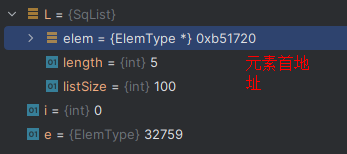

# 顺序存储结构

## 结构定义

```c
/* 顺序表元素类型定义 */
typedef int ElemType;

/*
 * 顺序表结构
 *
 * 注：elem在使用前需要先为其分配内存，且元素从elem[0]处开始存储
 */
typedef struct {
    ElemType* elem;  // 顺序表存储空间的首地址
    int length;      // 顺序表的长度(包含多少元素)
    int listSize;    // 当前分配的存储容量(可以存储多少元素)
} SqList;
```


## 初始化


L指向链表的首地址

```c
/*
 * 初始化成功则返回OK，否则返回ERROR。
 */
Status InitList(SqList* L) {
    // 分配指定容量的内存，如果分配失败，则返回NULL
    // 分配LIST_INIT_SIZE * sizeof(ElemType)内存大小
    L->elem = (ElemType*) malloc(LIST_INIT_SIZE * sizeof(ElemType));
    if(L->elem == NULL){
        // 储存内存失败
        exit(OVERFLOW);
    }
    L->length = 0;                 // 初始化顺序表长度为0(包含多少元素)
    L->listSize = LIST_INIT_SIZE;  // 顺序表初始内存分配量(可以存储多少元素)

    return OK;
}
```

## 销毁


```c
/*
 * 释放顺序表所占内存。
 */
Status DestroyList(SqList* L){
    // 确保顺序表结构存在
    if(L == NULL || L->elem == NULL){
        return ERROR;
    }

    // 释放顺序表内存
    free(L->elem);

    // 释放内存后置空指针
    L->length = 0;
    L->listSize = 0;
    return  OK;
}
```

## 置空

置空不会释放内存空间


```c
/*
 * 只是清理顺序表中存储的数据，不释放顺序表所占内存。
 */
Status ClearList(SqList* L){
    // 确保顺序表结构存在
    if(L == NULL || L->elem == NULL){
        return ERROR;
    }

    // 存储个数清空
    L->length = 0;

    return OK;
}
```

## 判空

```c
/*
 * 判断顺序表中是否包含有效数据。
 */

Status ListEmpty(SqList L){
    return L.length == 0 ? TRUE: FALSE;
}
```

## 计数

```c
/*
 * 返回顺序表包含的有效元素的数量。
 */
int ListLength(SqList L){
    return L.length;
}
```

## 取值

```c
/*
 * 获取顺序表中第i个元素，将其存储到e中。
 * 如果可以找到，返回OK，否则，返回ERROR。
 * i的含义是元素位置，从1开始计数
 */
Status GetElem(SqList L,int i, ElemType* e){
    // 因为i的含义是位置，所以其合法范围是：[1, length]
    if(i < 1 || i > L.length){
        return ERROR; //i值不合法
    }

    // 第i个元素对应下标为 i - 1
    *e = L.elem[i - 1];

    return OK;
}
```

## 插入

插入数字1,2,3,4,5



内存数据


```c
/*
 * 向顺序表第i个位置上插入e，插入成功则返回OK，否则返回ERROR。
 * i的含义是元素位置，从1开始计数
 */
Status ListInsert(SqList* L,int i,ElemType e){
    ElemType* newBase; // 用于内存不足时重新分配内存
    ElemType *p, *q;

    // 确保顺序表结构存在
    if(L == NULL || L->elem == NULL) {
        return ERROR;
    }

    // i值越界
    if(i < 1 || i > L->length + 1){
        return ERROR;
    }

    // 若存储空间已满，则增加新空间
    if(L->length >= L->listSize){
        // 基于现有空间扩充
        newBase = (ElemType *) realloc(L->elem,((L->listSize + LIST_INCREMENT) * sizeof(ElemType)));
        if(newBase == NULL){
            // 分配内存失败
            exit(OVERFLOW);
        }

        // 新开始地址
        L->elem = newBase;
        L->listSize = L->listSize + LIST_INCREMENT;
    }

    // q为插入位置的地址
    q = &(L->elem[i-1]);

    // 右移元素
    for(p = &(L->elem[L->length - 1]); p >= q; --p){
        *(p + 1) = *p;
    }

    // 插入e
    *q = e;

    // 表增长
    L->length = L->length + 1;

    return OK;
}
```

## 删除

```c
/*
 * 删除顺序表第i个位置上的元素，并将被删除元素存储到e中。
 * 删除成功则返回OK，否则返回ERROR。
 * i的含义是元素位置，从1开始计数
 */
Status ListDelete(SqList *L,int i,ElemType *e){

    ElemType *p,*q;

    // 确保顺序表结构存在
    if(L == NULL || L->elem == NULL) {
        return ERROR;
    }

    // i越界
    if(i < 1 || i > L->length){
        return ERROR;
    }

    // p 为删除元素的位置
    p = &(L->elem[i-1]);

    // 获取被删除的元素
    *e = *p;

    // 表尾元素位置
    q = L->elem + L->length - 1;

    // 将后面的元素向左移动
    for(++p; p <= q; ++p){
        *(p - 1) = *p;
    }

    // 表长减一
    L->length = L->length - 1;
    return OK;
}
```

## 遍历

```c
/*
 * 用visit函数访问顺序表L
 */
void ListTraverse(SqList L, void(Visit)(ElemType)){
    int i;
    for (i = 0; i < L.length; i++) {
        Visit(L.elem[i]);
    }

    printf("\n");
}
```

## 查找

```c
/*
 * 返回顺序表中首个与e满足Compare关系的元素位序。
 * 如果不存在这样的元素，则返回0。
 *
 *【备注】
 * 元素e是Compare函数第二个形参
 */
int LocateElem(SqList L,ElemType e,Status(Compare)(ElemType,ElemType)){
    int i;
    ElemType *p;
    // 确保顺序表结构存在
    if(L.elem == NULL){
        return ERROR;
    }

    /*
     * i的初值为第1个元素的位序
     *
     * 其实，更自然的写法是将i初始化为第1个元素的索引
     * 但由于教材中是按位序计数的，所以这里仍写作位序
     */
    i = 1;

    // p的初值为第1个元素的存储位置
    p = L.elem;

    // 遍历顺序表
    while (i <= L.length && !Compare(*p++,e)){
        ++i;
    }

    if(i <= L.length){
        return i;
    } else{
        return 0;
    }
}

```

## 前驱

```c
/*
 * 获取元素cur_e的前驱，
 * 如果存在，将其存储到pre_e中，返回OK，
 * 如果不存在，则返回ERROR。
 */
Status PriorElem(SqList L,ElemType cur_e,ElemType *pre_e){
    int i;
    // 确保顺序表结构存在，且最少包含两个元素
    if(L.elem == NULL || L.length < 2) {
        return ERROR;
    }
    // 这里的i初始化为第1个元素的【索引】
    i = 0;

    while (i < L.length && L.elem[i] != cur_e){
        ++i;
    }

    // 如果cur_e是首个元素(没有前驱)，或者没找到元素cur_e，返回ERROR
    if(i == 0 || i >= L.length){
        return ERROR;
    }

    // 存储cur_e的前驱
    *pre_e = L.elem[i - 1];

    return OK;
}
```

## 后继

```c
/*
 * 获取元素cur_e的后继，
 * 如果存在，将其存储到next_e中，返回OK，
 * 如果不存在，则返回ERROR。
 */

Status NextElem(SqList L, ElemType cur_e, ElemType* next_e){
    int i;
    // 确保顺序表结构存在，且最少包含两个元素
    if(L.elem == NULL || L.length < 2) {
        return ERROR;
    }
    // 这里的i初始化为第1个元素的【索引】
    i = 0;

    while (i < L.length-1 && L.elem[i] != cur_e){
        ++i;
    }

    if(i >= L.length - 1){
        return ERROR;
    }

    // 存储cur_e的后继
    *next_e = L.elem[i + 1];

    return OK;
}
```
