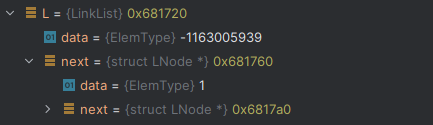
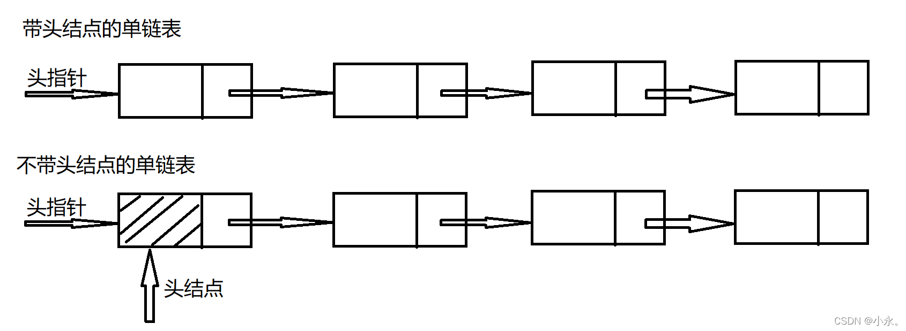
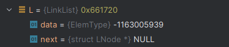
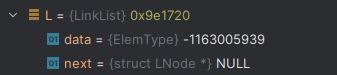

# 链式存储结构

## 结构定义

```c
/*
 * 单链表结构
 *
 * 注：这里的单链表存在头结点
 */
typedef struct LNode{
    ElemType data;      // 数据节点
    struct LNode *next; // 指向下一个节点的指针
} LNode;

// 指向单链表结点的指针
typedef LNode* LinkList;
```

带头结点的链表：头结点不设置data，头结点指向第一个元素






## 初始化



```c
/*
 * 只是初始化一个头结点。
 * 初始化成功则返回OK，否则返回ERROR。
 */
Status InitList(LinkList *L){
    // 分配内存
    (*L) = (LinkList) malloc(sizeof(LNode));
    if(*L == NULL){
        exit(-2);
    }

    (*L)->next = NULL;
    return OK;
}
```

## 销毁

销毁后内存被释放，头指针指向空(头结点也被释放)


```c
/*
 * 释放链表所占内存，头结点也会被清理。
 */
Status DestroyList(LinkList *L){

    // 用来存放下一个节点地址
    LinkList p;

    // 确保链表结构存在
    if(L == NULL || *L == NULL){
        return ERROR;
    }

    p = *L;

    while (p != NULL){
        p = (*L)->next;
        free(*L);
        // 头节点指向下一个节点
        (*L) = p;
    }

    *L = NULL;

    return OK;
}
```

## 置空

释放除了头结点以外的元素空间(头结点未被释放)



```c
/*
 * 这里需要释放链表中非头结点处的空间。
 */

Status ClearList(LinkList L){
    LinkList pre,p;

    // 确保链表存在
    if(L == NULL){
        return ERROR;
    }

    // 释放头节点以外的节点
    p = L->next;

    // 释放链表上所有结点所占内存
    while (p != NULL){
        pre = p;
        p = p->next;
        free(pre);
    }

    // 设置头节的下一个节点指针为空
    L->next = NULL;

    return OK;
}
```

## 判空

```c
/*
 * 判断链表中是否包含有效数据。
 */
Status ListEmpty(LinkList L){
    // 链表只有头结点时，认为该链表为空
    if(L != NULL && L->next == NULL){
        return TRUE;
    } else{
        return FALSE;
    }
}
```

## 计数

```c
/*
 * 返回链表包含的有效元素的数量。
 */
int ListLength(LinkList L){
    LinkList p;
    int i;

    // 确保链表存在且不为空
    if(L == NULL || L->next == NULL){
        return 0;
    }
    // 计数值
    i = 0;
    // 从非头节点开始计数
    p = L->next;

    // 遍历所有结点
    while (p != NULL){
        i++;
        p = p->next;
    }

    return i;
}
```

## 取值

```c
/*
 * 获取链表中第i个元素，将其存储到e中。
 * 如果可以找到，返回OK，否则，返回ERROR。
 *
 * i的含义是元素位置，从1开始计数
 */
Status GetElem(LinkList L, int i, ElemType* e){
    LinkList p;
    int j;

    // 确保链表存在且不为空
    if(L == NULL || L->next == NULL){
        return ERROR;
    }

    p = L;
    j = 0;

    // 寻找第i-1个结点，且保证该结点的后继不为NULL
    while (p->next != NULL && j < i - 1){
        p = p->next;
        ++j;
    }

    // 如果遍历到头了，或者i的值不合规(比如i<=0)，说明没找到合乎目标的结点
    if(p->next == NULL || j > i -1){
        return ERROR;
    }

    *e = p->next->data;
    return OK;
}
```

## 查找

```c
/*
 * 返回链表中首个与e满足Compare关系的元素位序。
 * 如果不存在这样的元素，则返回0。
 *
 *【备注】
 * 元素e是Compare函数第二个形参
 */
int LocateElem(LinkList L, ElemType e ,Status(Compare)(ElemType,ElemType)){
    int i;
    LinkList p;

    // 确保链表存在且不为空
    if(L == NULL || L->next == NULL){
        return ERROR;
    }

    i = 1;         // i的初值为第1个元素的位序
    p = L->next;   // p的初值为第1个元素的指针

    while (p != NULL && !Compare(p->data,e)){
        i++;
        p = p->next;
    }

    if(p != NULL){
        return i;
    } else{
        return 0;
    }
}
```

## 前驱

```c
/*
 * 获取元素cur_e的前驱，
 * 如果存在，将其存储到pre_e中，返回OK，
 * 如果不存在，则返回ERROR。
 */
Status PriorElem(LinkList L, ElemType cur_e, ElemType *pre_e){
    LinkList pre,next;

    // 确保链表存在且不为空
    if(L == NULL || L->next == NULL){
        return ERROR;
    }

    // 指向第一个元素
    pre = L->next;

    // 第一个元素没有前驱
    if(pre->data == cur_e){
        return ERROR;
    }

    // 指向第2个元素
    next = pre->next;

    // 从第2个元素开始，查找cur_e的位置
    while (next != NULL && next->data != cur_e){
        pre = next;
        next = next->next;
    }

    // 如果没找到元素cur_e,查找失败，返回ERROR
    if(next == NULL){
        return ERROR;
    }

    *pre_e = pre->data;

    return OK;
}
```

## 后继

```c
/*
 * 获取元素cur_e的后继，
 * 如果存在，将其存储到next_e中，返回OK，
 * 如果不存在，则返回ERROR。
 */
Status NextElem(LinkList L, ElemType cur_e, ElemType *nex_e){
    LinkList pre;

    // 确保链表存在且不为空
    if(L == NULL || L->next == NULL){
        return ERROR;
    }

    // 指向第1个元素
    pre = L->next;

    // 从第1个元素开始，查找cur_e的位置，且保证该结点的后继不为NULL
    while (pre->next != NULL && pre->data != cur_e){
        pre = pre->next;
    }

    if(pre->next == NULL){
        return ERROR;
    }

    *nex_e = pre->next->data;

    return OK;
}
```

## 插入

```c
/*
 * 向链表第i个位置上插入e，插入成功则返回OK，否则返回ERROR。
 * i的含义是元素位置，从1开始计数
 */
Status ListInsert(LinkList L,int i,ElemType e){
    LinkList p,s;
    int j;
    // 确保链表存在
    if(L == NULL){
        return ERROR;
    }
    p = L;
    j = 0;

    // 寻找第i-1个结点，且保证该结点本身不为NULL
    while (p != NULL && j < i-1){
        j++;
        p=p->next;
    }

    // 如果遍历到头了，或者i的值不合规(比如i<=0)，说明没找到合乎目标的结点
    if(p == NULL || j > i -1){
        return ERROR;
    }

    // 生成新的结点
    s = (LinkList) malloc(sizeof(LNode));
    if(s == NULL){
        exit(-2);
    }

    s->data = e;
    s->next = p->next;
    p->next = s;
    return OK;
}
```

## 删除

```c
/*
 * 删除链表第i个位置上的元素，并将被删除元素存储到e中。
 * 删除成功则返回OK，否则返回ERROR。
 * i的含义是元素位置，从1开始计数
 */
Status ListDelete(LinkList L,int i,ElemType* e){
    int j;
    LinkList p,q;
    // 确保链表存在且不为空
    if(L == NULL || L->next == NULL){
        return ERROR;
    }

    p = L;
    j = 0;

    // 寻找第i-1个结点，且保证该结点的后继不为NULL
    while (p->next != NULL && j < i -1){
        p = p->next;
        ++j;
    }

    // 如果遍历到头了，或者i的值不合规(比如i<=0)，说明没找到合乎目标的结点
    if(p->next == NULL || j > i - 1){
        return ERROR;
    }

    // 删除第i个结点
    q = p->next;
    // 移到后一个结点
    p->next = q->next;
    *e = q->data;
    free(q);

    return OK;
}
```

## 遍历

```c
/*
 * 用visit函数访问链表L
 */
void ListTraverse(LinkList L,void(Visit)(ElemType)){
    LinkList p;
    // 确保链表存在且不为空
    if(L == NULL || L->next == NULL){
        return;
    }

    p = L->next;

    while (p != NULL){
        Visit(p->data);
        p = p->next;
    }
    printf("\n");
}
```

## 头插法创建链表

```c
/*
 * 头插法创建链表
 * n 元素的个数
 */
Status CreateList_Head(LinkList* L, int n){
    int i;
    LinkList p;

    // 建立头结点
    *L = (LinkList) malloc(sizeof(LNode));
    (*L)->next = NULL;
    printf("请输入%d个降序元素：", n);

    for(i = 1; i <= n; i++){
        // 生成新结点
        p = (LinkList) malloc(sizeof(LNode));

        // 填充数据，并插入到链表中
        scanf("%d",&(p->data));

        p->next = (*L)->next;
        (*L)->next = p;
    }

    return OK;
}
```

## 尾插法创建链表

```c
/*
 * 尾插法创建链表
 * n 元素的个数
 */
Status CreateList_Tail(LinkList* L, int n){
    int i;
    LinkList p,q;
    // 建立头结点
    *L = (LinkList) malloc(sizeof(LNode));
    (*L)->next = NULL;

    printf("请输入%d个升序元素：", n);

    for(i = 1,q = *L; i <= n; ++i){
        // 生成新结点
        p = (LinkList) malloc(sizeof(LNode));

        // 填充数据，并插入到链表中
        scanf("%d",&(p->data));

        q->next = p;
        q = q->next;
    }

    q->next = NULL;

    return OK;
}
```
