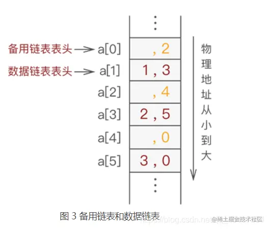
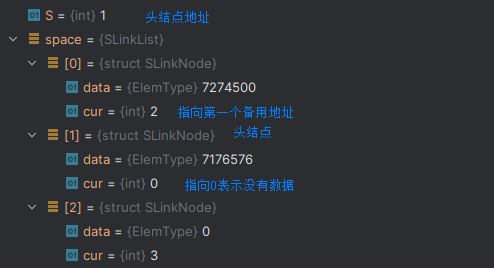
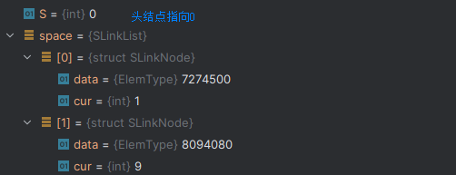
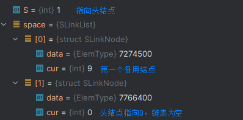
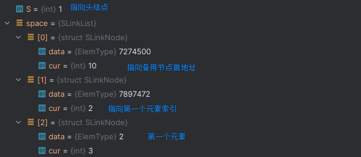

# 静态链表



a[0] 指向备用地址首地址

S 存储头结点索引(头节点不存储内容)

## 初始化备用空间

```c
/*
 * 初始化备用空间
 *
 * 备用空间为静态链表提供可用的内存。
 */
void InitSpace(SLinkList space){
    int i;

    for(i = 0; i < MAXSIZE - 1; i++){
        // 指向下一个结点
        space[i].cur = i + 1;
    }

    space[MAXSIZE - 1].cur = 0;
}
```

## 申请空间

```c
/*
 * 为静态链表从备用空间申请结点空间，
 * 如果申请成功，返回可用空间的索引，
 * 申请失败时，返回0。
 */
int Malloc(SLinkList space){
    int i = space[0].cur;

    if(i != 0){
        // 将申请到的空间从备用空间中删去
        space[0].cur = space[i].cur;
    }

    // 返回新申请结点下标
    return i;
}
```

## 回收空间

```c
/*
 * 回收空间
 *
 * 回收索引k处的结点空间以供静态链表后续复用，
 * 回收方式就是将该结点空间从静态链表上移除，
 * 并将其添加到备用空间的列表当中。
 */
void Free(SLinkList space, int k){
    space[k].cur = space[0].cur;
    space[0].cur = k;
}
```

## 初始化



```c
/*
 * 先初始化备用空间，而后从备用空间中申请头结点的空间，进而完成静态链表的初始化。
 * 初始化成功则使用S存储头结点索引，且返回OK，否则返回ERROR。
 */
Status InitList(SLinkList space,int* S){
    int index;
    // 初始化备用空间
    InitSpace(space);

    // 申请头结点空间
    index = Malloc(space);

    if(index == 0){
        return ERROR;
    }

    space[index].cur = 0;

    *S = index;
    return OK;
}
```

## 销毁

头结点也会被销毁，所有空间都是备用空间



```c
/*
 * 释放静态链表所占内存，即将静态链表所有结点空间移入备用空间列表中。
 */
Status DestroyList(SLinkList space, int* S){
    int cur;

    // S为头结点索引
    // 确保静态链表存在
    if(S == NULL || *S == 0){
        return ERROR;
    }
    while (*S != 0){
        // 暂存下一个结点的索引
        cur = space[*S].cur;
        // 回收当前结点所占空间
        Free(space,*S);
        // 前进到下一个结点的索引处
        *S = cur;
    }
    return OK;
}
```

## 置空

只保留头结点



```c
/*
 * 这里需要释放静态链表中非头结点处的空间。
 */
Status ClearList(SLinkList space,int S){
    int P;
    int cur;

    // 确保静态链表存在
    if(S == 0){
        return ERROR;
    }

    // 获取静态链表首个结点的索引
    P = space[S].cur;

    while (P != 0){
        // 暂存下一个结点的索引
        cur = space[P].cur;
        // 回收当前结点所占空间
        Free(space,P);
        // 前进到下一个结点的索引处
        P = cur;
    }

    space[S].cur = 0;
    return OK;
}
```

## 判空

```c
/*
 * 判断静态链表中是否包含有效数据。
 */
Status ListEmpty(SLinkList space, int S){
    // 只存在头结点的静态链表被视为空表
    if(S != 0 && space[S].cur == 0){
        return TRUE;
    } else{
        return FALSE;
    }
}
```

## 计数

```c
/*
 * 返回静态链表包含的有效元素的数量。
 */
int ListLength(SLinkList space, int S){
    int count;

    // 静态链表不存在，或静态链表为空时，返回0
    if(S == 0 || space[S].cur == 0){
        return 0;
    }

    // 获取静态链表首个元素的索引
    S = space[S].cur;
    count = 0;

    while (S != 0){
        count++;
        S = space[S].cur;
    }

    return count;
}

```

## 取值

```c
/*
 * 获取静态链表中第i个元素，将其存储到e中。
 * 如果可以找到，返回OK，否则，返回ERROR。
 *
 *【备注】
 * i的含义应该指索引，即从0开始计数
 */
Status GetElem(SLinkList space, int S, int i, ElemType* e){
    int count;

    // 确保静态链表存在且不为空
    if(S == 0 || space[S].cur == 0){
        return ERROR;
    }

    // 获取静态链表首个元素的索引
    S = space[S].cur;
    count = 0;

    while (S != 0 && count < i - 1){
        count++;
        S = space[S].cur;
    }

    // 获取到了最后一个结点或找到了最后一个
    if(S == 0 || count > i - 1){
        return ERROR;
    }

    *e = space[S].data;

    return OK;
}
```

## 查找

```c
/*
 * 返回静态链表中首个与e满足Compare关系的元素位序。
 * 如果不存在这样的元素，则返回0。
 *
 *【备注】
 * 1.元素e是Compare函数第二个形参
 */
int LocateElem(SLinkList space, int S, ElemType e, Status(Compare)(ElemType, ElemType)){
    int i;
    int p;

    // 确保静态链表存在且不为空
    if(S == 0 || space[S].cur == 0){
        return 0;
    }

    i = 1;             // i的初值为第1个元素的位序
    p = space[S].cur;  // p的初值为第1个元素的索引

    while (p != 0 && !Compare(space[p].data,e)){
        i++;
        p = space[p].cur;
    }

    if(p!=0){
        return i;
    } else{
        return 0;
    }
}
```

## 前驱

```c
/*
 * 获取元素cur_e的前驱，
 * 如果存在，将其存储到pre_e中，返回OK，
 * 如果不存在，则返回ERROR。
 */
Status PriorElem(SLinkList space, int S, ElemType cur_e, ElemType* pre_e){
    int pre,next;

    // 确保静态链表存在且不为空
    if(S == 0 || space[S].cur == 0){
        return ERROR;
    }

    // 指向第一个元素
    pre = space[S].cur;

    // 如果查找的元素是第一个元素
    if(space[pre].data == cur_e){
        return ERROR;
    }

    // 指向第2个元素
    next = space[pre].cur;

    // 从第2个元素开始，查找cur_e的位置
    while (next != 0 && space[next].data != cur_e){
        pre = next;
        next = space[next].cur;
    }

    // 如果没有找到元素cur_e, 查找失败，返回ERROR
    if(next == 0){
        return ERROR;
    }

    *pre_e = space[pre].data;

    return OK;
}
```

## 后继

```c
/*
 * 获取元素cur_e的后继，
 * 如果存在，将其存储到next_e中，返回OK，
 * 如果不存在，则返回ERROR。
 */
Status NextElem(SLinkList space, int S, ElemType cur_e, ElemType* next_e){
    int pre;

    // 确保静态链表存在且不为空
    if(S == 0 || space[S].cur == 0){
        return ERROR;
    }

    // 指向第1个元素
    pre = space[S].cur;

    // 从第1个元素开始，查找cur_e的位置，且保证该结点后继存在
    while (space[pre].cur != 0 && space[pre].data != cur_e){
        pre = space[pre].cur;
    }

    // 如果没有找到cur_e,或者找到了，但它没有后继，均返回ERROR
    if(space[pre].cur == 0){
        return ERROR;
    }

    *next_e = space[space[pre].cur].data;

    return OK;
}
```

## 插入



```c
/*
 * 向静态链表第i个位置上插入e，插入成功则返回OK，否则返回ERROR。
 *
 *【备注】
 * i的含义是元素位置，从1开始计数
 */
Status ListInsert(SLinkList space, int S, int i, ElemType e){
    int p,s;
    int j;

    // 确保静态链表存在
    if(S == 0){
        return ERROR;
    }

    p = S;
    j = 0;

    // 寻找第i-1个结点，且保证该结点本身存在
    while(p != 0 && j < i - 1) {
        p = space[p].cur;
        ++j;
    }

    // 如果遍历到头了，或者i的值不合规(比如i<=0)，说明没找到合乎目标的结点
    if(p == 0 || j > i - 1) {
        return ERROR;
    }

    // 生成新结点
    s = Malloc(space);
    space[s].data = e;
    space[s].cur = space[p].cur;
    space[p].cur = s;

    return OK;
}
```

## 删除

```c
/*
 * 删除静态链表第i个位置上的元素，并将被删除元素存储到e中。
 * 删除成功则返回OK，否则返回ERROR。
 *
 *【备注】
 * i的含义是元素位置，从1开始计数
 */
Status ListDelete(SLinkList space, int S, int i, ElemType* e) {
    int p,q;
    int j;

    // 确保静态链表存在
    if(S == 0){
        return ERROR;
    }

    p = S;
    j = 0;

    // 寻找第i-1个结点，且保证该结点的后继存在
    while (space[p].cur != 0 && j < i - 1){
        p = space[p].cur;
        ++j;
    }

    // 如果遍历到头了，或者i的值不合规(比如i<=0),说明没找到合乎目标的结点
    if(space[p].cur == 0 || j > i-1){
        return ERROR;
    }

    // 删除第i个结点
    q = space[p].cur;
    space[p].cur = space[q].cur;
    *e = space[q].data;
    Free(space,q);
    return OK;
}
```

## 遍历

```c
/*
 * 用visit函数访问静态链表S
 */
void ListTraverse(SLinkList space,int S,void(Visit)(ElemType)){
    int p;

    // 确保链表存在
    if(S == 0 || space[S].cur == 0){
        return;
    }

    p = space[S].cur;

    while (p != 0){
        Visit(space[p].data);
        p = space[p].cur;
    }

    printf("\n");
}
```
