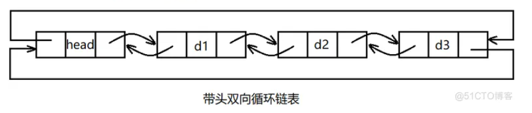
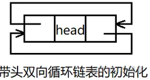
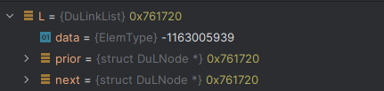
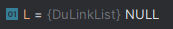
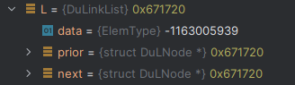
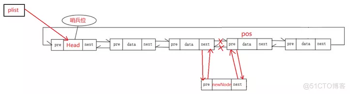
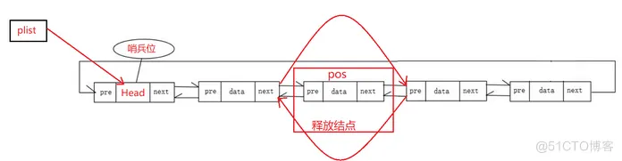

# 双向循环链表

## 结构定义

```c
/* 双向循环链表元素类型定义 */
typedef int ElemType;

/*
 * 双向循环链表结构
 *
 * 注：这里的双向循环链表存在头结点
 */
typedef struct DuLNode {
    ElemType data;
    struct DuLNode* prior;  // 前驱
    struct DuLNode* next;   // 后继
} DuLNode;

// 指向双向循环链表结点的指针
typedef DuLNode* DuLinkList;
```



## 初始化



存储的结构



头结点的`prior`和`next`都指向头结点地址[0X761720]

```c
/*
 * 初始化成功则返回OK，否则返回ERROR。
 */

Status InitList(DuLinkList* L){
    *L = (DuLinkList) malloc(sizeof(DuLNode));
    if(*L == NULL){
        exit(-2);
    }

    // 前驱和后继均指向自身
    (*L)->next = (*L)->prior = *L;

    return OK;
}
```

## 销毁



销毁会释放所有内存（包括头结点）

```c
/*
 * 释放双向循环链表所占内存。
 */
Status DestroyList(DuLinkList* L){
    // 确保链表结构存在
    if(L == NULL || *L == NULL){
        return ERROR;
    }
    ClearList(*L);

    free(*L);

    *L = NULL;

    return OK;
}
```

## 置空



置空后头结点的`prior`和`next`都指向头结点地址[0X671720]

```c
/*
 * 这里需要释放双向循环链表中非头结点处的空间。
 */
Status ClearList(DuLinkList L){
    DuLinkList p,q;
    if(L == NULL){
        return ERROR;
    }

    p = L->next;

    while (p != L){
        q = p->next;
        free(p);
        p = q;
    }

    L->next = L->prior = L;

    return OK;
}
```

## 判空

```c
/*
 * 判断双向循环链表中是否包含有效数据。
 */
Status ListEmpty(DuLinkList L){
    if(L != NULL && L->next == L && L->prior == L){
        return TRUE;
    } else{
        return FALSE;
    }
}

```

## 计数

```c
/*
 * 返回双向循环链表包含的有效元素的数量。
 */
int ListLength(DuLinkList L){
    DuLinkList p;
    int i;

    if(L == NULL || L->next == L || L->prior == L){
        return 0;
    }

    i = 0;
    p = L->next;
    while (p != L){
        i++;
        p = p->next;
    }

    return i;
}
```

## 取值

```c
/*
 * 获取双向循环链表中第i个元素，将其存储到e中。
 * 如果可以找到，返回OK，否则，返回ERROR。
 *
 *【备注】
 * i的含义应该指索引，即从0开始计数。
 */
Status GetElem(DuLinkList L, int i, ElemType* e){
    DuLinkList p;
    int j;

    // 确保双向循环链表存在
    if(L == NULL || L->next == L || L->prior == L){
        return ERROR;
    }

    p = L;
    j = 0;

    while (p->next != L && j < i - 1){
        ++j;
        p = p->next;
    }
    // 如果遍历到头了，或者i的值不合规(比如i<=0)，说明没找到合乎目标的结点
    if(p->next == L || j > i - 1){
        return ERROR;
    }

    *e = p->next->data;

    return OK;
}
```

## 查找

```c
/*
 * 返回双向循环链表中首个与e满足Compare关系的元素位序。
 * 如果不存在这样的元素，则返回0。
 *
 *【备注】
 * 元素e是Compare函数第二个形参
 */
int LocateElem(DuLinkList L, ElemType e, Status(Compare)(ElemType, ElemType)){
    int i;
    DuLinkList p;

    // 确保双向循环链表存在
    if(L == NULL || L->next == L || L->prior == L){
        return ERROR;
    }

    i = 1;        // i的初值为第1个元素的位序
    p = L->next;  // p的初值为第1个元素的指针

    while (p != L && !Compare(p->data,e)){
        i++;
        p = p->next;
    }

    if(p != L){
        return i;
    } else{
        return 0;
    }
}
```

## 前驱

```c
/*
 * 获取元素cur_e的前驱，
 * 如果存在，将其存储到pre_e中，返回OK，
 * 如果不存在，则返回ERROR。
 */
Status PriorElem(DuLinkList L, ElemType cur_e, ElemType* pre_e){
    DuLinkList p;

    // 确保双向循环链表存在
    if(L == NULL || L->next == L || L->prior == L) {
        return ERROR;
    }

    // 指向第1个元素
    p = L->next;

    // 第1个元素没有前驱
    if(p->data == cur_e){
        return ERROR;
    }

    // 指向第2个元素
    p = p->next;

    while (p != L && p->data != cur_e){
        p = p->next;
    }

    if(p == L){
        return ERROR;
    }

    *pre_e = p->prior->data;

    return OK;
}

```

## 后继

```c
/*
 * 获取元素cur_e的后继，
 * 如果存在，将其存储到next_e中，返回OK，
 * 如果不存在，则返回ERROR。
 */
Status NextElem(DuLinkList L, ElemType cur_e, ElemType* next_e) {
    DuLinkList p;

    // 确保双向循环链表存在
    if(L == NULL || L->next == L || L->prior == L) {
        return ERROR;
    }

    // 指向第1个元素
    p = L->next;

    while (p != NULL && p->data != cur_e){
        p = p->next;
    }

    // 从第1个元素开始，查找cur_e的位置，且保证该结点的后继不为L
    if(p->next == L){
        return ERROR;
    }

    // 如果没找到cur_e，或者找到了，但它没有后继，均返回ERROR
    *next_e = p->next->data;

    return OK;
}
```

## 插入




```c
/*
 * 向双向循环链表第i个位置上插入e，插入成功则返回OK，否则返回ERROR。
 *
 *【备注】
 * i的含义是元素位置，从1开始计数
 */
Status ListInsert(DuLinkList L, int i, ElemType e){
    DuLinkList p,s;

    // 确保双向链表存在(但可能为空)
    if(L == NULL){
        return ERROR;
    }

    // 查找第i个结点位置(引用)
    p = GetElemP(L,i);
    if(p == NULL){
        return ERROR;
    }

    // 创建新结点
    s = (DuLinkList) malloc(sizeof(DuLNode));

    if(s == NULL){
        exit(-2);
    }
    s->data = e;

    // 将s插入到p的前面,称为第i个结点
    s->prior = p->prior;
    p->prior->next = s;
    s->next = p;
    p->prior = s;

    return OK;
}
```

## 删除



```c
/*
 * 删除双向循环链表第i个位置上的元素，并将被删除元素存储到e中。
 * 删除成功则返回OK，否则返回ERROR。
 *
 *【备注】
 * i的含义是元素位置，从1开始计数
 */
Status ListDelete(DuLinkList L, int i, ElemType* e){
    DuLinkList p;

    // 确保双向循环链表存在
    if(L == NULL || L->next == L || L->prior == L) {
        return ERROR;
    }

    // 查找第i个结点位置(引用)
    p = GetElemP(L,i);
    if(p == NULL){
        return ERROR;
    }

    // 如果p==L，说明待删除元素是第len+1个元素，不合规
    if(p == L) {
        return ERROR;
    }

    *e = p->data;

    p->prior->next = p->next;
    p->next->prior = p->prior;

    free(p);

    return OK;
}
```

## 遍历

```c
/*
 * 用visit函数访问双向循环链表L
 */
void ListTraverse(DuLinkList L, void(Visit)(ElemType)){
    DuLinkList p;

    // 确保双向循环链表存在
    // 确保双向循环链表存在
    if(L == NULL || L->next == L || L->prior == L) {
        return;
    }

    p = L->next;

    while (p != L){
        Visit(p->data);
        p = p->next;
    }

    printf("\n");
}
```

## 获取循环链表 L 上第 i 个元素的引用

```c
/*
 * 获取循环链表L上第i个元素的引用
 *
 * 【备注】
 * 1.加static的含义是当前函数只在DuLinkList中使用，不会被别的文件引用
 * 2.假设链表长度为len，且需要获取第len+1个元素的引用时，由于这里是循环链表，所以返回的是头结点
 */
static DuLinkList GetElemP(DuLinkList L, int i){
    DuLinkList p;
    int count;

    // 确保双向循环链表存在(但可能为空表)
    if(L == NULL){
        return ERROR;
    }

    // 下标不合规
    if(i < 1){
        return ERROR;
    }

    p = L;
    count = 0;

    // 尝试查找第i个元素
    while (p->next != L && count < i){
        p = p->next;
        ++count;
    }

    // 恰好找到第i个元素
    if(count == i){
        return p;
    }

    // 至此，说明p->next==L，此时需要判断i是否过大
    if(count + 1 < i){
        return NULL;
    }
    // 至此，说明需要在len+1的位置上插入元素(最后一个元素)
    return L;
}
```
