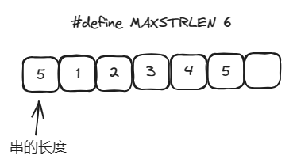
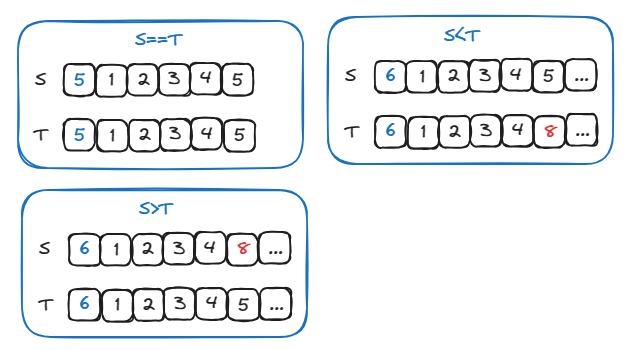
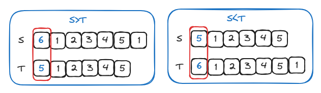
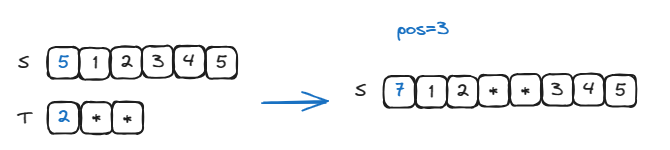
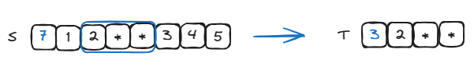
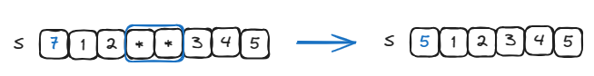

# 串的定长顺序存储表示

## 结构定义

```c
/* 宏定义 */
#define MAXSTRLEN 255  // 顺序串的最大串长

/*
 * 串的顺序存储类型定义
 *
 * 注：有效元素从SString的1号单元开始存储
 *     SString的0号单元用来存储其长度
 */
typedef unsigned char SString[MAXSTRLEN + 1]; // 0号单元存放串的长度
```

## 初始化



::: code-group

```c [SString.c]
/*
 * 构造一个值为chars的串T。
 *
 *【注】
 * 该操作属于最小操作子集
 */
Status StrAssign(SString T, const char* chars){
    int i,len;

    // 获取str的长度
    len = (int) strlen(chars);

    // chars过长
    if(len > MAXSTRLEN){
        return ERROR;
    }

    // 0号单元存放串的长度
    T[0] = len;
    for(i = 1; i <= len; i++){
        T[i] = chars[i - 1];
    }

    return OK;
}
```

```c [main.c]
#include <stdlib.h>
#include "SString.h"


int main() {
    char* chars = "12345";
    SString S;

    // 初始化串
    StrAssign(S, chars);

    return 0;
}

```

:::

## 销毁

```c
/*
 * 将串S销毁。
 *
 *【注】
 * 顺序串的结构无法销毁
 */
Status DestroyString(SString S){
    return OK;
}
```

## 清空

```c
/*
 * 将串S清空。
 */
Status ClearString(SString S){
    // 只需要将长度置为0就可以
    S[0] = 0;
    return OK;
}
```

## 判空

```c
/*
 * 判断串S中是否包含有效数据。
 */
Status StrEmpty(SString S) {
    return S[0] == 0 ? TRUE : FALSE;
}
```

## 计数

```c
/*
 * 返回串S中元素的个数。
 */
int StrLength(SString S) {
    return S[0];
}
```

## 复制

```c
/*
 * 将串S复制到串T。
 */
Status StrCopy(SString T, SString S){
    int i;

    // 连同长度信息一起复制
    for(i = 0; i<= S[0]; i++){
        T[i] = S[i];
    }

    return OK;
}
```

## 比较

比较第一位不同的元素



如果到最后都没有不同，则长的那一方更大



```c
/*
 * 比较串S和串T，返回比较结果。
 *
 *【注】
 * 该操作属于最小操作子集
 */
int StrCompare(SString S, SString T) {
    int i = 1;
    while (i <= S[0] && i <= T[0]){
        // 遇到不同的字符时，比较其大小
        if(S[i] != T[i]){
            // 比较最后一个不同元素的大小
            return S[i] - T[i];
        }
        i++;
    }

    // 如果最后都没有匹配完就比长度
    return S[0] - T[0];
}
```

## 插入



```c
/*
 * 将串T插入到主串S的pos位置处。
 */
Status StrInsert(SString S, int pos, SString T){
    int i;

    if(pos < 1 || pos > S[0] + 1 || S[0] + T[1] > MAXSTRLEN){
        return ERROR;
    }

    // 如果待插入的串为空，则提前返回
    if(StrEmpty(T)){
        return OK;
    }

    // 在S中腾出位置，为插入T做准备
    for(i = S[0]; i >= pos; i--){
        // 从后向前遍历，将前面的元素挪到后面
        S[i + T[0]] = S[i];
    }

    // 将串T插入在S中腾出的位置上
    for(i = pos; i <= pos + T[0] - 1; i++){
        S[i] = T[i - pos + 1];
    }

    // 长度增加
    S[0] += T[0];

    return OK;
}
```

## 求子串

获取 S 中第 2 个字符起的 3 个字符 pos = 2,len = 3



```c
/*
 * 用Sub返回S[pos, pos+len-1]。
 * 返回值指示是否截取成功。
 *
 *【注】
 * 该操作属于最小操作子集
 */
Status SubString(SString Sub, SString S, int pos, int len){
    int i;

    // 起始位置和结束位置是否有效
    if(pos < 1 || pos > S[0] || len < 0 || pos + len - 1 > S[0]){
        return ERROR;
    }

    // 复制元素
    for(i = 1; i <= len; i++){
        Sub[i] = S[pos + i - 1];
    }

    // 确定新的长度
    Sub[0] = len;

    return OK;
}
```

## 删除

删除 S 中第 3 个字符起的 2 个字符 pos = 3,len = 2



```C
/*
 * 删除S[pos, pos+len-1]。
 */
Status StrDelete(SString S, int pos, int len){
    int i;

    if(pos < 1 || pos + len -1 > S[0] || len < 0){
        return ERROR;
    }

    // 如果待删除的长度为0，则提前返回
    if(len == 0){
        return OK;
    }

    // 把后面的元素挪到前面，覆盖掉被删除的元素
    for(i = pos + len; i <= S[0];i++){
        S[i - len] = S[i];
    }

    // 长度减少
    S[0] -= len;

    return OK;
}

```

## 串联接

```c
/*
 * 联接S1和S2，并存储到T中返回。如果联接后的长度溢出，则只保留未溢出的部分。
 * 返回值表示联接后的串是否完整。
 *
 *【注】
 * 该操作属于最小操作子集
 */
Status Concat(SString T, SString S1, SString S2){
    int i;
    int uncut;  // 新串是否完整

    // 完全不需要裁剪
    if(S1[0] + S2[0] <= MAXSTRLEN){
        // 复制S1到T中
        for(i = 1; i<= S1[0]; i++){
            T[i] = S1[i];
        }

        // 复制S2到T中
        for(i = S1[0] + 1; i <= S1[0]; i++){
            T[i] = S2[i - S1[0]];
        }

        // 设置新长度
        T[0] = S1[0] + S2[0];

        // 未采集，完整
        uncut = TRUE;

        // 需要裁剪S2
    } else if (S1[0] <= MAXSTRLEN){
        // 复制S1到T中
        for(i = 1; i<= S1[0]; i++){
            T[i] = S1[i];
        }

        // 将S2的一部分复制到T中
        for(i = S1[0] + 1; i <= MAXSTRLEN; i++){
            T[i] = S2[i - S1[0]];
        }

        // 设置新长度
        T[0] = MAXSTRLEN;

        uncut = FALSE;

        // 只需要复制S1的一部分
    } else{
        // 连同长度信息一起复制
        for(i = 0; i <= MAXSTRLEN; i++){
            T[i] = S1[i];
        }

        uncut = FALSE;
    }

    return uncut;
}
```
