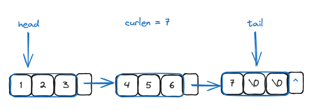
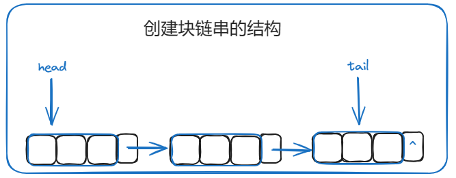
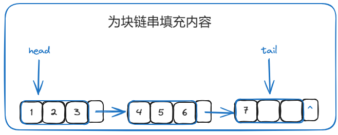
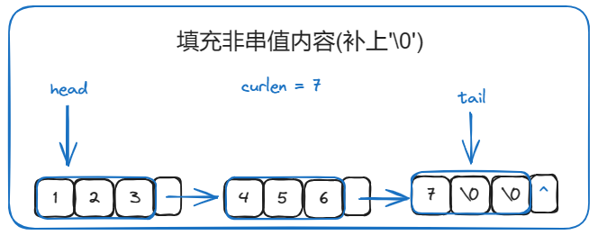
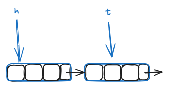

# 串的块链分配存储表示

块链大小决定每个块存储的元素个数，元素不够的填充`\0`



## 结构定义

```c
/* 宏定义 */
#define CHUNKSIZE 3   // 块大小

/* 串的块链存储结构 */
typedef struct Chunk{
    char ch[CHUNKSIZE]; // 当前块中的内容
    struct Chunk* next; // 指向下一个块
} Chunk;

/* 串的块链存储类型定义 */
typedef struct {
    Chunk* head;  // 串的头指针
    Chunk* tail;  // 串的尾指针
    int curlen;   // 串的当前长度
} LString;
```

## 初始化

1.创建块链串的结构



2.为块链串填充内容



3.如果存在未填满的块



```c
/*
 * 构造一个值为chars的串T。
 *
 *【注】
 * 该操作属于最小操作子集
 */
Status StrAssign(LString* T, const char* chars){
    int len;      // chars的长度
    int i,count;  // 遍历块链串和字符串chars的游标
    int m;        // 总块数
    int n;        // 如果存在未填满的块，存储该块中的有效元素数量
    Chunk* r;

    // 求chars的长度
    len = (int) strlen(chars);

    // 没有有效元素
    if(len == 0){
        T->head = NULL;
        T->tail = NULL;
        T->curlen = 0;
        return OK;
    }

    m = len / CHUNKSIZE;  // 先计算需要填满的块
    n = len % CHUNKSIZE;  // 如果存在未填满的块，计算该块中填充的有效元素数量

    if(n != 0){
        m++;       // 计算总块数
    }

    // 1.创建块链串的结构
    for(i = 1; i <=m; i++){
        // 创建新块
        r = (Chunk*) malloc(sizeof(Chunk));
        if(r == NULL){
            exit(-2);
        }
        r->next = NULL;

        // 第一个块
        if(i == 1){
            T->head = T->tail = r;
        } else{
            T->tail->next = r;
            T->tail = r;
        }
    }

    r = T->head;
    i = 0;        // 块链串T的游标
    count = 0;    // 统计遍历过的元素，顺便作为chars的游标

    // 2.为块链串填充内容
    while (count < len){
        r->ch[i] = chars[count];

        i = (i + 1) % CHUNKSIZE;

        // 如i = 2时共填充了3个元素，i = (2 + 1) % 3 = 0; 移到下一个块
        if(i == 0){
            r = r->next; // 指向下一个块
        }

        count++;
    }

    // 3.如果存在未填满的块
    if(n != 0){
        // 填充非串值内容(补上'\0')
        while (i < CHUNKSIZE){
            T->tail->ch[i] = '\0';
            i++;
        }
    }

    // 4.记录长度信息
    T->curlen = len;

    return OK;
}
```

## 销毁

```c
/*
 *【注】
 * 块链串的结构可以销毁，但不是在销毁操作中
 */
Status DestroyString(LString* S) {
    return OK;
}
```

## 清空

```c
/*
 * 将串S清空。
 */
Status ClearString(LString* S) {
    Chunk* p, * q;

    p = S->head;

    // 释放所有串占用的空间
    while (p != NULL){
        q = p->next;
        free(p);
        p = q;
    }

    S->head = NULL;
    S->tail = NULL;
    S->curlen = 0;

    return OK;
}
```

## 判空

```c
/*
 * 判断串S中是否包含有效数据。
 */
Status StrEmpty(LString S){
    return S.curlen == 0 ? TRUE : FALSE;
}
```

## 计数

```c
/*
 * 返回串S中元素的个数。
 *
 *【注】
 * 该操作属于最小操作子集
 */
int StrLength(LString S){
    return S.curlen;
}
```

## 复制

```c
/*
 * 将串S复制到串T。
 */
Status StrCopy(LString* T, LString S){
    int i;
    Chunk *s, *p;

    p = S.head;

    while (p != NULL){
        s = (Chunk*) malloc(sizeof (Chunk));
        if(s == NULL){
            exit(-2);
        }
        s->next = NULL;

        if(p == S.head){
            T->head = T->tail = s;
        } else{
            T->tail->next = s;
            T->tail = s;
        }

        // 填充内容
        for (i = 0; i < CHUNKSIZE;i++){
            s->ch[i] = p->ch[i];
        }
        p = p->next;
    }

    T->curlen = S.curlen;

    return OK;
}
```

## 比较

```c
/*
 * 比较串S和串T，返回比较结果。
 *
 *【注】
 * 该操作属于最小操作子集
 */
int StrCompare(LString S, LString T){
    int i;
    Chunk* s = S.head;
    Chunk* t = T.head;

    while (s != NULL && t != NULL){
        for (i = 0; i < CHUNKSIZE; i++){
            if(s->ch[i] != t->ch[i]){
                return s->ch[i] - t->ch[i];
            }
        }

        s = s->next;
        t = t->next;
    }

    if(s != NULL){
        // S > T
        return 1;
    }else if(t != NULL){
        // S < T
        return -1;
    } else{
        // S = T
        return 0;
    }
}
```

## 插入

复制T中的块（只复制结构)



查找S中第pos(**5**)个元素所在的块(**2**)(注：称为目标块),并用指针pre指向它的前驱,p指向插入位置


将h到t范围的块插入到pos(**5**)所在的块(**2**)之前


如果插入到了某个块(**2**)的“中间”第5个位置，j的值变为了1


复制T中的元素到S中,j的值变为2,i的值变为1


如果T中最后一个块中包含`\0` 前移


```c
/*
 * 插入
 *
 * 将串T插入到主串S的pos位置处。
 */
Status StrInsert(LString* S, int pos, LString T) {
    Chunk *pre, *p;    // pre指向目标块的前驱，p指向目标块
    Chunk *h, *t;      // 指向新增的块链的头部和尾部
    Chunk *r;
    Chunk *s;
    int i,j,count;

    if(pos < 1 || pos > S->curlen + 1){
        return ERROR;
    }

    // 如果待插入的串为空，则提前返回
    if(StrEmpty(T)){
        return OK;
    }

    // 记录待插入块的起始块和终止块
    h = t = NULL;

    // 复制T中的块（只复制结构)
    for(r = T.head; r != NULL; r = r->next){
        s = (Chunk*) malloc(sizeof(Chunk));
        if(s == NULL){
            exit(-2);
        }


        if(r == T.head){
            // 如果是第一节点
            h = t = s;
        } else{
            t->next = s;
            t = s;
        }
    }

    // 查找S中第pos个元素所在的块(注：称为目标块),并用指针pre指向它的前驱
    if(pos <= CHUNKSIZE){
        pre = NULL;  // 说明第pos个元素所在块为head
        p = S->head;
    } else{
        count = 1;
        pre = S->head;
        // 找到所在的块
        while (count < (pos - 1) / CHUNKSIZE){
            count++;
            pre = pre->next;
        }
        p = pre->next;
    }

    /*
     * 接下来，将h到t范围的块插入到pos所在的块之前
     */
    if(pre == NULL){
        // pos 所在块为head
        t->next = S->head;
        // 在块头插入
        S->head = h;
    } else{
        // pre指向目标块的前驱
        pre->next = h;
        // 表尾指向原来节点的下一个元素
        t->next = p;
    }

    // 如果插入在末尾,则需要移动队尾指针
    if(pre == S->tail){
        S->tail = t;
    }

    // 移动/复制元素
    j = 0;

    // 如果插入到了某个块的“中间”
    if((pos - 1) % CHUNKSIZE != 0){
        // 移动目标块中pos位置之前的元素
        for (i = 1; i <= (pos - 1) % CHUNKSIZE;i++){
            h->ch[j++] = p->ch[i - 1];
            p->ch[i - 1] = '\0';
        }
    }

    r = T.head;
    i = 0;

    // 复制T中的元素到S中
    for (count = 1; count <= T.curlen; count ++){
        h->ch[j] = r->ch[i];

        j = (j + 1) % CHUNKSIZE;
        i = (i + 1) % CHUNKSIZE;

        if(j == 0){
            // S中的h指针移到下一个节点
            h = h->next;
        }

        if(i == 0){
            // T中的r指针移到下一个节点
            r = r->next;
        }
    }

    // 如果T中最后一个块中包含'\0'
    if(T.curlen % CHUNKSIZE != 0){
        r = p; // 指向目标块
        i = (pos - 1) % CHUNKSIZE;

        // 移动原S块中pos位置及其之后的元素
        // 1,2,3,4,5,6,7; pos = 5; 移动5,6,7三个元素
        for(count = pos; count <= S->curlen;count++){
            h->ch[j] = r->ch[i];
            r->ch[i] = '\0';

            j = (j + 1) % CHUNKSIZE;
            i = (i + 1) % CHUNKSIZE;

            if(j == 0) {
                h = h->next;
            }

            if(i == 0) {
                r = r->next;
            }
        }
    }


    S->curlen += T.curlen;
    return OK;
}
```

## 求子串

```c
/*
 * 用Sub返回S[pos, pos+len-1]。
 * 返回值指示是否截取成功。
 *
 *【注】
 * 该操作属于最小操作子集
 */
Status SubString(LString* Sub, LString S, int pos, int len) {
    int m;      // Sub的总块数
    int n;      // 如果Sub存在未填满的块，存储该块中的有效元素数量
    int i, j, count;
    Chunk* r, * p;

    if(pos < 1 || pos > S.curlen || len < 0 || pos + len - 1 > S.curlen) {
        return ERROR;
    }

    // 如果是截取0个字符，不需要分配空间
    if(len == 0) {
        (*Sub).head = NULL;
        (*Sub).tail = NULL;
        (*Sub).curlen = 0;

        return OK;
    }

    m = len / CHUNKSIZE;    // 先计算需要填满的块
    n = len % CHUNKSIZE;    // 如果Sub存在未填满的块，计算该块中填充的有效元素数量
    if(n != 0) {
        m++;                // 计算Sub的总块数
    }

    // 1.创建Sub的结构
    for(i = 1; i <= m; i++) {
        // 创建新块
        r = (Chunk*) malloc(sizeof(Chunk));
        if(r == NULL) {
            exit(-2);
        }
        r->next = NULL;

        // 第一个块
        if(i == 1) {
            (*Sub).head = (*Sub).tail = r;

            // 联接后面的块
        } else {
            (*Sub).tail->next = r;
            (*Sub).tail = r;
        }
    }

    // 查找S中第pos个元素所在的块，并用指针p指向它
    for(count = 1, p = S.head; pos > count * CHUNKSIZE; count++, p = p->next) {
        // 空循环
    }

    r = (*Sub).head;            // 指向Sub的块

    i = 0;                      // 块链串Sub的游标
    j = (pos - 1) % CHUNKSIZE;  // 块链串S  的游标
    count = 0;                  // 统计遍历过的元素

    // 2.为块链串Sub填充内容
    while(count < len) {
        r->ch[i] = p->ch[j];

        i = (i + 1) % CHUNKSIZE;
        if(i == 0) {
            r = r->next;    // 指向Sub中下一个块
        }

        j = (j + 1) % CHUNKSIZE;
        if(j == 0) {
            p = p->next;    // 指向S中下一个块
        }

        count++;
    }

    // 3.如果存在未填满的块
    if(n != 0) {
        // 填充非串值内容(补上'\0')
        while(i < CHUNKSIZE) {
            (*Sub).tail->ch[i] = '\0';
            i++;
        }
    }

    // 4.记录长度信息
    (*Sub).curlen = len;

    return OK;
}
```

## 删除

```c
/*
 * 删除S[pos, pos+len-1]。
 */
Status StrDelete(LString* S, int pos, int len){
    Chunk *pre;    // 指向元素S[pos]所在的块的前驱
    Chunk *p;      // 指向元素S[pos]所在的块
    Chunk *q;      // 指向元素S[pos+len]所在的块
    Chunk *r;
    int i,j,count,total;

    if(pos < 1 || pos > S->curlen || len < 0 || pos + len - 1 > S->curlen){
        return ERROR;
    }

    // 如果待删除的长度为0，则提前返回
    if(len == 0) {
        return OK;
    }

    // 查找S[pos]所在的块，并用指针pre指向它的前驱
    if(pos <= CHUNKSIZE) {
        pre = NULL;     // 说明第pos个元素所在块为head
        p = (*S).head;
    } else {
        for(count = 1, pre = (*S).head; count < (pos - 1) / CHUNKSIZE; count++, pre = pre->next) {
            // 空循环
        }
        p = pre->next;
    }

    // 查找S[pos+len]所在的块
    for(count = (pos - 1) / CHUNKSIZE, q = p; count < (pos + len - 1) / CHUNKSIZE; count++, q = q->next) {
        // 空循环
    }

    // 计算可能需要移动的元素个数
    total = (*S).curlen - (pos + len) + 1;

    // 把最终的长度先定下来
    (*S).curlen -= len;

    i = (pos - 1) % CHUNKSIZE;
    j = (pos + len - 1) % CHUNKSIZE;

    if(p != q) {
        // 删除p与q之间的块
        r = p->next;
        while(r != q) {
            p->next = r->next;
            free(r);
            r = p->next;
        }

        if(q == NULL) {
            (*S).tail = p;
        }

        // 如果需要删除p指向的整个块
        if((pos - 1) % CHUNKSIZE == 0) {
            // p已经指向块链的头部
            if(pre == NULL) {
                (*S).head = q;
            } else {
                pre->next = q;
            }

            free(p);
            p = q;

            if(q == NULL) {
                (*S).tail = pre;
            }
        }
    }

    // 已经就位
    if(p == q && i == j) {
        return OK;
    }

    for(count = 1; count <= total; count++) {
        // 移动元素
        p->ch[i] = q->ch[j];

        i = (i + 1) % CHUNKSIZE;
        j = (j + 1) % CHUNKSIZE;

        if(i == 0) {
            pre = p;
            p = p->next;
        }

        if(j == 0) {
            q = q->next;
        }
    }

    // 恰好填满了最后的块
    if(i == 0) {
        (*S).tail = pre;
        r = p;
    } else {
        (*S).tail = p;

        // 剩余部分填充非串值字符
        while(i < CHUNKSIZE) {
            p->ch[i++] = '\0';
        }

        r = p->next;
    }

    // 释放多余的空间
    while(r != NULL) {
        (*S).tail->next = r->next;
        free(r);
        r = (*S).tail->next;
    }

    return OK;
}
```

## 串联接

```c
/*
 * 联接S1和S2，并存储到T中返回。如果联接后的长度溢出，则只保留未溢出的部分。
 * 返回值表示联接后的串是否完整。
 *
 *【注】
 * 该操作属于最小操作子集
 */
Status Concat(LString* T, LString S1, LString S2) {
    Chunk* p;   // 用来遍历S1和S2
    Chunk* r;   // 遍历T
    Chunk* s;
    int i, j, count;

    // 计算长度信息
    (*T).curlen = S1.curlen + S2.curlen;

    // 计算需要创建多少个块
    count = (*T).curlen / CHUNKSIZE + ((*T).curlen % CHUNKSIZE == 0 ? 0 : 1);

    // 复制S1的结构
    for(i = 1; i <= count; i++) {
        s = (Chunk*) malloc(sizeof(Chunk));
        if(s == NULL) {
            exit(-2);
        }
        s->next = NULL;

        if(i == 1) {
            (*T).head = (*T).tail = s;
        } else {
            (*T).tail->next = s;
            (*T).tail = s;
        }
    }

    i = 0;
    r = (*T).head;

    // 复制S1中的数据
    j = 0;
    p = S1.head;
    for(count = 0; count < S1.curlen; count++) {
        r->ch[i] = p->ch[j];

        i = (i + 1) % CHUNKSIZE;
        j = (j + 1) % CHUNKSIZE;

        if(i == 0) {
            r = r->next;
        }

        if(j == 0) {
            p = p->next;
        }
    }

    // 复制S2中的数据
    j = 0;
    p = S2.head;
    for(count = 0; count < S2.curlen; count++) {
        r->ch[i] = p->ch[j];

        i = (i + 1) % CHUNKSIZE;
        j = (j + 1) % CHUNKSIZE;

        if(i == 0) {
            r = r->next;
        }

        if(j == 0) {
            p = p->next;
        }
    }

    // 多余的空间填充非串值字符
    if(i != 0) {
        while(i < CHUNKSIZE) {
            r->ch[i] = '\0';
            i++;
        }
    }

    return OK;
}
```

## 查找

```c
/*
 * 从pos处开始搜索模式串T在主串S中首次出现的位置，如果不存在，则返回0。
 * 如果查找成功，返回匹配的位置。
 *
 *【注】
 * 1.此实现需要依赖串的最小操作子集
 * 2.该实现比较低效
 */
int Index(LString S, LString T, int pos) {
    int i, s, t;
    LString sub;

    if(pos < 1 || pos > S.curlen || StrEmpty(T)) {
        return 0;
    }

    s = S.curlen;                //主串S长度
    t = T.curlen;                //模式串T长度
    i = pos;

    while(i + t - 1 <= s) {
        // 获取S[i, i+m-1]
        SubString(&sub, S, i, t);

        // 如果子串与模式串不匹配，则需要继续推进
        if(StrCompare(sub, T) != 0) {
            ++i;
        } else {
            return i;
        }
    }

    return 0;                        //找不到匹配的则返回0
}
```

## 替换

```c
/*
 * 用V替换主串S中出现的所有与T相等的且不重叠的子串。
 *
 *【注】
 * 1.该操作依赖最小操作子集
 * 2.该实现比较低效
 */
Status Replace(LString* S, LString T, LString V) {
    int i;

    if(StrEmpty(*S) || StrEmpty(T)) {
        return ERROR;
    }

    // 在主串S中寻找模式串T第一次出现的位置
    i = Index(*S, T, 1);

    // 如果存在匹配的字符串
    while(i != 0) {
        StrDelete(S, i, StrLength(T));  // 从S中删除T
        StrInsert(S, i, V);             // 向S中插入V

        i += StrLength(V);      // i切换到下一个位置

        i = Index(*S, T, i);    // 查找下一个匹配的字符串
    }

    return OK;
}
```

