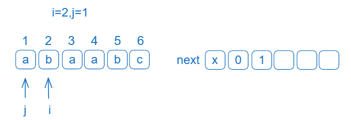
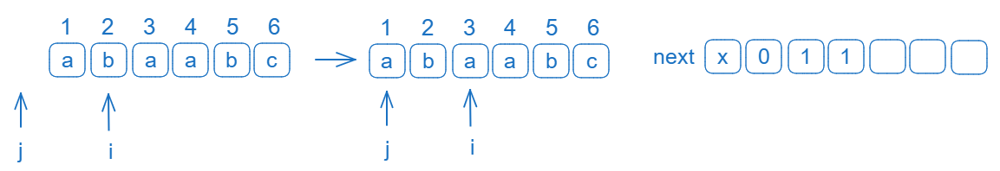
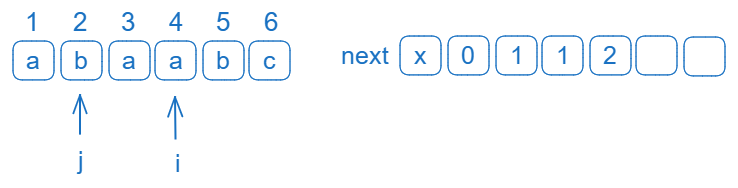
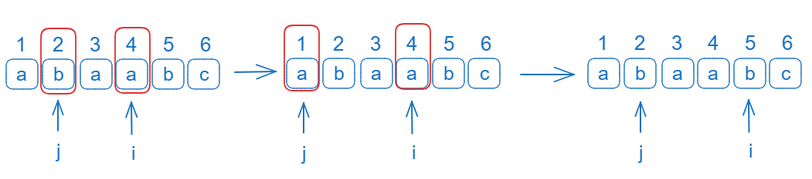
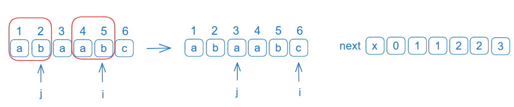
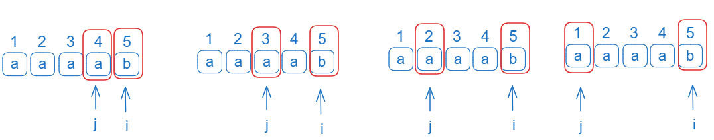

# KMP 算法

手算 next

|      序号      | 1   | 2   | 3   | 4   | 5   | 6   |
| :------------: | --- | --- | --- | --- | --- | --- |
|      模式      | a   | b   | a   | a   | b   | c   |
| 最大公共前后缀 | 0   | 0   | 0   | 1   | 1   | 2   |
|   next 数组    | 0   | 1   | 1   | 2   | 2   | 3   |
|  nextval 数组  | 0   | 1   | 0   | 2   | 1   | 3   |

next 数组求法：除 1 号位其他为最大公共前后缀+1

**求解公共前后缀**

序号 1 之前没有公共前后缀最大位 0

序号 2 之前`a`没有公共前后缀最大位 0

序号 3 之前`ab`没有公共前后缀最大位 0

序号 4 之前`aba`公共前后缀`a`最大位 1

序号 5 之前`abaa`公共前后缀`a`最大位 1

序号 6 之前`abab`公共前后缀`ab`最大位 2

公共前后缀为[0,0,0,1,1,2]

**求解 next 数组**

除 1 号位其他为最大公共前后缀+1

next 数组为[0,1,1,2,2,3]

**求解 nextval 数组**

nextval 的值从 next 而来

|      序号      | 1      | 2      | 3             | 4      | 5             | 6      |
| :------------: | ------ | ------ | ------------- | ------ | ------------- | ------ |
|      模式      | a      | b      | a             | a      | b             | c      |
| 最大公共前后缀 | 0      | 0      | 0             | 1      | 1             | 2      |
|   next 数组    | 0      | 1      | 1             | 2      | 2             | 3      |
|  nextval 数组  | 直写 0 | 直写 1 | 序号 1 的值 0 | 直写 2 | 序号 2 的值 1 | 直写 3 |

序号 1 的 next 数组为 0，而 0 没有对应的序号，值为 0

序号 2 的 next 数组值为 1，而 1 对应的模式与 2 对应的模式 a≠b,直接写下 next 的值 1

序号 3 的 next 数组值为 1，而 1 对应的模式与 3 对应的模式 a=a,写下序号 1 对应的 next 值 0

序号 4 的 next 数组值为 2，而 2 对应的模式与 4 对应的模式 b≠a,直接写下 next 的值 2

序号 5 的 next 数组值为 2，而 2 对应的模式与 5 对应的模式 b=b,写下序号 2 对应的 next 值 1

序号 6 的 next 数组值为 3，而 3 对应的模式与 6 对应的模式 a≠c,直接写下 next 的值 3

## 求 next 数组

初始化时next[1] = 0


初始化i=1,j = 0 此时if成立`i`变成2,`j`变为1,即next[2] = 1



j=1≠0,对比`a`和`b`不相同，j回溯next[1]的位置0；j=0 此时if成立`i`变成3,`j`变为1,即next[3] = 1



j=1≠0,对比`a`和`a`相同，此时if成立`i`变成4,`j`变为2,即next[4] = 2



j=2≠0,对比`b`和`a`不相同，j回溯上一个相同的位置next[2]的位置1；j=1#0,对比`a`和`a`相同，此时if成立`i`变成5,`j`变为2,即next[5] = 2




j=2≠0,对比`b`和`b`相同，此时不用回溯。此时if成立`i`变成6,`j`变为3,即next[6] = 3



此时i=6与T的长度T[0]相等，循环结束

```c
/*
 * 计算模式串的“失配数组”，用于KMP算法。
 */
void get_next(SString T, int next[]) {
    int i = 1;
    int j = 0;

    // 模式串第一个字符处失配时，模式串需要从头比较，主串需要前进到下一个位置比较
    next[1] = 0;

    while(i < T[0]) {
        if(j == 0 || T[i] == T[j]) {
            i++;
            // 最大公共后缀加1
            j++;
            next[i] = j;
        } else {
            j = next[j];
        }
    }
}
```

## 求nextval数组
|      序号      | 1    | 2    | 3    | 4    | 5    |
| :------------: | ---- | ---- | ---- | ---- | ---- |
|      模式      | a    | a    | a    | a    | b    |
| 最大公共前后缀 | 0    | 0    | 1    | 2    | 3    |
|   next 数组    | 0    | 1    | 2    | 3    | 4    |
|  nextval 数组  | 0    | 0    | 0    | 0    | 4    |

对于序号5处时失配，对于next数组j需要向前移动4次，进行4次对比



如果和上一个相同，则赋值上一个j可匹配的值，否则赋值当前值


```c
/*
 * 计算模式串的“失配数组”，用于KMP算法。
 * 这是一个优化后的版本，效率较算法4.7有所提高。
 */
void get_nextval(SString T, int nextval[]) {
    int i = 1;
    int j = 0;

    // 模式串第一个字符处失配时，模式串需要从头比较，主串需要前进到下一个位置比较
    nextval[1] = 0;

    // 遍历模式串上的字符
    while(i < T[0]) {
        if(j==0 || T[i] == T[j]) {
            i++;
            j++;

            if(T[i] != T[j]) {
                nextval[i] = j;
            } else {
                nextval[i] = nextval[j];
            }
        } else {
            j = nextval[j];
        }
    }
}
```

## 查找

```c
/*
 * 从pos处开始搜索模式串T在主串S中首次出现的位置，如果不存在，则返回0。
 * 如果查找成功，返回匹配的位置。
 *
 *【注】
 * 1.该实现用到了KMP算法，是一种比较高效的字符串匹配方式
 * 2.教材中没有next参数
 */
int Index_KMP(SString S, SString T, int pos, int next[]) {
    int i = pos;
    int j = 1;

    if(pos < 1) {
        return 0;
    }

    // 比较字符串
    while(i <= S[0] && j <= T[0]) {
        /*
         * 两种情形：
         * 1.在模式串的第一个字符处就失配
         * 2.主串和模式串处的字符相等
         */
        if(j == 0 || S[i] == T[j]) {
            i++;
            j++;
        } else {
            // 失配时回到前一个适当的位置
            j = next[j];
        }
    }

    if(j > T[0]) {
        // 匹配成功，返回匹配位置
        return i - T[0];
    } else {
        // 匹配失败
        return 0;
    }
}
```

