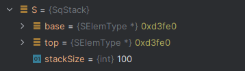

# 栈的顺序存储结构

## 结构定义

```c
/* 宏定义 */
#define STACK_INIT_SIZE 100    // 顺序栈存储空间的初始分配量
#define STACK_INCREMENT 10     // 顺序栈存储空间的分配增量

/* 顺序栈元素类型定义 */
typedef int SElemType;

// 顺序栈元素结构
typedef struct {
    SElemType *base;    // 栈底指针
    SElemType *top;     // 栈顶指针
    int stackSize;      // 当前已分配的存储空间，元素为单位
} SqStack;
```


栈顶指针永远指向下一个地址

## 初始化


初始化时栈顶指针指向栈底

内存结构图


```c
/*
 * 构造一个空栈。初始化成功则返回OK，否则返回ERROR。
 */
Status InitStack(SqStack* S){
    if(S == NULL){
        return ERROR;
    }

    // 分配栈空间
    S->base = (SElemType *) malloc(STACK_INIT_SIZE * sizeof (SqStack));

    // 分配空间失败
    if(S->base == NULL){
        exit(-2);
    }

    // 栈顶指针指向栈底指针
    S->top = S->base;
    // 栈空间大小
    S->stackSize = STACK_INIT_SIZE;

    return OK;
}
```

## 销毁


```c
/*
 * 释放顺序栈所占内存。
 */
Status DestroyStack(SqStack* S){
    if(S == NULL){
        return ERROR;
    }

    // 释放栈底指针指向的空间
    free(S->base);

    S->base = NULL;
    S->top = NULL;
    S->stackSize = 0;

    return OK;
}
```

## 置空



置空时：栈顶指向栈底

```c
/*
 * 只是清理顺序栈中存储的数据，不释放顺序栈所占内存。
 */
Status ClearStack(SqStack* S){
    // 栈不存在
    if(S == NULL || S->base == NULL){
        return ERROR;
    }
    S->top = S->base;
    return OK;
}
```

## 判空

```c
/*
 * 判断顺序栈中是否包含有效数据。
 */
Status StackEmpty(SqStack S) {
    // 栈顶指针等于栈底指针时为空
    if(S.top == S.base){
        return TRUE;
    } else{
        return ERROR;
    }
}
```

## 计数

```c
/*
 * 返回顺序栈包含的有效元素的数量。
 */
int StackLength(SqStack S){
    if(S.base == NULL){
        return 0;
    }
    // 栈顶指针-栈底指针
    return (int)(S.top - S.base);
}

```

## 取值

```c
/*
 * 返回栈顶元素，并用e接收。
 */
Status GetTop(SqStack S, SElemType* e){
    if(S.base == NULL || S.top == S.base) {
        return 0;
    }

    // 不会改变栈中元素
    *e = *(S.top - 1);

    return OK;
}
```

## 入栈

依次入栈2,4,6,8,10,12


内存结构图


```c
/*
 * 将元素e压入到栈顶。
 */
Status Push(SqStack* S, SElemType e){
    if(S == NULL || (*S).base == NULL) {
        return ERROR;
    }

    // 栈满时，追加存储空间
    if(S->top - S->base >= S->stackSize){
        S->base = (SElemType*) realloc(S->base,(S->stackSize + STACK_INCREMENT) * sizeof(SElemType));
        if((*S).base == NULL){
            exit(-2);
        }
        S->top = S->base + S->stackSize; // 指向下一个地址
        S->stackSize = S->stackSize + STACK_INCREMENT;
    }

    // 进栈操作
    *(S->top) = e;
    // 移动到下一个地址
    S->top++;

    return OK;
}
```

## 出栈


```c
/*
 * 将栈顶元素弹出，并用e接收。
 */
Status Pop(SqStack* S, SElemType* e){
    if(S == NULL || (*S).base == NULL) {
        return ERROR;
    }

    // 没有元素了
    if((*S).top == (*S).base){
        return ERROR;
    }

    // 出栈栈顶指针先递减，再赋值
    S->top--;
    // 获取top指针指向的值
    *e = *(S->top);

    return OK;
}
```

## 遍历

```c
/*
 * 用visit函数访问顺序栈S
 */
Status StackTraverse(SqStack S, void(Visit)(SElemType)){
    SElemType *p = S.base;

    if(S.base == NULL){
        return ERROR;
    }

    // 从栈底向栈底遍历
    while (p < S.top){
        Visit(*p);
        p++;
    }

    printf("\n");

    return OK;
}
```
