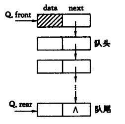

# 队列的链式存储结构

## 结构定义

```c
/* 链队元素类型定义 */
typedef int QElemType;

// 队列元素结构
typedef struct QNode{
    QElemType data;
    struct QNode* next; // 下一个结点
} QNode,* QueuePtr;

// 队列结构
typedef struct {
    QueuePtr front;  // 队头指针
    QueuePtr rear;   // 队尾指针
} LinkQueue;         // 队列的链式存储表示
```



## 初始化


```c
/*
 * 构造一个空的链队。
 * 初始化成功则返回OK，否则返回ERROR。
 *
 *【注】
 * 这里的队列带有头结点
 */
Status InitQueue(LinkQueue* Q){
    if(Q == NULL){
        return ERROR;
    }

    Q->front = Q->rear = (QueuePtr) malloc(sizeof(QNode));

    if(Q->front == NULL){
        exit(-2);
    }

    Q->front->next = NULL;

    return OK;
}
```

## 销毁

```c
/*
 * 释放链队所占内存。
 */
Status DestroyQueue(LinkQueue* Q){
    if(Q == NULL){
        return ERROR;
    }

    // 链队是从队头指向队尾
    while (Q->front){
        Q->rear = Q->front->next;
        free(Q->front);
        Q->front = Q->rear;
    }

    return OK;
}
```

## 置空

```c
/*
 * 这里需要释放链队中非头结点处的空间。
 */
Status ClearQueue(LinkQueue* Q){
    if(Q == NULL){
        return ERROR;
    }

    Q->rear = Q->front->next;

    while (Q->rear){
        Q->front->next = Q->rear->next;
        free(Q->rear);
        Q->rear = Q->front->next;
    }

    Q->rear = Q->front;

    return OK;
}
```

## 判空

```c
/*
 * 判断链队中是否包含有效数据。
 */
Status QueueEmpty(LinkQueue Q){
    if(Q.front == Q.rear){
        return TRUE;
    } else{
        return FALSE;
    }
}
```

## 计数

```c
/*
 * 返回链队包含的有效元素的数量。
 */
int QueueLength(LinkQueue Q){
    int count = 0;
    QueuePtr p = Q.front;

    while (p != Q.rear){
        count++;
        p = p->next;
    }

    return count;
}
```

## 取值

```c
/*
 * 获取队头元素，将其存储到e中。
 * 如果可以找到，返回OK，否则，返回ERROR。
 */
Status GetHead(LinkQueue Q, QElemType* e){
    QueuePtr p;

    if(Q.front == NULL || Q.front == Q.rear){
        return ERROR;
    }

    p = Q.front->next;
    *e = p->data;
    return OK;
}
```

## 入队

```c
/*
 * 将元素e添加到队列尾部。
 */
Status EnQueue(LinkQueue* Q, QElemType e){
    QueuePtr p;

    if(Q == NULL || Q->front == NULL){
        return ERROR;
    }

    p = (QueuePtr) malloc(sizeof(QNode));
    if(!p){
        exit(-2);
    }

    p->data = e;
    p->next = NULL;

    // 队尾指针指向要插入的结点
    Q->rear->next = p;
    // 指向下一个结点
    Q->rear = p;

    return OK;
}

```

## 出队

```c
/*
 * 移除队列头部的元素，将其存储到e中。
 */
Status DeQueue(LinkQueue* Q, QElemType* e){
    QueuePtr p;

    if(Q == NULL || Q->front == NULL || Q->front == Q->rear){
        return ERROR;
    }

    // 获取队头第一个元素地址
    p = Q->front->next;
    *e = p->data;

    // 队头指向下一个地址
    Q->front->next = p->next;

    // 有数据时队尾指针为NULL
    // 队列空了
    if(Q->rear == p){
        Q->rear = Q->front;
    }

    free(p);

    return OK;
}
```

## 遍历

```c
/*
 * 用visit函数访问队列Q
 */
Status QueueTraverse(LinkQueue Q, void (Visit)(QElemType)){
    QueuePtr p;

    if(Q.front == NULL){
        return ERROR;
    }

    // 指向第一个结点
    p = Q.front->next;

    while (p != NULL){
        Visit(p->data);
        p = p->next;
    }

    printf("\n");
    return OK;
}
```
