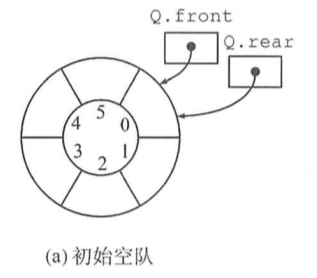
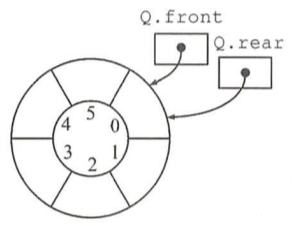
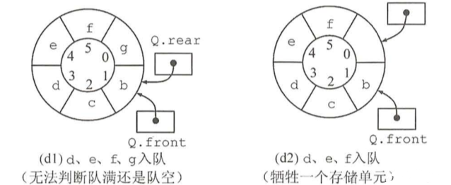
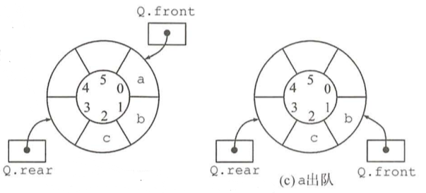

# 队列的顺序存储结构

## 结构定义

```c
/* 宏定义 */
#define MAXQSIZE 5   // 最大队列长度

/** 循环队列元素类型定义 **/
typedef int QElemType;

// 循环队列的顺序存储结构
typedef struct {
    QElemType* base;    // 动态分配存储空间
    int front;          // 头指针，若队列不空，指向队头元素
    int rear;           // 尾指针，若队列不空，指向队列尾元素的下一个位置
} SqQueue;
```

## 初始化



初始化时，队头指向队尾

```c
/*
 * 构造一个空的顺序队列。
 * 初始化成功则返回OK，否则返回ERROR。
 *
 *【注】
 * 这里的队列是循环队列
 */
Status InitQueue(SqQueue* Q){
    if(Q == NULL){
        return ERROR;
    }

    Q->base = (QElemType *) malloc(MAXQSIZE * sizeof(QElemType));

    if(!Q->base){
        exit(-2);
    }

    Q->front = Q->rear = 0;

    return OK;
}

```

## 销毁

```c
/*
 * 销毁(结构)
 *
 * 释放循环顺序队列所占内存。
 */
Status DestroyQueue(SqQueue* Q){
    if(Q == NULL){
        return ERROR;
    }

    // 销毁空间
    if(Q->base){
        free(Q->base);
    }

    Q->base = NULL;
    Q->front = Q->rear = 0;

    return ERROR;
}
```

## 置空



为空时队头指向队尾

```c
/*
 * 置空(内容)
 *
 * 只是清理循环顺序队列中存储的数据，不释放顺序队列所占内存。
 */
Status ClearQueue(SqQueue* Q) {
    if(Q == NULL || Q->base == NULL){
        return ERROR;
    }

    Q->front = Q->rear = 0;

    return OK;
}
```

## 判空

```c
/*
 * 判断循环顺序队列中是否包含有效数据。
 */
Status QueueEmpty(SqQueue Q){
    // 队列空的标志
    if(Q.front == Q.rear){
        return TRUE;
    } else{
        return FALSE;
    }
}
```

## 计数

```c
/*
 * 返回循环顺序队列包含的有效元素的数量。
 */
int QueueLength(SqQueue Q){
    if(Q.base == NULL){
        return 0;
    }

    // 队列长度
    return (Q.rear - Q.front + MAXQSIZE) % MAXQSIZE;
}
```

## 取值

```c
/*
 * 获取队头元素，将其存储到e中。
 * 如果可以找到，返回OK，否则，返回ERROR。
 */
Status GetHead(SqQueue Q, QElemType* e){
    // 队列空的标志
    if(Q.base == NULL || Q.front == Q.rear){
        return ERROR;
    }

    // 从队头取出元素
    *e = Q.base[Q.front];

    return OK;
}

```

## 入队



尾下标位置不存放数据，尾下标是下一个元素插入点。

```c
/*
 * 将元素e添加到队列尾部。
 */
Status EnQueue(SqQueue* Q, QElemType e){
    if(Q == NULL || Q->base == NULL){
        return ERROR;
    }

    // 队列满的标志（会浪费一个空间来区分队列空和队列满）
    if((Q->rear + 1) % MAXQSIZE == Q->front){
        return ERROR;
    }

    // 入队
    Q->base[Q->rear] = e;

    // 尾指针前进
    Q->rear = (Q->rear + 1) % MAXQSIZE;

    return OK;
}

```

## 出队



```c
/*
 * 移除队列头部的元素，将其存储到e中。
 */
Status DeQueue(SqQueue* Q, QElemType* e){
    if(Q == NULL || Q->base == NULL){
        return ERROR;
    }

    // 队列空的标志
    if(Q->front == Q->rear){
        return ERROR;
    }

    // 出队
    *e = Q->base[Q->front];

    // 头指针前进
    Q->front = (Q->front + 1) % MAXQSIZE;

    return OK;
}

```

## 遍历

```c
/*
 * 用visit函数访问队列Q
 */
Status QueueTraverse(SqQueue Q, void(Visit)(QElemType)){
    int i;

    if(Q.base == NULL){
        return ERROR;
    }

    for(i = Q.front; i != Q.rear; i = (i+1)%MAXQSIZE){
        Visit(Q.base[i]);
    }

    printf("\n");
    return OK;
}

```
