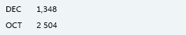
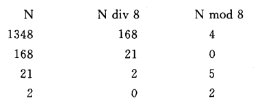

# 进制转换



依次取余得到个位，十位，百位...



1348 % 168 = 4; 

1348 / 8 = 168;  168 % 8 = 0;

168 / 8 = 21;   21 % 8 = 5;

21 / 8 = 2;  2 % 8 = 2;

2 / 8 = 0; 结束

```c
/*
 * 进制转换：将指定的非负十进制整数，转换为八进制后输出。
 *
 *【注】
 * 教材使用的是控制台输入，这里为了便于测试，直接改为从形参接收参数
 */
void conversion(int i) {
    SqStack S;
    SElemType e;

    InitStack(&S);

    // 八进制数前面加0
    printf("十进制数 %d 转换为八进制数后为：0", i);

    while (i != 0){
        Push(&S,i % 8);
        i = i / 8;
    }

    while (StackEmpty(S) == FALSE){
        Pop(&S,&e);
        printf("%d",e);
    }

    printf("\n");
}
```
