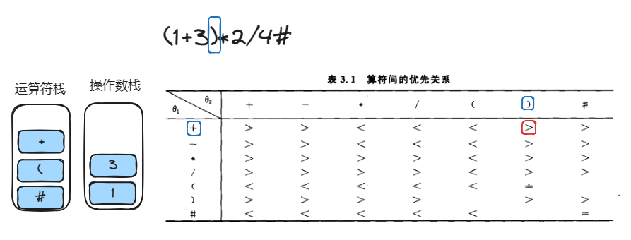
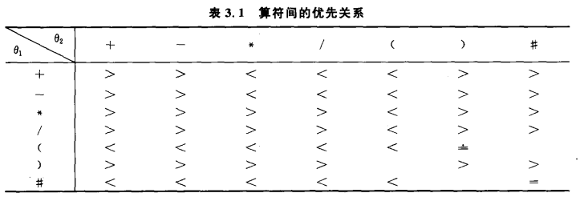

# 表达式计算

计算步骤

1. 判断是数字还是字符
2. 数字入数字栈
3. 字符判断优先级，栈顶符号`>`当前符号出栈计算，栈顶符号`=`当前符号出栈，栈顶符号`<`当前符号入栈

如计算表达式`(1+3)*2/4#`

0. 初始化时 运算符栈 ['#'] 操作数栈[]

1. `(` 为符号`#`<`(` 运算符入栈 [`#`,`(`] 此时 运算符栈 [`#` , `(`] 操作数栈[]

2. `1`为数字入数字栈 [`1`] 此时 运算符栈 [`#`, `(`] 操作数栈[`1`]
3. `+`为符号`(` < `+` 运算符入栈 [`#`,`(`,`+`] 此时 运算符栈 [`#`,`(`,`+`] 操作数栈[`1`]
4. `3`为数字入数字栈 [`1`,`3`] 此时 运算符栈 [`#`,`(`,`+`] 操作数栈[`1`,`3`]
5. `)`为符号`+` > `)` 操作符`+` 出栈,操作数`3`和`1` 出栈，1+3=4 求和入栈[`4`] 此时 运算符栈 [`#`,`(`] 操作数栈[`4`]
6. `)`为符号`(` = `)` 操作符出栈 [`#`] 此时 运算符栈 [`#`] 操作数栈[`4`]
7. `*`为符号`#` < ` *` 运算符入栈 [`#`,`*`] 此时 运算符栈 [`#`,`*`] 操作数栈[`4`]
8. `2`为数字入数字栈 [`4`,`2`] 此时 运算符栈 [`#`,`*`] 操作数栈[`4`,`2`]
9. `/`为符号`*`>`/` 操作符`*` 出栈，操作数`4`和`2`出栈，4\*2=8 入栈[`8`] 此时 运算符栈 [`#`] 操作数栈[`8`]
10. `/`为符号`#`<`/` 操作符`/` 入栈[`#`,`/`] 此时 运算符栈 [`#`,`/`] 操作数栈[`8`]
11. `4` 为数字入数字栈 [`8`,`4`] 此时 运算符栈 [`#`,`/`] 操作数栈[`8`,`4`]
12. `#` 为符号`/ `>`#` 操作符`/` 出栈，操作数`8`和`4`出栈，8/4=2 入栈[`2`] 此时 运算符栈 [`#`] 操作数栈[`2`]
13. 当前字符为`#`并且运算符栈栈顶为`#` 循环结束
14. 返回数字栈顶元素`2`

## 判断是否为符号

```c
// 运算符表，即表达式中允许出现的符号（包括界限符'#'）
static const char OP[] = {'+', '-', '*', '/', '(',')','#'};

Status In(SElemType c, const char OP[]) {

    SElemType* e = strchr(OP, c);

    // 如果运算符c不在合规范围内，说明指定的运算符不合规
    if(e == NULL) {
        return FALSE;
    } else {
        return TRUE;
    }
}
```

## 判断优先级

获取对应的x,y坐标来获取优先级。

x对应左侧(表示符号栈栈顶元素符号的坐标)

y对应顶部对应当前符号的坐标



::: code-group

```c [Expression.c]
/*
 * 判断运算符栈中操作符o1与表达式中的操作符o2的优先级。
 *
 * 返回'>'、'<'、'='，以指示o1和o2的优先级
 */
OperatorType Precede(OperatorType o1, OperatorType o2) {
    int x, y;

    // 获取指定的运算符在运算符表中的位置
    char* p1 = strchr(OP, o1);
    char* p2 = strchr(OP, o2);

    // 计算出一个运算符优先级表坐标
    x = p1 - OP;
    y = p2 - OP;

    return PrecedeTable[x][y];
}
```

```c [Expression.h]
// 运算符表，即表达式中允许出现的符号（包括界限符'#'）
static const char OP[] = {'+', '-', '*', '/', '(',')','#'};

/*
 * 运算符优先级表（包括界限符'#'），与上面的OP表是呼应的。
 * 可参见教材中的"算符间的优先关系"表
 */
static const char PrecedeTable[7][7] = {{'>', '>', '<', '<', '<', '>', '>'},
                                        {'>', '>', '<', '<', '<', '>', '>'},
                                        {'>', '>', '>', '>', '<', '>', '>'},
                                        {'>', '>', '>', '>', '<', '>', '>'},
                                        {'<', '<', '<', '<', '<', '=', ' '},
                                        {'>', '>', '>', '>', ' ', '>', '>'},
                                        {'<', '<', '<', '<', '<', ' ', '='}};
```

:::



## 对操作数进行运算

```c
/*
 * 对操作数进行运算
 *
 * a、b是操作数，theta是运算符。
 * 对于操作数和运算结果，仅保证对个位数的支持
 */
OperandType Operate(OperandType a, OperatorType theta, OperandType b) {
    int x, y, z = CHAR_MAX - 48;

    // 先从字符型转为整型
    x = a - '0';
    y = b - '0';

    switch(theta) {
        case '+':
            z = x + y;
            break;
        case '-':
            z = x - y;
            break;
        case '*':
            z = x * y;
            break;
        case '/':
            z = x / y;
            break;
    }

    // 计算完成后，将整型转换为字符型返回
    return z + 48;
}
```

## 计算表达式

```c
/*
 * 从exp读入表达式，并计算表达式的运算结果
 *
 *   该计算功能有限，理论上仅支持对个位数运算，且要求每一步的运算结果也是个位数。
 *   教材提供此算法的目的是验证栈的使用，如果想扩展对运算符的支持，并扩大对操作数的支持，
 *   则可以顺着此思路进行改版
 */
OperandType EvaluateExpression(const char exp[]) {
    SElemType c;   // 输入序列

    SqStack OPTR;   // 运算符栈
    SqStack OPND;   // 操作数栈

    OperatorType theta, x;  // 运算符
    OperandType a, b;       // 操作数

    int i = 0;

    // (1+3)*2/4#
    // 初始化运算符栈，并将一个界限符'#'入栈
    InitStack(&OPTR);
    Push(&OPTR, '#');

    // 初始化操作数栈，并开始读取输入
    InitStack(&OPND);
    c = exp[i++];

    // 当输入中遇到界限符'#'，且运算符栈的栈顶元素也是界限符'#'时，则表示读取结束，且运算结束
    while(c != '#' || GetTop(OPTR) != '#') {
        // 如果ch不是运算符，则视其为操作数，将其入栈
        if(!In(c, OP)) {
            Push(&OPND, c);    // 将操作数入栈
            c = exp[i++];      // 获取下一个输入字符
        } else {
            switch(Precede(GetTop(OPTR), c)) {
                // 栈中运算符优先级低，继续进栈
                case '<':
                    Push(&OPTR, c);
                    c = exp[i++];
                    break;

                    // 优先级相等时，说明这里遇到括号，需要脱括号
                case '=':
                    Pop(&OPTR, &x);
                    c = exp[i++];
                    break;

                    /*
                     * 栈中运算符优先级高时，先计算，再将计算结果压入栈
                     *
                     * 注：这儿没有读字符，c保留的还是刚才读到的字符
                     */
                case '>':
                    Pop(&OPTR, &theta); // 弹出运算符
                    Pop(&OPND, &b);     // 弹出右边的操作数
                    Pop(&OPND, &a);     // 弹出左边的操作数
                    Push(&OPND, Operate(a, theta, b));
                    break;
            }
        }
    }

    return GetTop(OPND);
}
```

## ASCLL 表

| ASCII值 | 控制字符 | ASCII值 | 控制字符 | ASCII值 | 控制字符 | ASCII值 | 控制字符 |
| :------ | :------- | :------ | :------- | :------ | :------- | :------ | :------- |
| 0       | NUT      | 32      | (space)  | 64      | @        | 96      | 、       |
| 1       | SOH      | 33      | !        | 65      | A        | 97      | a        |
| 2       | STX      | 34      | "        | 66      | B        | 98      | b        |
| 3       | ETX      | 35      | #        | 67      | C        | 99      | c        |
| 4       | EOT      | 36      | $        | 68      | D        | 100     | d        |
| 5       | ENQ      | 37      | %        | 69      | E        | 101     | e        |
| 6       | ACK      | 38      | &        | 70      | F        | 102     | f        |
| 7       | BEL      | 39      | ,        | 71      | G        | 103     | g        |
| 8       | BS       | 40      | (        | 72      | H        | 104     | h        |
| 9       | HT       | 41      | )        | 73      | I        | 105     | i        |
| 10      | LF       | 42      | *        | 74      | J        | 106     | j        |
| 11      | VT       | 43      | +        | 75      | K        | 107     | k        |
| 12      | FF       | 44      | ,        | 76      | L        | 108     | l        |
| 13      | CR       | 45      | -        | 77      | M        | 109     | m        |
| 14      | SO       | 46      | .        | 78      | N        | 110     | n        |
| 15      | SI       | 47      | /        | 79      | O        | 111     | o        |
| 16      | DLE      | 48      | 0        | 80      | P        | 112     | p        |
| 17      | DCI      | 49      | 1        | 81      | Q        | 113     | q        |
| 18      | DC2      | 50      | 2        | 82      | R        | 114     | r        |
| 19      | DC3      | 51      | 3        | 83      | S        | 115     | s        |
| 20      | DC4      | 52      | 4        | 84      | T        | 116     | t        |
| 21      | NAK      | 53      | 5        | 85      | U        | 117     | u        |
| 22      | SYN      | 54      | 6        | 86      | V        | 118     | v        |
| 23      | TB       | 55      | 7        | 87      | W        | 119     | w        |
| 24      | CAN      | 56      | 8        | 88      | X        | 120     | x        |
| 25      | EM       | 57      | 9        | 89      | Y        | 121     | y        |
| 26      | SUB      | 58      | :        | 90      | Z        | 122     | z        |
| 27      | ESC      | 59      | ;        | 91      | [        | 123     | {        |
| 28      | FS       | 60      | <        | 92      | \        | 124     | \|       |
| 29      | GS       | 61      | =        | 93      | ]        | 125     | }        |
| 30      | RS       | 62      | >        | 94      | ^        | 126     | `        |
| 31      | US       | 63      | ?        | 95      | _        | 127     | DEL      |
