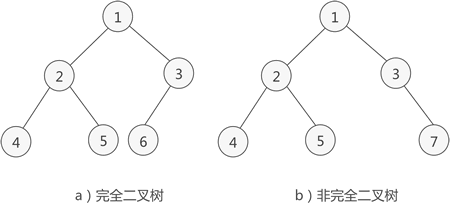

# 数与二叉树

## 树

树结构通常用来存储逻辑关系为 "一对多" 的数据

**1.结点**

树存储结构中也将存储的各个元素称为 "结点"。

**2.子树**

A 是整棵树的根结点。但如果单看结点 B、E、F、K、L 组成的部分来说，它们也组成了一棵树，结点 B 是这棵树的根结点。通常，我们将一棵树中几个结点构成的“小树”称为这棵树的“子树”。

**3.结点的度**

一个结点拥有子树的个数，就称为该结点的度。(如A的度是3)

**4.结点的层次**

从一棵树的树根开始，树根所在层为第一层，根的孩子结点所在的层为第二层，依次类推。

**5.有序树和无序树**

各个结点左子树和右子树的位置不能交换，那么这棵树就称为有序树。反之，如果树中结点的左、右子树可以互换，那么这棵树就是一棵无序树。

**6.森林**

由 m（m >= 0）个互不相交的树组成的集合就称为森林。

## 二叉树

1.本身是有序树；

2.树中包含的各个节点的度不能超过 2，即只能是 0、1 或者 2；

### 满二叉树

如果二叉树中除了叶子结点，每个结点的度都为 2，则此二叉树称为满二叉树。

### 完全二叉树

如果二叉树中除去最后一层节点为满二叉树，且最后一层的结点依次从左到右分布，则此二叉树被称为完全二叉树。

