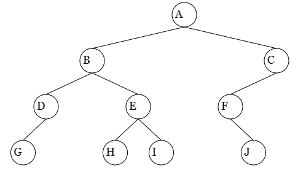
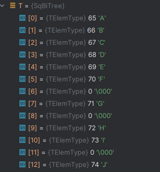
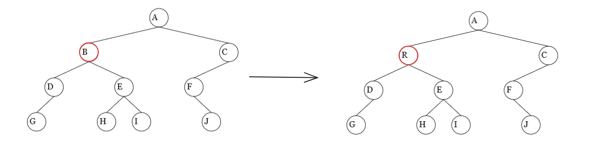
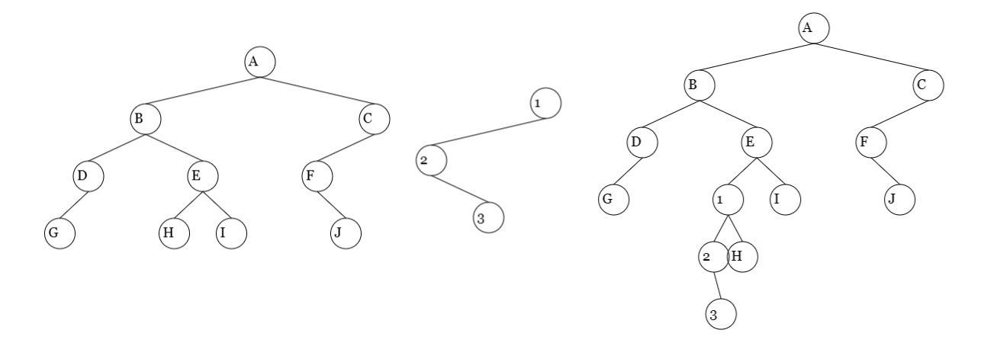
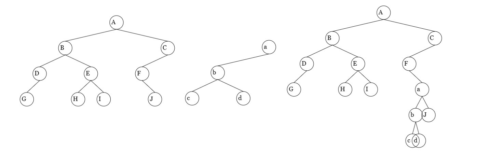

# 二叉树顺序存储结构

按照顺序二叉树的层序序列排列

## 结构定义

```c
/* 宏定义 */
#define MAX_TREE_SIZE 1024    // 二叉树的最大结点数

/* 二叉树元素类型定义，这里假设其元素类型为char */
typedef char TElemType;

/*
 * 二叉树类型定义，0号单元存储根结点。
 *
 *【注】
 * 在二叉树的顺序结构中，其元素是按照完全顺序二叉树的层序序列排列的。
 */
typedef TElemType SqBiTree[MAX_TREE_SIZE];
```

## 初始化

::: info

初始化MAX_TREE_SIZE个\0,['\0', '\0', '\0', '\0', '\0', '\0', '\0', '\0', '\0', '\0']

:::

```c
/*
 * 构造空二叉树。
 */
Status InitBiTree(SqBiTree T){
    // 使用空字符填充二叉树的顺序结构
    // 整个数组填'\0'
    memset(T,'\0', sizeof(SqBiTree));

    return OK;
}
```

## 创建二叉树



先序序列为：ABDG^^^EH^^I^^CF^J^^^

::: info

ABDG^表示G没有左子树

ABDG^^表示G没有右子树

ABDG^^^表示D没有右子树

ABDG^^^EH^表示H没有左子树

ABDG^^^EH^^表示H没有右子树

ABDG^^^EH^^I^表示I没有左子树

ABDG^^^EH^^I^^表示I没有右子树

:::

通过先序序列ABDG^^^EH^^I^^CF^J^^^创建二叉树。(创建的二叉树是层序遍历的)


每一个结点的左子树层序序列为当前下标*2+1；

A的下标为`0`左子树为2*0+1 = 1;

B的下标为`1`左子树为2*1+1 = 3;

D的下标为`3`左子树为2*3+1 = 7;

E的下标为`4`左子树为2*4+1 = 9;

每一个结点的左子树层序序列为当前下标*2+2；

A的下标为`0`右子树为2*0+2 = 2;

B的下标为`1`左子树为2*1+2 = 4;

D的下标为`3`左子树为2*3+2 = 8;

E的下标为`4`左子树为2*4+2 = 10;

先序序列ABDG^^^EH^^I^^CF^J^^^创建二叉树为ABCDEF^G^HI^J



```c
/*━━━━━━━━━━━━━━━━━━━━━━ 仅限内部使用的函数 ━━━━━━━━━━━━━━━━━━━━━━*/

// 创建二叉树的内部函数
static void CreateTree(SqBiTree T, int i, FILE* fp) {
    char ch;

    // 读取当前结点的值
    if(fp == NULL) {
        scanf("%c", &ch);
    } else {
        ReadData(fp, "%c", &ch);
    }

    if(ch == '^') {
        T[i] = '\0';
    } else {
        T[i] = ch;
        CreateTree(T, 2 * i + 1, fp); // 创建左子树
        CreateTree(T, 2 * i + 2, fp); // 创建右子树
    }
}

/*
 * 按照预设的定义来创建二叉树。
 * 这里约定使用【先序序列】来创建二叉树。
 */
Status CreateBiTree(SqBiTree T, char* path) {
    FILE* fp;
    int readFromConsole;    // 是否从控制台读取数据

    // 如果没有文件路径信息，则从控制台读取输入
    readFromConsole = path == NULL || strcmp(path, "") == 0;

    if(readFromConsole) {
        printf("请输入二叉树的先序序列，如果没有子结点，使用^代替：");
        CreateTree(T, 0, NULL);
    } else {
        // 打开文件，准备读取测试数据
        fp = fopen(path, "r");
        if(fp == NULL) {
            return ERROR;
        }
        CreateTree(T, 0, fp);
        fclose(fp);
    }

    return OK;
}
```

## 销毁

```c
/*
 * 释放二叉树所占内存。
 *
 *【注】
 * 二叉树的顺序存储结构无法销毁。
 */
Status DestroyBiTree(SqBiTree T){
    // 二叉树的顺序存储结构无法销毁
    return ERROR;
}
```

## 置空

```c
/*
 * 清理二叉树中的数据，使其成为空树。
 */
Status ClearBiTree(SqBiTree T) {
    // 使用空字符填充二叉树的顺序结构
    memset(T, '\0', sizeof(SqBiTree));

    return OK;
}
```

## 判空

```c
/*
 * 判断二叉树是否为空树。
 */
Status BiTreeEmpty(SqBiTree T){
    return T[0] == '\0' ? TRUE : FALSE;
}
```

## 树深

::: tip

递归获取左右子树的深度

左子树根结点为当前节点*2 + 1

右子树根结点为当前节点*2 + 2

:::

```c
/*━━━━━━━━━━━━━━━━━━━━━━ 仅限内部使用的函数 ━━━━━━━━━━━━━━━━━━━━━━*/

// 求二叉树深度的内部函数
static int TreeDepth(SqBiTree T, int i) {
    int ld, rd;     // 记录左右子树的深度

    if(T[i] == '\0') {
        return 0;
    } else {
        ld = TreeDepth(T, 2 * i + 1);
        rd = TreeDepth(T, 2 * i + 2);

        return (ld >= rd ? ld : rd) + 1;
    }
}

/*
 * 返回二叉树的深度（层数）。
 */
int BiTreeDepth(SqBiTree T){
    return TreeDepth(T,0);
}
```

## 取值

获取指定的值`Value(T,'A')`查找结点`A`的

```c
/*━━━━━━━━━━━━━━━━━━━━━━ 仅限内部使用的函数 ━━━━━━━━━━━━━━━━━━━━━━*/

// 返回二叉树结点e的索引号，i是结点p的索引号
static int EIndex(SqBiTree T, TElemType e, int i){
    int cl,cr;
    
    // 已经越界
    if(i >= MAX_TREE_SIZE){
        return -1;
    }
    
    // e的值不合规
    if(e == '\0'){
        return -1;
    }
    
    // 找到了元素
    if(T[i] == e){
        return i;
    }
    
    // 在左子树中查找
    cl = EIndex(T,e,2 * i + 1);
    if(cl != -1){
        return cl;
    }
    
    // 在右子树中查找
    cr = EIndex(T,e, 2 * i + 2);
    if(cr != -1){
        return cr;
    }

    // 如果没有找到
    return -1;
}

/*
 * 取值
 *
 * 返回二叉树中指定结点的值。
 */
TElemType Value(SqBiTree T, TElemType e){
    int index;

    // 遇到空树则无需继续计算
    if(BiTreeEmpty(T)){
        return '\0';
    }

    // 获取结点e的索引
    index = EIndex(T,e,0);

    // 如果没有找到元素e
    if(index == -1){
        return '\0';
    } else{
        return T[index];
    }
}
```

## 赋值

将`B`赋值为`R`, `Assign(T,'B','R');`



```c 
/*
 * 为二叉树指定的结点赋值。
 */
Status Assign(SqBiTree T, TElemType e, TElemType value){
    int index;

    // 遇到空树则无需继续计算
    if(BiTreeEmpty(T)) {
        return ERROR;
    }

    // 获取结点e的索引
    index = EIndex(T,e,0);

    // 如果没有找到元素e
    if(index == -1){
        return ERROR;
    } else{
        // 进行赋值
        T[index] = value;
        return OK;
    }
}
```

## 根结点

```c
/*
 * 返回二叉树的根结点。
 */
TElemType Root(SqBiTree T){
    // 遇到空树则无需继续计算
    if(BiTreeEmpty(T)) {
        return '\0';
    }

    return T[0];
}
```

## 双亲(父节点)

::: tip

父结点为(当前结点-1) / 2 即`T[(index - 1) / 2]`

:::

```c {26}
/*
 * 双亲
 *
 * 返回二叉树中结点e的双亲结点。
 */
TElemType Parent(SqBiTree T, TElemType e){
    int index;

    // 遇到空树则无需继续计算
    if(BiTreeEmpty(T)) {
        return '\0';
    }

    // 获取结点e的索引
    index = EIndex(T,e,0);

    // 如果没有找到元素e
    if(index == -1) {
        return '\0';

        // 如果e是根结点
    } else if(index == 0) {
        return '\0';
    } else {
        // 返回父结点
        return T[(index - 1) / 2];
    }
}
```

## 左孩子

::: tip

左孩子为当前结点*2+1 即`T[2 * index + 1]`

:::

```c {22}
/*
 * 左孩子
 *
 * 返回二叉树中结点e的左孩子结点。
 */
TElemType LeftChild(SqBiTree T, TElemType e) {
    int index;

    // 遇到空树则无需继续计算
    if(BiTreeEmpty(T)) {
        return '\0';
    }

    // 获取结点e的索引
    index = EIndex(T, e, 0);

    // 如果没有找到元素e
    if(index == -1) {
        return '\0';
    } else {
        // 返回左孩子
        return T[2 * index + 1];
    }
}
```

## 右孩子

::: tip

左孩子为当前结点*2+2 即`T[2 * index + 2]`

:::

```c {22}
/*
 * 右孩子
 *
 * 返回二叉树中结点e的右孩子结点。
 */
TElemType RightChild(SqBiTree T, TElemType e) {
    int index;

    // 遇到空树则无需继续计算
    if(BiTreeEmpty(T)) {
        return '\0';
    }

    // 获取结点e的索引
    index = EIndex(T, e, 0);

    // 如果没有找到元素e
    if(index == -1) {
        return '\0';
    } else {
        // 返回右孩子
        return T[2 * index + 2];
    }
}
```

## 左兄弟

::: tip

1.获取当前结点所在下标`index = EIndex(T, e, 0)`

2.获取其父结点索引`(index - 1) / 2`

3.如果结点是其父结点右孩子则返回其左孩子

:::

```c
/*
 * 左兄弟
 *
 * 返回二叉树中结点e的左兄弟结点。
 */
TElemType LeftSibling(SqBiTree T, TElemType e){
    int index, p;

    // 遇到空树则无需继续计算
    if(BiTreeEmpty(T)) {
        return '\0';
    }

    // 获取结点e的索引
    index = EIndex(T, e, 0);

    // 获取结点e的索引
    index = EIndex(T, e, 0);

    // 如果没有找到元素e
    if(index == -1) {
        return '\0';

        // 如果e是根结点
    } else if(index == 0) {
        return '\0';
    } else {
        // 获取父结点的索引
        p = (index - 1) / 2;

        // 如果结点e是右孩子，则返回其左兄弟
        if(T[2 * p + 2] == e) {
            return T[2 * p + 1];
        } else {
            return '\0';
        }
    }
}
```

## 右兄弟

::: tip

1.获取当前结点所在下标`index = EIndex(T, e, 0)`

2.获取其父结点索引`(index - 1) / 2`

3.如果结点是其父结点左孩子则返回其右孩子

:::

```c
/*
 * 右兄弟
 *
 * 返回二叉树中结点e的右兄弟结点。
 */
TElemType RightSibling(SqBiTree T, TElemType e) {
    int index, p;

    // 遇到空树则无需继续计算
    if(BiTreeEmpty(T)) {
        return '\0';
    }

    // 获取结点e的索引
    index = EIndex(T, e, 0);

    // 如果没有找到元素e
    if(index == -1) {
        return '\0';

        // 如果e是根结点
    } else if(index == 0) {
        return '\0';
    } else {
        // 获取父结点的索引
        p = (index - 1) / 2;

        // 如果结点e是左孩子，则返回其右兄弟
        if(T[2 * p + 1] == e) {
            return T[2 * p + 2];
        } else {
            return '\0';
        }
    }
}
```

## 先序遍历


::: tip

按照中->左->右遍历 ABDGEHICFJ

中 Visit(T[i])

左子树 PreTraverse(T, Visit, 2 * i + 1)

右子树 PreTraverse(T, Visit, 2 * i + 2)

:::

```c
// 先序遍历的内部实现
static Status PreTraverse(SqBiTree T, Status(Visit)(TElemType), int i) {
    // 越界
    if(i >= MAX_TREE_SIZE) {
        return ERROR;
    }

    if(T[i]) {
        if(Visit(T[i])) {
            if(PreTraverse(T, Visit, 2 * i + 1)) {
                if(PreTraverse(T, Visit, 2 * i + 2)) {
                    return OK;
                }
            }
        }

        return ERROR;

        // 遇到空树则无需继续计算
    } else {
        return OK;
    }
}

/*
 * 先序遍历
 */
Status PreOrderTraverse(SqBiTree T, Status(Visit)(TElemType)) {
    Status status;

    status = PreTraverse(T, Visit, 0);
    printf("\n");

    return status;
}
```

## 中序遍历


::: tip

按照左->中->右遍历：GDBHEIAFJC

左子树 InTraverse(T, Visit, 2 * i + 1)

中 Visit(T[i])

右子树 InTraverse(T, Visit, 2 * i + 2)

:::

```c
// 中序遍历的内部实现
static Status InTraverse(SqBiTree T, Status(Visit)(TElemType), int i) {
    // 越界
    if(i >= MAX_TREE_SIZE) {
        return ERROR;
    }

    if(T[i]) {
        if(InTraverse(T, Visit, 2 * i + 1)) {
            if(Visit(T[i])) {
                if(InTraverse(T, Visit, 2 * i + 2)) {
                    return OK;
                }
            }

        }

        return ERROR;

        // 遇到空树则无需继续计算
    } else {
        return OK;
    }
}

/*
 * 中序遍历
 */
Status InOrderTraverse(SqBiTree T, Status(Visit)(TElemType)) {
    Status status;

    status = InTraverse(T, Visit, 0);
    printf("\n");

    return status;
}
```

## 后序遍历


::: tip

左子树->右子树->中 GDHIEBJFCA

左子树 PostTraverse(T, Visit, 2 * i + 1)

右子树 PostTraverse(T, Visit, 2 * i + 2)

中 Visit(T[i])

:::

```c
// 后序遍历的内部实现
static Status PostTraverse(SqBiTree T, Status(Visit)(TElemType), int i) {
    // 越界
    if(i >= MAX_TREE_SIZE) {
        return ERROR;
    }

    if(T[i]) {
        if(PostTraverse(T, Visit, 2 * i + 1)) {
            if(PostTraverse(T, Visit, 2 * i + 2)) {
                if(Visit(T[i])) {
                    return OK;
                }

            }
        }

        return ERROR;

        // 遇到空树则无需继续计算
    } else {
        return OK;
    }
}

/*
 * 后序遍历
 */
Status PostOrderTraverse(SqBiTree T, Status(Visit)(TElemType)) {
    Status status;

    status = PostTraverse(T, Visit, 0);
    printf("\n");

    return status;
}
```

## 层序遍历


::: tip

层序遍历为：ABCDEFGHIJ

创建时生成的结构即为层序遍历。获取元素个数依次遍历即可。

总结点个数：2的深度次方 - 1。$2^4 - 1 = 15$ 个结点(包含空结点^)

:::

```c
/*
 * 层序遍历
 */
Status LevelOrderTraverse(SqBiTree T, Status(Visit)(TElemType)) {
    int i;
    int deep;
    int len;

    // 二叉树层数
    deep = BiTreeDepth(T);
    if(deep == 0) {
        return OK;
    }

    // 二叉树元素数量（最大值）
    len = (int) pow(2, deep) - 1;

    for(i = 0; i < len; i++) {
        if(T[i] != '\0') {
            if(!Visit(T[i])) {
                // 如果遇到访问错误，会即时返回
                return ERROR;
            }
        }
    }

    printf("\n");

    return OK;
}
```

## 插入

::: tip

插入的右子树必须为空

:::

将子树 `c2` 插入为二叉树 T 中` E `结点的左子树。E有左子树将其移动到`c2`的右子树上



将子树`c1`插入为二叉树T中`F`结点的右子树。F中有右子树将其移动到`c1`的右子树上




```c
/*
 * 已知c为与T不相交的非空二叉树，且c的右子树为空，
 * 根据LR的取值(0或1)，将c插入为T中结点p的左子树/右子树，
 * 并且，将p结点原有的左子树/右子树嫁接为二叉树c的右子树。
 */
Status InsertChild(SqBiTree T, TElemType p, int LR, SqBiTree c) {
    int index;

    // 如果待插入的树为空树则无需继续计算
    if(BiTreeEmpty(c)) {
        return ERROR;
    }

    // 获取结点p的索引
    index = EIndex(T, p, 0);

    // 如果p结点不存在，则返回错误提示
    if(index == -1) {
        return ERROR;
    }

    // 将c插入为p的左子树
    if(LR==0) {
        // 如果p处存在左子树
        if(T[2*index+1]!='\0') {
            // 将p的左子树插入为c的右子树
            Transfer(T, 2*index+1, c, 2);
        }

        Transfer(c, 0, T, 2*index+1);

        // 将c插入为p的右子树
    } else {
        // 如果p处存在右子树
        if(T[2*index+2]!='\0') {
            // 将p的右子树插入为c的右子树
            Transfer(T, 2*index+2, c, 2);
        }

        Transfer(c, 0, T, 2*index+2);
    }

    return OK;
}

// 摘下二叉树T中的子树i，将其插入为二叉树R的子树j
static void Transfer(SqBiTree T, int i, SqBiTree R, int j) {
    R[j] = T[i];

    if(T[i] != '\0') {
        Transfer(T, 2 * i + 1, R, 2 * j + 1);
        Transfer(T, 2 * i + 2, R, 2 * j + 2);
        T[i] = '\0';
    }
}
```

## 删除

```c
/*
 * 根据LR的取值(0或1)，删除结点p的左子树/右子树。
 */
Status DeleteChild(SqBiTree T, TElemType p, int LR) {
    int index;

    // 如果待删除的树为空树则无需继续计算
    if(BiTreeEmpty(T)) {
        return ERROR;
    }

    // 获取结点p的索引
    index = EIndex(T, p, 0);

    // 如果待删除结点不存在，则返回错误提示
    if(index == -1) {
        return ERROR;
    }

    // 如果需要删除p的左子树
    if(LR == 0) {
        Delete(T, 2 * index + 1);

        // 如果需要删除p的右子树
    } else {
        Delete(T, 2 * index + 2);
    }

    return OK;
}

// 删除二叉树T中的子树i
static void Delete(SqBiTree T, int i) {
    if(T[i] != '\0') {
        T[i] = '\0';
        Delete(T, 2 * i + 1);
        Delete(T, 2 * i + 2);
    }
}
```

