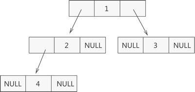
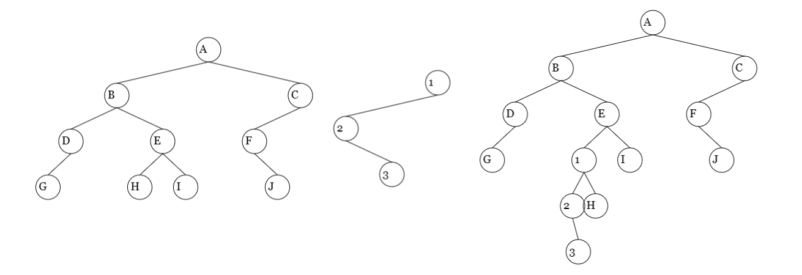
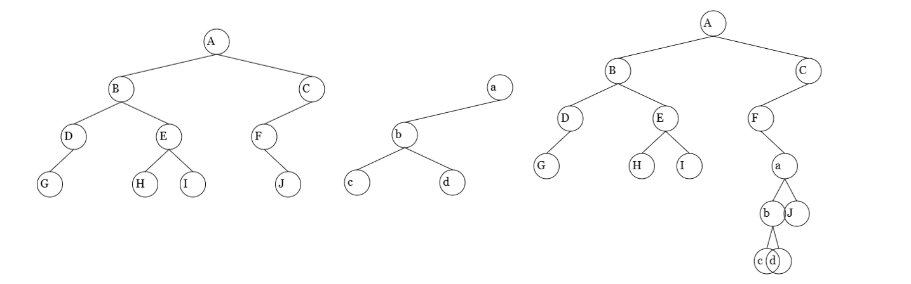

# 二叉树的二叉链表存储结构

二叉链拥有左子树指针和右子树指针


二叉链存储二叉树



## 结构定义

```c
/* 二叉树元素类型定义，这里假设其元素类型为char */
typedef char TElemType;

/* 二叉树结点定义 */
typedef struct BiTNode {
    TElemType data;             // 结点元素
    struct BiTNode* lchild;     // 左孩子指针
    struct BiTNode* rchild;     // 右孩子指针
} BiTNode;

/* 指向二叉树结点的指针 */
typedef BiTNode* BiTree;
```

## 初始化

```c
/*
 * 构造空二叉树。
 */
Status InitBiTree(BiTree* T){
    if(T == NULL){
        return ERROR;
    }

    *T = NULL;

    return OK;
}
```

## 创建二叉树

```c
/*━━━━━━━━━━━━━━━━━━━━━━ 仅限内部使用的函数 ━━━━━━━━━━━━━━━━━━━━━━*/
// 创建二叉树的内部函数
static void CreateTree(BiTree* T, FILE* fp) {
    char ch;

    // 读取当前结点的值
    if(fp == NULL) {
        scanf("%c", &ch);
    } else {
        ReadData(fp, "%c", &ch);
    }

    if(ch == '^') {
        *T = NULL;
    } else {
        // 生成根结点
        *T = (BiTree) malloc(sizeof(BiTNode));
        if(!(*T)) {
            exit(OVERFLOW);
        }
        (*T)->data = ch;
        CreateTree(&((*T)->lchild), fp); // 创建左子树
        CreateTree(&((*T)->rchild), fp); // 创建右子树
    }
}

/*
 * 按照预设的定义来创建二叉树。
 * 这里约定使用【先序序列】来创建二叉树。
 */
Status CreateBiTree(BiTree* T, char* path) {
    FILE* fp;
    int readFromConsole;    // 是否从控制台读取数据

    // 如果没有文件路径信息，则从控制台读取输入
    readFromConsole = path == NULL || strcmp(path, "") == 0;

    if(readFromConsole) {
        printf("请输入二叉树的先序序列，如果没有子结点，使用^代替：");
        CreateTree(T, NULL);
    } else {
        // 打开文件，准备读取测试数据
        fp = fopen(path, "r");
        if(fp == NULL) {
            return ERROR;
        }
        CreateTree(T, fp);
        fclose(fp);
    }

    return OK;
}
```

## 销毁

```c
/*
 * 释放二叉树所占内存。
 *
 *【注】
 * 二叉树的二叉链表存储结构可以销毁，但是没必要销毁。
 * 因为二叉链表销毁后的状态与置空后的状态是一致的。
 */
Status DestroyBiTree(BiTree* T){
    // 无需销毁，使用置空就可以
    return ERROR;
}
```

## 置空

```c
/*
 * 清理二叉树中的数据，使其成为空树。
 */
Status ClearBiTree(BiTree* T){
    if(T == NULL){
        return ERROR;
    }

    // 在*T不为空时进行递归清理
    if(*T){
        if((*T)->lchild != NULL){
            ClearBiTree(&(*T)->lchild);
        }
        if((*T)->rchild != NULL){
            ClearBiTree(&(*T)->rchild);
        }

        free(*T);
        *T = NULL;
    }

    return OK;
}
```

## 判空

```c
/*
 * 判断二叉树是否为空树。
 */
Status BiTreeEmpty(BiTree T){
    return T == NULL ? TRUE : FALSE;
}
```

## 树深

```c
/*
 * 返回二叉树的深度（层数）。
 */
int BiTreeDepth(BiTree T) {
    int LD, RD;

    if(T == NULL) {
        return 0;                       // 空树深度为0
    } else {
        LD = BiTreeDepth(T->lchild);    // 求左子树深度
        RD = BiTreeDepth(T->rchild);    // 求右子树深度

        // +1加上当前结点深度
        return (LD >= RD ? LD : RD) + 1;
    }
}
```

## 取值

```c
// 返回指向二叉树结点e的指针
static BiTree EPtr(BiTree T, TElemType e){
    BiTree pl,pr;

    if(T == NULL){
        return NULL;
    }

    // 如果找到了目标结点，直接返回其指针
    if(T->data == e){
        return T;
    }

    // 在左子树中查找e
    pl = EPtr(T->lchild, e);
    if(pl != NULL) {
        return pl;
    }

    // 在右子树中查找e
    pr = EPtr(T->rchild, e);
    if(pr != NULL) {
        return pr;
    }

    return NULL;
}
```

## 赋值

```c
/*
 * 为二叉树指定的结点赋值。
 */
Status Assign(BiTree T, TElemType e, TElemType value){
    BiTree p;

    // 遇到空树则无需继续计算
    if(BiTreeEmpty(T)) {
        return ERROR;
    }

    // 获取结点e的指针
    p = EPtr(T, e);

    // 如果没有找到元素e
    if(p == NULL) {
        return ERROR;
    } else {
        // 进行赋值
        p->data = value;
        return OK;
    }
}
```

## 根结点

```c
/*
 * 返回二叉树的根结点。
 */
TElemType Root(BiTree T){
    // 遇到空树则无需继续计算
    if(BiTreeEmpty(T)){
        return '\0';
    }

    return T->data;
}
```

## 双亲(父节点)

从根结点向下查找`e`值的父节点

```c
// 返回指向二叉树结点e的双亲结点的指针
static BiTree PPtr(BiTree T, TElemType e){
    BiTree pl, pr;

    if(T == NULL || T->data == e) {
        return NULL;
    }

    // e是T的左孩子
    if(T->lchild != NULL && T->lchild->data == e) {
        return T;
    }

    // e是T的右孩子
    if(T->rchild != NULL && T->rchild->data == e) {
        return T;
    }

    // 在左子树中查找e
    pl = PPtr(T->lchild, e);
    if(pl != NULL) {
        return pl;
    }

    // 在右子树中查找e
    pr = PPtr(T->rchild, e);
    if(pr != NULL) {
        return pr;
    }

    return NULL;
}

/*
 * 双亲
 *
 * 返回二叉树中结点e的双亲结点。
 */
TElemType Parent(BiTree T, TElemType e){
    BiTree p;

    // 遇到空树则无需继续计算
    if(BiTreeEmpty(T)) {
        return '\0';
    }

    // 获取结点e的双亲结点的指针
    p = PPtr(T,e);
    
    // 如果没有找到元素e的双亲
    if(p == NULL){
        return '\0';
    } else{
        return p->data;
    }
}
```

## 左孩子

1.查找`e`所在的指针`p = EPtr(T, e);`

2.获取左孩子数据`p->lchild->data`

```c
/*
 * 左孩子
 *
 * 返回二叉树中结点e的左孩子结点。
 */
TElemType LeftChild(BiTree T, TElemType e){
    BiTree p;

    // 遇到空树则无需继续计算
    if(BiTreeEmpty(T)) {
        return ERROR;
    }

    // 获取结点e的指针
    p = EPtr(T, e);

    if(p != NULL && p->lchild != NULL){
        return p->lchild->data;
    }

    return '\0';
}
```

## 右孩子

1.查找`e`所在的指针`p = EPtr(T, e);`

2.获取左孩子数据`p->rchild->data`

```c
/*
 * 右孩子
 *
 * 返回二叉树中结点e的右孩子结点。
 */
TElemType RightChild(BiTree T, TElemType e){
    BiTree p;

    // 遇到空树则无需继续计算
    if(BiTreeEmpty(T)) {
        return '\0';
    }

    // 获取结点e的指针
    p = EPtr(T, e);

    // 如果找到了元素e
    if(p != NULL && p->rchild != NULL){
        return p->rchild->data;
    }
    return '\0';
}
```

## 左兄弟

1.查找`e`的双亲结点`p = PPtr(T,e)`

2.获取双亲结点的左孩子`p->lchild->data`

```c
/*
 * 返回二叉树中结点e的左兄弟结点。
 */
TElemType LeftSibling(BiTree T, TElemType e){
    BiTree p;

    if(BiTreeEmpty(T)){
        return '\0';
    }

    // 获取结点e的双亲结点的指针
    p = PPtr(T,e);

    // 如果找到了元素e的双亲
    if(p != NULL && p->lchild != NULL){
        return p->lchild->data;
    }

    return '\0';
}
```

## 右兄弟

1.查找`e`的双亲结点`p = PPtr(T,e)`

2.获取双亲结点的左孩子`p->rchild->data`

```c
/*
 * 右兄弟
 *
 * 返回二叉树中结点e的右兄弟结点。
 */
TElemType RightSibling(BiTree T, TElemType e){
    BiTree p;

    if(BiTreeEmpty(T)){
        return '\0';
    }

    // 获取结点e的双亲结点的指针
    p = PPtr(T,e);

    // 如果找到了元素e的双亲
    if(p != NULL && p->rchild != NULL){
        return p->rchild->data;
    }
    
    return '\0';
}
```

## 先序遍历

中->左->右 

中`Visit(T->data)`

左子树`PreTraverse(T->lchild, Visit)`

右子树`PreTraverse(T->rchild, Visit)`

```c
// 先序遍历的内部实现
static Status PreTraverse(BiTree T, Status(Visit)(TElemType)) {
    if(T) {
        if(Visit(T->data)) {
            if(PreTraverse(T->lchild, Visit)) {
                if(PreTraverse(T->rchild, Visit)) {
                    return OK;
                }
            }
        }

        return ERROR;

        // 遇到空树则无需继续计算
    } else {
        return OK;
    }
}

/*
 * 先序遍历
 */
Status PreOrderTraverse(BiTree T, Status(Visit)(TElemType)) {
    Status status;

    status = PreTraverse(T, Visit);
    printf("\n");

    return status;
}
```

## 中序遍历

左->中->右

左 `InTraverse(T->lchild, Visit)`

中 `Visit(T->data)`

右 `InTraverse(T->rchild, Visit)`

```c
// 中序遍历的内部实现
static Status InTraverse(BiTree T, Status(Visit)(TElemType)) {
    if(T) {
        if(InTraverse(T->lchild, Visit)) {
            if(Visit(T->data)) {
                if(InTraverse(T->rchild, Visit)) {
                    return OK;
                }
            }
        }

        return ERROR;

        // 遇到空树则无需继续计算
    } else {
        return OK;
    }
}

/*
 * 中序遍历
 */
Status InOrderTraverse(BiTree T, Status(Visit)(TElemType)) {
    Status status;

    status = InTraverse(T, Visit);
    printf("\n");

    return status;
}
```

## 后序遍历

左->右->中

左`PostTraverse(T->lchild, Visit)`

右`PostTraverse(T->rchild, Visit)`

中`Visit(T->data)`

```c
// 后序遍历的内部实现
static Status PostTraverse(BiTree T, Status(Visit)(TElemType)) {
    if(T) {
        if(PostTraverse(T->lchild, Visit)) {
            if(PostTraverse(T->rchild, Visit)) {
                if(Visit(T->data)) {
                    return OK;
                }
            }
        }

        return ERROR;

        // 遇到空树则无需继续计算
    } else {
        return OK;
    }
}
/*
 * 后序遍历
 */
Status PostOrderTraverse(BiTree T, Status(Visit)(TElemType)) {
    Status status;

    status = PostTraverse(T, Visit);
    printf("\n");

    return status;
}
```

## 层序遍历


根指针入队 `A`

队列不为空，`A`出队；`B` `C` 入队。队列中元素为[`B`,`C`]

队列不为空，`B`出队；`D` `E` 入队。队列中元素为[`C`,`D`,`E`]

队列不为空，`C`出队；`F` 入队。队列中元素为[`D`,`E`,`F`]

队列不为空，`D`出队；`C`入队。队列中元素为[`E`,`F`,`C`]

队列不为空，`E`出队；`H` `I`入队。队列中元素为[`F`,`C`,`H`,`I`]

队列不为空，`F`出队；`J`入队。队列中元素为[`C`,`H`,`I`,`J`]

队列不为空，`C`出队；队列中元素为[`H`,`I`,`J`]

队列不为空，`H`出队；队列中元素为[`I`,`J`]

队列不为空，`I`出队；队列中元素为[`J`]

队列不为空，`J`出队；队列中元素为[]

队列为空，循环结束。

```c
/*
 * 层序遍历
 */
Status LevelOrderTraverse(BiTree T, Status(Visit)(TElemType)){
    LinkQueue Q;
    BiTree e;

    // 二叉树为空
    if(T == NULL) {
        printf("\n");
        return OK;
    }

    // 借助队列实现层序遍历
    InitQueue(&Q);

    // 根指针入队
    EnQueue(&Q, T);

    // 一直循环，直到队列为空
    while(!QueueEmpty(Q)) {
        DeQueue(&Q, &e);

        // 访问元素
        if(!Visit(e->data)) {
            return ERROR;
        }

        // 左孩子入队
        if(e->lchild != NULL) {
            EnQueue(&Q, e->lchild);
        }

        // 右孩子入队
        if(e->rchild != NULL) {
            EnQueue(&Q, e->rchild);
        }
    }

    printf("\n");

    return OK;
}
```

## 中序遍历 - 非递归算法1


::: tip

根指针入栈 `A`

第1个循环

栈不为空，入栈`B` `D` `G` `^` 空指针`^`退栈。栈中元素为 `A`  `B` `D` `G` 

访问结点`G` 获取`G`的右结点入栈`^`。栈中元素为 `A`  `B` `D` `^`

第2个循环

栈不为空，栈头为空；空指针退栈。 栈中元素为 `A`  `B` `D`

访问结点`D` 获取`D`的右结点入栈`^`。栈中元素为 `A`  `B`  `^`

第3个循环

栈不为空，栈头为空；空指针退栈。 栈中元素为 `A`  `B` 

访问节点`B` 获取`B`的右结点入栈`E`。栈中元素为 `A`  `E` 

第4个循环

栈不为空，入栈`H` `^`; 空指针退栈。 栈中元素为 `A`  `E` `H`

访问节点`H` 获取`H`的右结点入栈`^`。栈中元素为 `A`  `E` `^`

第5个循环

栈不为空，栈头为空；空指针退栈。 栈中元素为 `A`   

访问节点`E ` 获取`E`的右结点入栈`I`。栈中元素为 `A`   `I`

第6个循环

栈不为空，入栈`^`；空指针退栈。 栈中元素为 `A`  `I`

访问节点`I ` 获取`I`的右结点入栈`^`。栈中元素为 `A`  `^`

第7个循环

栈不为空，栈头为空；空指针退栈。 栈中元素为 `A`  

访问节点`A ` 获取`A`的右结点入栈`C`。栈中元素为   `C`

第7个循环

栈不为空，入栈`F` `^`；空指针退栈。 栈中元素为 `C` `F`

访问节点`F` 获取`F`的右结点入栈`J`。栈中元素为   `C` `J`

第8个循环

栈不为空，入栈`^`；空指针退栈。栈中元素为   `C` `J`

访问节点`J` 获取`J`的右结点入栈`^`。栈中元素为   `C` `^`

第9个循环

栈不为空，栈头为空；空指针退栈。 栈中元素为 `C`  

访问节点`C` 获取`C`的右结点入栈`^`。栈中元素为    `^`

第10个循环

栈不为空，栈头为空；空指针退栈。栈中元素为空。退出循环

::: 

```c
/*
 * 非递归算法
 */
Status InOrderTraverse_2(BiTree T, Status(Visit)(TElemType)) {
    SqStack S;
    BiTree p;

    InitStack(&S);
    Push(&S, T);    // 根指针入栈

    while(!StackEmpty(S)) {
        // 向左走到尽头
        while(GetTop(S, &p) && p != NULL) {
            Push(&S, p->lchild);
        }

        Pop(&S, &p);    // 空指针退栈

        if(!StackEmpty(S)) {
            // 访问结点
            Pop(&S, &p);
            if(!Visit(p->data)) {
                return ERROR;
            }

            // 向右一步
            Push(&S, p->rchild);

        }
    }

    printf("\n");

    return OK;
}
```

## 中序遍历 - 非递归算法2

与中序遍历 - 非递归算法1原理类似

```c
/*
 * 中序遍历
 *
 *【注】
 * 非递归算法
 */
Status InOrderTraverse_3(BiTree T, Status(Visit)(TElemType)) {
    SqStack S;
    BiTree p;

    InitStack(&S);

    p = T;

    while(p != NULL || !StackEmpty(S)) {
        if(p != NULL) {
            Push(&S, p);    // 根指针进栈
            p = p->lchild;  // 遍历左子树
        } else {
            // 访问结点
            Pop(&S, &p);
            if(!Visit(p->data)) {
                return ERROR;
            }

            p = p->rchild;
        }
    }

    printf("\n");

    return OK;
}
```

## 插入

::: tip


插入的右子树必须为空


:::


将子树 `c2` 插入为二叉树 T 中` E `结点的左子树。E有左子树将其移动到`c2`的右子树上





将子树`c1`插入为二叉树T中`F`结点的右子树。F中有右子树将其移动到`c1`的右子树上




```c
/*
 * 已知c为与T不相交的非空二叉树，且c的右子树为空，
 * 根据LR的取值(0或1)，将c插入为T中结点p的左子树/右子树，
 * 并且，将p结点原有的左子树/右子树嫁接为二叉树c的右子树。
 */
Status InsertChild(BiTree T, TElemType p, int LR, BiTree c) {
    BiTree p_ptr;

    // 如果待插入的树为空树则无需继续计算
    if(BiTreeEmpty(c)) {
        return ERROR;
    }

    // 获取结点p的指针
    p_ptr = EPtr(T, p);

    // 如果p结点不存在，则返回错误提示
    if(p_ptr == NULL) {
        return ERROR;
    }

    // 将c插入为p的左子树
    if(LR==0) {
        // 如果p处存在左子树，则摘下p的左子树，插入为c的右子树
        if(p_ptr->lchild!=NULL) {
            c->rchild = p_ptr->lchild;
        }

        p_ptr->lchild = c;
    } else {
        // 如果p处存在右子树，则摘下p的右子树，插入为c的右子树
        if(p_ptr->rchild!=NULL) {
            c->rchild = p_ptr->rchild;
        }

        p_ptr->rchild = c;
    }

    return OK;
}
```

## 删除

```c
/*
 * 根据LR的取值(0或1)，删除结点p的左子树/右子树。
 */
Status DeleteChild(BiTree T, TElemType p, int LR) {
    BiTree p_ptr;

    // 遇到空树则无需继续计算
    if(BiTreeEmpty(T)) {
        return ERROR;
    }

    // 获取结点p的指针
    p_ptr = EPtr(T, p);

    // 如果p结点不存在，则返回错误提示
    if(p_ptr == NULL) {
        return ERROR;
    }

    // 如果需要删除p的左子树
    if(LR == 0) {
        ClearBiTree(&(p_ptr->lchild));

        // 如果需要删除p的右子树
    } else {
        ClearBiTree(&(p_ptr->rchild));
    }

    return OK;
}
```

