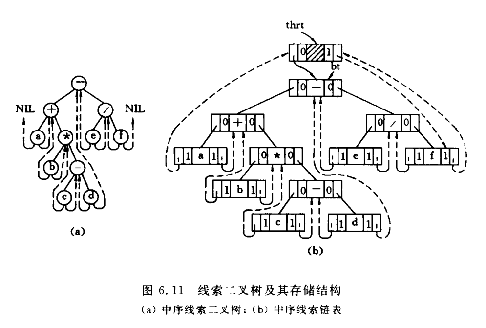

# 线索二叉树

::: tip

叶子节点指向问题

:::

二叉链拥有左子树指针,右子树指针和左标志和右标志


如果结点有左子树，则` lchild `指针域指向左孩子(此时`LTag = 0` )，否则` lchild `指针域指向该结点的直接前趋(此时`LTag = 1` )。

如果结点有右子树，则 `rchild `指针域指向右孩子(此时`RTag = 0` )，否则 `rchild `指针域指向该结点的直接后继(此时`RTag = 1` )。

## 结构定义

```c
/* 线索二叉树结点类型标记 */
typedef enum {
    Link, Thread    // Link==0：指针(孩子)；Thread==1：线索
} PointerTag;

/* 线索二叉树元素类型定义，这里假设其元素类型为char */
typedef char TElemType;

/* 线索二叉树结点定义 */
typedef struct BiThrNode{
    TElemType data;            // 结点元素
    struct BiThrNode* lchild;  // 左孩子指针
    struct BiThrNode* rchild;  // 右孩子指针
    PointerTag LTag;           // 左孩子标记
    PointerTag RTag;           // 右孩子标记
    struct BiThrNode* parent;  // 双亲结点指针，仅在非递归遍历后序后继线索二叉树时使用
} BiThrNode;

/* 指向线索二叉树结点的指针 */
typedef BiThrNode* BiThrTree;

/* 全局变量 */
static BiThrTree pre;   // 指向当前访问结点的上一个结点(前驱)
```

## 创建二叉树

::: tip

与二叉树-二叉链存储结构相同

:::

```c
// 创建二叉树的内部函数
static void CreateTree(BiThrTree* T,FILE *fp){
    char ch;

    // 读取当前结点的值
    if(fp == NULL) {
        scanf("%c", &ch);
    } else {
        ReadData(fp, "%c", &ch);
    }

    if(ch == '^') {
        *T = NULL;
    } else {
        // 生成根结点
        *T = (BiThrTree) malloc(sizeof(BiThrNode));
        if(!(*T)) {
            exit(OVERFLOW);
        }
        (*T)->data = ch;
        CreateTree(&((*T)->lchild), fp); // 创建左子树
        CreateTree(&((*T)->rchild), fp); // 创建右子树
    }
}

/*
 * 按照预设的定义来创建二叉树。
 * 这里约定使用【先序序列】来创建二叉树。
 */
Status CreateBiTree(BiThrTree* T, char* path) {
    FILE* fp;
    int readFromConsole;    // 是否从控制台读取数据

    // 如果没有文件路径信息，则从控制台读取输入
    readFromConsole = path == NULL || strcmp(path, "") == 0;

    if(readFromConsole) {
        printf("请输入二叉树的先序序列，如果没有子结点，使用^代替：");
        CreateTree(T, NULL);
    } else {
        // 打开文件，准备读取测试数据
        fp = fopen(path, "r");
        if(fp == NULL) {
            return ERROR;
        }
        CreateTree(T, fp);
        fclose(fp);
    }

    return OK;
}
```

## 中序全线索化二叉树



`thrt` 是扩展的节点，左指针指向根节点，右指针指向最后一个节点。

**当前结点没有左子树**：对于结点`b`,结点`b`的左子树为空；此时的前驱为`+`，因此`a`的左指针指向`+`

```c
// 如果当前结点的左子树为空，则需要建立前驱线索
if(!p->lchild){
    p->LTag = Thread;
    p->lchild = pre;
}
```

**前驱没有后继**：对于结点`+`，此时前驱`pre`为`a`。前驱`a`的右子树为空，因此`a`右子树指针指向`+`

```c
// 如果前驱结点的右子树为空，则为前驱建立后继线索
if(!pre->rchild){
    pre->RTag = Thread;
    pre->rchild = p;
}
```

完整代码

```c
/* 全局变量 */
static BiThrTree pre;   // 指向当前访问结点的上一个结点(前驱)

/*
 * 中序全线索化的内部实现
 */
static void InTheading(BiThrTree p) {
    if(p == NULL){
        return;
    }

    // 线索化左子树
    InTheading(p->lchild);

    // 如果当前结点的左子树为空，则需要建立前驱线索
    if(!p->lchild){
        p->LTag = Thread;
        p->lchild = pre;
    } else{
        // 如果左子树不为空
        p->LTag = Link;
    }

    // 如果前驱结点的右子树为空，则为前驱建立后继线索
    if(!pre->rchild){
        pre->RTag = Thread;
        pre->rchild = p;
    } else{
        pre->RTag = Link;
    }

    pre = p;   // pre向前挪一步

    InTheading(p->rchild);
}

/*
 * 中序遍历二叉树T，并将其全线索化为线索二叉树Thrt。
 * 注：这里的线索包括前驱线索与后继线索。
 */
Status InOrderThreading(BiThrTree* Thrt, BiThrTree T) {
    // 建立头结点
    *Thrt = (BiThrTree) malloc(sizeof(BiThrNode));
    if(!*Thrt) {
        exit(OVERFLOW);
    }

    (*Thrt)->data = '\0';

    (*Thrt)->LTag = Link;       // 左孩子，需要指向二叉树的根结点
    (*Thrt)->RTag = Thread;     // 右指针，需要指向中序序列最后一个元素，以便逆中序遍历线索二叉树

    (*Thrt)->rchild = *Thrt;

    // 若二叉树为空，则左指针回指
    if(!T) {
        (*Thrt)->lchild = *Thrt;
    } else {
        (*Thrt)->lchild = T;    // 指向二叉树头结点
        pre = *Thrt;            // 记录前驱信息，初始化为线索二叉树头结点

        InTheading(T);          // 中序遍历，以进行中序线索化

        pre->rchild = *Thrt;    // 最后一个结点指回线索二叉树头结点
        pre->RTag = Thread;     // 最后一个结点线索化
        (*Thrt)->rchild = pre;  // 头结点指向最后一个结点，建立双向联系
    }

    return OK;

}
```

## 中序遍历中序全线索二叉树


循环访问`—`  `+` `a` 访问`a` ；`a`的右tag为线索，p指针`+`，访问`+` ,`+`的右tag为不是线索；访问右子树`-`

```c
/*
 * 中序遍历中序全线索二叉树（非递归算法）。
 *
 * 注：该方法可以验证后继线索是否正确
 */
Status InOrderTraverse_Thr(BiThrTree T, Status(Visit)(TElemType)) {
    BiThrTree p = T->lchild;    // p指向二叉树根结点（不同于线索二叉树的头结点）
    
    // 空树或遍历结束时，p==T
    while(p != T) {
        // 如果存在左孩子，则持续向左访问
        while(p->LTag == Link) {
            p = p->lchild;
        }
        
        // 访问左子树为空的结点（最左边）
        if(!Visit(p->data)) {
            return ERROR;
        }
        
        // 如果存在后继线索（即没有右子树）
        while(p->RTag == Thread && p->rchild != T) {
            p = p->rchild;   // 将p指向其后继
            Visit(p->data);  // 访问后继结点
        }
        
        // 访问右子树
        p = p->rchild;
    }
    
    printf("\n");
    
    return OK;
}
```

