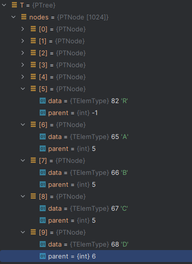
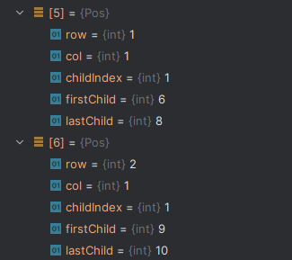

# 树的双亲表存储表示


采用顺序存储方式，如果有父元素则存储父元素下标。没有则存储`-1`。

例如：A父元素是R，R的下标是0


## 结构定义

```c
/* 树的最大结点树 */
#define MAX_TREE_SIZE 1024

/* 单个结点最大的孩子数量 */
#define MAX_CHILD_COUNT 8

/* 树的元素类型定义，这里假设其元素类型为char */
typedef char TElemType;

/* (双亲)树的结点定义 */
typedef struct PTNode{
    TElemType data;
    int parent;       // 双亲位置域
} PTNode;

/*
 * (双亲)树类型定义
 *
 *【注】
 * 1.树中结点在nodes中"紧邻"存储，没有空隙
 * 2.树根r可能出现在nodes的任意位置
 * 3.除根结点外，其他结点依次按层序顺着根结点往下排列（这一点与教材图示可能会有区别）
 * 4.nodes数组是循环使用的（这一点教材未提到）
 * 5.这里假设nodes空间是足够大的，可以视需求将其改为动态分配存储
 */
typedef struct {
    PTNode nodes[MAX_TREE_SIZE];    // 存储树中结点
    int r;    // 树根位置(索引)
    int n;    // 树的结点数
} PTree;

/* 树中某个结点的信息 */
typedef struct {
    int row;          // 当前结点所在的行
    int col;          // 当前结点所在的列
    int childIndex;   // 当前结点是第几个孩子
    int firstChild;   // 当前结点的第一个孩子在树中的索引
    int lastChild;    // 当前结点的最后一个孩子在树中的索引
} Pos;
```

## 初始化

```c
/*
 * 构造空树。
 */
Status InitTree(PTree* T){
    if(T == NULL){
        return ERROR;
    }
    // 树的结点数置零
    T->n = 0;

    // 所有数据清零
    memset(T->nodes,0,sizeof(T->nodes));

    return OK;
}
```

## 销毁

```c
/*
 * 释放树所占内存。
 *
 *【注】
 * 树的双亲表结构无法被销毁
 */
Status DestroyTree(PTree* T) {
    // 无法销毁
    return ERROR;
}
```

## 置空

```c
/*
 * 清理树中的数据，使其成为空树。
 */
Status ClearTree(PTree* T){
    if(T == NULL){
        return ERROR;
    }

    // 将元素数量归零即可
    T->n = 0;

    // 所有数据清零
    memset(T->nodes,0,sizeof(T->nodes));

    return OK;
}
```

## 创建



处理的数据

R入队，队内元素为[`5`]。nodes元素[`\0`,`\0`,`\0`,`\0`,`\0`,`R`]

录入ABC；队列出队`5`,队内元素为[]。队列依次入队[`6`,`7`,`8`]。nodes元素[`\0`,`\0`,`\0`,`\0`,`\0`,`R`,`A`,`B`,`C`]。ABC的父元素为`5`

录入DE；队列出队`6`,队列元素为[`7`,`8`]。队列依次入队[`7`,`8`,`9`,`10`]。nodes元素[`\0`,`\0`,`\0`,`\0`,`\0`,`R`,`A`,`B`,`C`,`D`,`E`]。

...

```
根结点位置：5
根结点的值：R
R的孩子结点：ABC
A的孩子结点：DE
B的孩子结点：^
C的孩子结点：F
D的孩子结点：^
E的孩子结点：^
F的孩子结点：GHK
G的孩子结点：^
H的孩子结点：^
K的孩子结点：^
```

创建函数

```c
/*━━━━━━━━━━━━━━━━━━━━━━ 仅限内部使用的函数 ━━━━━━━━━━━━━━━━━━━━━━*/

// 创建树的内部函数
static void Create(PTree* T, FILE* fp) {
    int r;          // 树的根结点的位置（索引）
    int n;          // 记录元素数量
    int cur;        // 游标
    TElemType ch;
    LinkQueue Q;
    QElemType e;    // 队列元素指示结点的位置
    char s[MAX_CHILD_COUNT + 1];
    int i;

    InitQueue(&Q);

    n = 0;

    // 读取根结点的位置
    if(fp == NULL) {
        printf("请输入根结点的位置(0~%d)：", MAX_TREE_SIZE - 1);
        scanf("%d", &r);
        cur = r;

        printf("请输入根结点的值：");
        scanf("%s", s);
        ch = s[0];

        // 树根入队
        EnQueue(&Q, cur);
        T->nodes[cur].data = ch;
        T->nodes[cur].parent = -1;
        cur = (cur + 1) % MAX_TREE_SIZE;
        n++;

        while(!QueueEmpty(Q)) {
            DeQueue(&Q, &e);    // 父结点位置出队

            printf("请依次输入 %c 的孩子结点，不存在孩子时输入一个^：", T->nodes[e].data);
            scanf("%s", s);
            for(i = 0; i < strlen(s); i++) {
                if(s[i] == '^') {
                    break;
                }

                EnQueue(&Q, cur); // 当前结点位置入队
                T->nodes[cur].data = s[i];
                T->nodes[cur].parent = e;
                cur = (cur + 1) % MAX_TREE_SIZE;
                n++;
            }
        }
    } else {
        // 录入根结点的位置
        ReadData(fp, "%d", &r);
        cur = r;

        // 录入根结点的值
        ReadData(fp, "%s", s);
        ch = s[0];
        printf("录入根结点的值：%c\n", ch);

        // 树根所在位置入队
        EnQueue(&Q, cur);
        T->nodes[cur].data = ch;
        T->nodes[cur].parent = -1;
        cur = (cur + 1) % MAX_TREE_SIZE;
        n++;

        while(!QueueEmpty(Q)) {
            ReadData(fp, "%s", s);
            ch = s[0];
            printf("依次录入 %c 结点的孩子：", ch);

            // 录入孩子结点
            ReadData(fp, "%s", s);
            printf("%s\n", s);

            DeQueue(&Q, &e);    // 父结点位置出队

            // 遍历孩子
            for(i = 0; i < strlen(s); i++) {
                if(s[i] == '^') {
                    break;
                }

                EnQueue(&Q, cur); // 当前结点位置入队
                T->nodes[cur].data = s[i];
                T->nodes[cur].parent = e;
                cur = (cur + 1) % MAX_TREE_SIZE;
                // 增加树的结点数
                n++;
            }
        }
    }

    // 树根位置(索引)
    T->r = r;
    // 树的结点数
    T->n = n;
}

/*
 * 按照预设的定义来创建树。
 * 这里约定使用【层序序列】来创建树。
 */
Status CreateTree(PTree* T, char* path) {
    FILE* fp;
    int readFromConsole;    // 是否从控制台读取数据

    // 如果没有文件路径信息，则从控制台读取输入
    readFromConsole = path == NULL || strcmp(path, "") == 0;

    if(readFromConsole) {
        printf("请输入树的元素信息，对于空结点，使用^代替...\n");
        Create(T, NULL);
    } else {
        // 打开文件，准备读取测试数据
        fp = fopen(path, "r");
        if(fp == NULL) {
            return ERROR;
        }
        Create(T, fp);
        fclose(fp);
    }

    return OK;
}
```

## 判空

```c
/*
 * 判断树是否为空树。
 */
Status TreeEmpty(PTree T){
    return T.n == 0 ? TRUE : FALSE;
}
```

## 树深

::: tip

因为是层序遍历的，最后一个元素是树中最后一个元素。

从最后一个元素查询一直向上查找其父元素就可以统计元素个数。

:::

```c
/*
 * 返回树的深度（层数）。
 */
int TreeDepth(PTree T) {
    int k, level;

    // 遇到空树则无需继续计算
    if(TreeEmpty(T)) {
        return 0;
    }

    /*
     * 将k初始化为最后一个结点的位置
     * 由于树的结点按层序存储，故最后存储的结点必定位于最大层
     */
    k = (T.r + T.n - 1) % MAX_TREE_SIZE;
    level = 0;

    do {
        level++;
        k = T.nodes[k].parent;
    } while(k != -1);

    return level;
}
```

## 取值

::: info

从头到尾依次查找即可

:::

::: code-group

```c [PTree.c]
// 返回树结点e的索引，如果不存在，返回-1
static int EIndex(PTree T, TElemType e) {
    int i = T.r;    // 指向根结点
    int p = -1;

    // 遇到空树则无需继续计算
    if(TreeEmpty(T)) {
        return -1;
    }

    // 在树中查找结点e
    while(i != (T.r + T.n) % MAX_TREE_SIZE) {
        if(T.nodes[i].data == e) {
            p = i;
            break;
        }

        i = (i + 1) % MAX_TREE_SIZE;
    }

    return p;
}

/*
 * 取值
 *
 * 返回树中指定结点的值。
 */
TElemType Value(PTree T, TElemType e) {
    int p;

    // 遇到空树则无需继续计算
    if(TreeEmpty(T)) {
        return '\0';
    }

    // 获取结点e的索引
    p = EIndex(T, e);

    // 如果没有找到元素e
    if(p == -1) {
        return '\0';
    } else {
        return T.nodes[p].data;
    }
}
```

``` c [main.c]
#include <stdio.h>
#include "PTree.h"

int main() {
    PTree T;

    // 初始化空树T
    InitTree(&T);

    // 按先序序列创建数T
    CreateTree(&T,"TestData_T.txt");

    // 查找结点E
    Value(T,'E');
    printf("%c\n", Value(T,'E'));
    
    return 0;
}
```

:::

## 赋值

::: info

从头到尾查找结点所在的索引，然后修改对应索引的值。

:::

```c
/*
 * 为树指定的结点赋值。
 */
Status Assign(PTree* T, TElemType e, TElemType value) {
    int p;

    // 遇到空树则无需继续计算
    if(TreeEmpty(*T)) {
        return ERROR;
    }

    // 获取结点e的索引
    p = EIndex(*T, e);

    // 如果没有找到元素e
    if(p == -1) {
        return ERROR;
    } else {
        // 进行赋值
        T->nodes[p].data = value;
        return OK;
    }
}
```

## 根

```c
/*
 * 返回树的根结点。
 */
TElemType Root(PTree T) {
    // 遇到空树则无需继续计算
    if(TreeEmpty(T)) {
        return '\0';
    }

    return T.nodes[T.r].data;
}
```

## 双亲(父结点)

::: info

查找当前节点的索引；获取当前结点的索引，通过当前结点的索引获取父元素的索引来获取值。

:::

```c
/*
 * 返回树中结点e的双亲结点。
 */
TElemType Parent(PTree T, TElemType e) {
    int p, parent;

    // 遇到空树则无需继续计算
    if(TreeEmpty(T)) {
        return '\0';
    }

    // 获取结点e的索引
    p = EIndex(T, e);

    // 如果没有找到元素e
    if(p == -1) {
        return '\0';
    } else {
        parent = T.nodes[p].parent;

        // 根结点无双亲
        if(parent == -1) {
            return '\0';
        } else {
            return T.nodes[parent].data;
        }
    }
}
```

## 孩子数量

::: tip

1.获取当前结点的索引，从当前索引开始查找第一个parent为当前节点的索引

2.因为是层序存储，元素是连续的。通过依次遍历既可获取孩子结点数量。

:::

```c
/*
 * 返回树T中结点e的孩子数量。
 */
int ChildCount(PTree T, TElemType e) {
    int p, k, count;

    // 遇到空树则无需继续计算
    if(TreeEmpty(T)) {
        return -1;
    }

    // 获取结点e的索引
    p = EIndex(T, e);
    // 结点e不存在
    if(p == -1) {
        return -1;
    }

    // 查找第一个孩子
    for(k = (p + 1) % MAX_TREE_SIZE; k != (T.r + T.n) % MAX_TREE_SIZE; k = (k + 1) % MAX_TREE_SIZE) {
        if(T.nodes[k].parent == p) {
            break;
        }
    }

    count = 0;

    // 统计结点e的孩子数量
    while(k != (T.r + T.n) % MAX_TREE_SIZE && T.nodes[k].parent == p) {
        count++;
        k = (k + 1) % MAX_TREE_SIZE;
    }

    return count;
}
```

## 孩子结点

::: tip

返回树中结点e的第i个孩子。

1.获取第一个孩子结点索引

2.依次遍历到第i个结点

:::

```c
// 返回树结点e的第i个孩子索引，如果不存在，返回-1
static int CIndex(PTree T, TElemType e, int i) {
    int p, k, r, count;

    // 遇到空树则无需继续计算
    if(TreeEmpty(T)) {
        return -1;
    }

    // i的范围越界
    if(i < 1 || i > MAX_CHILD_COUNT) {
        return -1;
    }

    // 获取结点e的索引
    p = EIndex(T, e);
    // 结点e不存在
    if(p == -1) {
        return -1;
    }

    k = (p + 1) % MAX_TREE_SIZE;

    // 查找第一个孩子，用k记录
    while(k != (T.r + T.n) % MAX_TREE_SIZE && T.nodes[k].parent < p) {
        k = (k + 1) % MAX_TREE_SIZE;
    }

    // 确保第一个孩子存在
    if(k != (T.r + T.n) % MAX_TREE_SIZE) {
        count = 1;
        r = k;

        while(count < i && T.nodes[r].parent==p) {
            r = (r + 1) % MAX_TREE_SIZE;
            count++;
        }

        if(count == i) {
            return r;
        }
    }

    return -1;
}

/*
 * 返回树中结点e的第i个孩子。
 */
TElemType Child(PTree T, TElemType e, int i) {
    int p;

    // 遇到空树则无需继续计算
    if(TreeEmpty(T)) {
        return '\0';
    }

    // i的范围越界
    if(i < 1 || i > MAX_CHILD_COUNT) {
        return '\0';
    }

    // 获取结点e的第i个孩子索引
    p = CIndex(T, e, i);
    // 结点e第i个孩子不存在
    if(p == -1) {
        return '\0';
    }

    return T.nodes[p].data;
}
```

## 左兄弟

::: tip

返回树中结点e的左兄弟结点。

1.获取当前结点所在的索引。

2.通过当前索引-1获取其左兄弟。

:::

```c
/*
 * 返回树中结点e的左兄弟结点。
 *
 *【注】
 * 由于树的结点可能会包含多个孩子，
 * 因此这里的左兄弟特指左边紧邻该结点的兄弟。
 */
TElemType LeftSibling(PTree T, TElemType e) {
    int p, ls;

    // 遇到空树则无需继续计算
    if(TreeEmpty(T)) {
        return '\0';
    }

    // 获取结点e的索引
    p = EIndex(T, e);
    // 结点e不存在
    if(p == -1) {
        return '\0';
    }

    // 假设存在左兄弟
    ls = (p - 1 + MAX_TREE_SIZE) % MAX_TREE_SIZE;

    // 如果该结点有效，且与结点e的双亲相同，说明它是兄弟
    if(ls != p && T.nodes[ls].data != '\0' && T.nodes[ls].parent == T.nodes[p].parent) {
        return T.nodes[ls].data;
    }

    return '\0';
}
```

## 右兄弟

::: tip

返回树中结点e的右兄弟结点。

1.获取当前结点所在的索引。

2.通过当前索引+1获取其右兄弟。

:::

```c
/*
 * 返回树中结点e的右兄弟结点。
 *
 *【注】
 * 由于树的结点可能会包含多个孩子，
 * 因此这里的右兄弟特指右边紧邻该结点的兄弟。
 */
TElemType RightSibling(PTree T, TElemType e) {
    int p, rs;

    // 遇到空树则无需继续计算
    if(TreeEmpty(T)) {
        return '\0';
    }

    // 获取结点e的索引
    p = EIndex(T, e);
    // 结点e不存在
    if(p == -1) {
        return '\0';
    }

    // 假设存在右兄弟
    rs = (p + 1) % MAX_TREE_SIZE;

    // 如果该结点有效，且与结点e的双亲相同，说明它是兄弟
    if(rs != p && T.nodes[rs].data != '\0' && T.nodes[rs].parent == T.nodes[p].parent) {
        return T.nodes[rs].data;
    }

    return '\0';
}
```

## 先序遍历


先序序列中->左->右为RADEBCFGHK

计算T中结点的位置信息



[5] 对应R结点；第一个孩子索引为6[A]，最后一个索引孩子为8[C]

[6] 对应A结点；第一个孩子索引为9[D]，最后一个索引孩子为10[E]

```c
/* 树中某个结点的信息 */
typedef struct {
    int row;          // 当前结点所在的行
    int col;          // 当前结点所在的列
    int childIndex;   // 当前结点是第几个孩子
    int firstChild;   // 当前结点的第一个孩子在树中的索引
    int lastChild;    // 当前结点的最后一个孩子在树中的索引
} Pos;

// 获取树T的结点信息，具体包含哪些信息，请参照Pos类型的定义
static void getPos(PTree T, Pos pt[]) {
    LinkList Lt, Lt_parent, Lt_child;
    int m, n, p, k, s;
    int level;

    memset(pt, 0, MAX_TREE_SIZE * sizeof(Pos));

    // 遇到空树则无需继续计算
    if(TreeEmpty(T)) {
        return;
    }

    InitList(&Lt_parent);
    InitList(&Lt_child);

    // 根结点的parent为-1
    ListInsert(Lt_parent, 1, -1);

    level = 1;
    k = T.r;
    m = n = 0;
    s = -1; // 初始化头结点的父结点为-1

    while(k != (T.r + T.n) % MAX_TREE_SIZE) {
        // 结点k第一个孩子在树中的索引初始化为-1
        pt[k].firstChild = -1;

        // 结点k最后一个孩子在树中的索引初始化为-1
        pt[k].lastChild = -1;

        // 当前结点k的父结点
        p = T.nodes[k].parent;
        if(p != s) {
            s = p;  // 追踪父结点的变化
            n = 0;  // 父结点改变时，需要重新计数
        }

        // 判断当前结点是否为第level-1层结点的孩子
        if(LocateElem(Lt_parent, p, Equal)) {
            ListInsert(Lt_child, ++m, k);

            pt[k].row = level;
            pt[k].col = m;
            pt[k].childIndex = ++n;

            // 确保当前结点父结点存在
            if(p != -1) {
                // 第一个孩子在树中的索引
                if(pt[p].firstChild==-1) {
                    pt[p].firstChild = k;
                }

                // 最后一个孩子在树中的索引
                pt[p].lastChild = k;
            }

            k = (k + 1) % MAX_TREE_SIZE;
        } else {
            Lt = Lt_parent;
            Lt_parent = Lt_child;
            Lt_child = Lt;
            ClearList(Lt_child);

            level++;
            m = 0;
        }
    }

    DestroyList(&Lt_parent);
    DestroyList(&Lt_child);
}

// 先序遍历的内部实现
static Status PreTraverse(PTree T, Pos pt[], int i, Status(Visit)(TElemType)) {
    int firstChild;
    int rightBrother;

    // 访问当前结点
    if(!Visit(T.nodes[i].data)) {
        return ERROR;
    }

    firstChild = pt[i].firstChild;

    // 遍历长子（需要先确定长子的身份）
    if(firstChild != -1 && !PreTraverse(T, pt, firstChild, Visit)) {
        return ERROR;
    }

    rightBrother = (i + 1) % MAX_TREE_SIZE;

    // 遍历右兄弟（需要先确定右兄弟的身份）
    if(T.nodes[i].parent == T.nodes[rightBrother].parent && !PreTraverse(T, pt, rightBrother, Visit)) {
        return ERROR;
    }

    return OK;
}

/*
 * 先序遍历
 */
Status PreOrderTraverse(PTree T, Status(Visit)(TElemType)) {
    Pos pt[MAX_TREE_SIZE];

    // 遇到空树则无需继续计算
    if(TreeEmpty(T)) {
        printf("\n");
        return ERROR;
    }

    // 计算T中结点的位置信息
    getPos(T, pt);

    PreTraverse(T, pt, T.r, Visit);

    printf("\n");

    return OK;
}
```

## 后序遍历


左子树->右子树->中为DEABGHKFCR

```c
// 后序遍历的内部实现
static Status PostTraverse(PTree T, Pos pt[], int i, Status(Visit)(TElemType)) {
    int firstChild;
    int rightBrother;

    firstChild = pt[i].firstChild;

    // 遍历长子（需要先确定长子的身份）
    if(firstChild != -1 && !PostTraverse(T, pt, firstChild, Visit)) {
        return ERROR;
    }

    // 访问当前结点
    if(!Visit(T.nodes[i].data)) {
        return ERROR;
    }

    rightBrother = (i + 1) % MAX_TREE_SIZE;

    // 遍历右兄弟（需要先确定右兄弟的身份）
    if(T.nodes[i].parent == T.nodes[rightBrother].parent && !PostTraverse(T, pt, rightBrother, Visit)) {
        return ERROR;
    }

    return OK;
}

/*
 * 后序遍历
 */
Status PostOrderTraverse(PTree T, Status(Visit)(TElemType)) {
    Pos pt[MAX_TREE_SIZE];

    // 遇到空树则无需继续计算
    if(TreeEmpty(T)) {
        printf("\n");
        return ERROR;
    }

    // 计算T中结点的位置信息
    getPos(T, pt);

    PostTraverse(T, pt, T.r, Visit);

    printf("\n");

    return OK;
}
```

## 层序遍历

默认存储即为层序存储，顺序遍历即可

```c
/*
 * 层序遍历
 */
Status LevelOrderTraverse(PTree T, Status(Visit)(TElemType)) {
    int i;

    // 遇到空树则无需继续计算
    if(TreeEmpty(T)) {
        printf("\n");
        return ERROR;
    }

    // 顺次遍历所有元素
    for(i = T.r; i != (T.r + T.n) % MAX_TREE_SIZE; i = (i + 1) % MAX_TREE_SIZE) {
        if(!Visit(T.nodes[i].data)) {
            return ERROR;
        }
    }

    printf("\n");

    return OK;
}
```

