# 赫夫曼树

当用 n 个结点（都做叶子结点且都有各自的权值）试图构建一棵树时，如果构建的这棵树的带权路径长度最小，称这棵树为“最优二叉树”，有时也叫“赫夫曼树”或者“哈夫曼树”。

在构建哈弗曼树时，要使树的带权路径长度最小，只需要遵循一个原则，那就是：权重越大的结点离树根越近。在图 1 中，因为结点 a 的权值最大，所以理应直接作为根结点的孩子结点。


路径：在一棵树中，一个结点到另一个结点之间的通路，称为路径。如根结点到结点a之间的通路就是一条路径。

路径长度：在一条路径中，每经过一个结点，路径长度都要加 1 。如根节点到b结点的路径长度为2。

结点的权：给每一个结点赋予一个新的数值，被称为这个结点的权。如结点d的权为4。

结点的带权路径长度：指的是从根结点到该结点之间的路径长度与该结点的权的乘积。

树的带权路径长度为树中所有叶子结点的带权路径长度之和。通常记作 “WPL” 。
$$
WPL = 7*1 + 5*2 + 2*3 + 4*3
$$
根结点到a的路径长度为1

根结点到b的路径长度为2

根结点到c的路径长度为3

根结点到d的路径长度为3

## 哈弗曼树的算法实现

构建哈夫曼树时，需要每次根据各个结点的权重值，筛选出其中值最小的两个结点，然后构建二叉树。

查找权重值最小的两个结点的思想是：从树组起始位置开始，首先找到两个无父结点的结点（说明还未使用其构建成树），然后和后续无父结点的结点依次做比较，有两种情况需要考虑：

- 如果比两个结点中较小的那个还小，就保留这个结点，删除原来较大的结点；
- 如果介于两个结点权重值之间，替换原来较大的结点；

对权值为 5, 29, 7, 8, 14, 23, 3, 11的叶子节点生成哈夫曼树

排序后 3,5,7,8,11,14,23,29；选择两个最小的值构成一棵树3,5

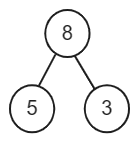

将8加入重新排序后7,**8**,8,11,14,23,29；选择两个最小的值构成一棵树7,8

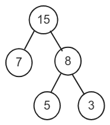

将15加入重新排序后8,11,14,**15**,23,29；选择两个最小的值构成一棵树8,11

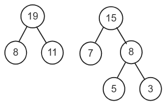

将19加入重新排序后14,15,**19**,23,29；选择两个最小的值构成一棵树14,15

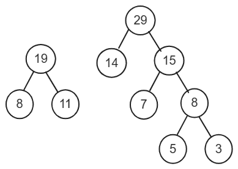

将29加入重新排序后19,23,29,**29**；选择两个最小的值构成一棵树19,23

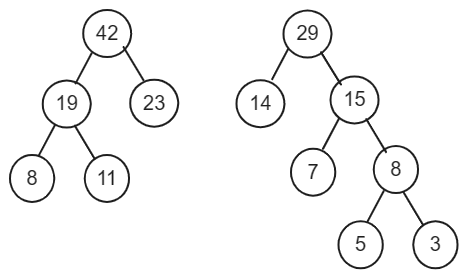

将42加入重新排序后29,29,**42**；选择两个最小的值构成一棵树29,29

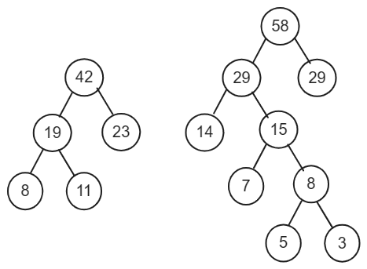

将58加入重新排序后42,**58**；选择两个最小的值构成一棵树42,58

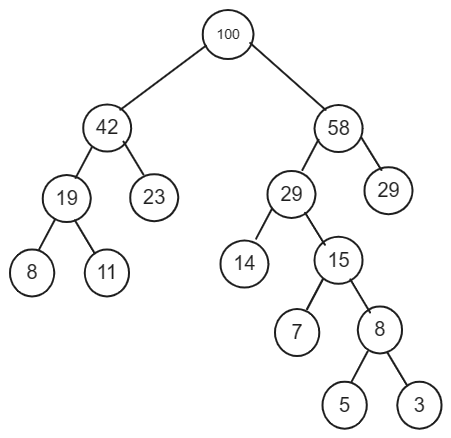

## 结构定义

```c
/* 赫夫曼树结点定义，是一种双亲存储结构 */
typedef struct {
    unsigned int weight;    // 权值
    unsigned int parent;    // 双亲位置
    unsigned int lchild;    // 左孩子位置
    unsigned int rchild;    // 右孩子位置
} HTNode;

/*
 * 赫夫曼树类型定义
 *
 *【注】
 * 1.0号单元的weight域指示赫夫曼树的结点数量
 * 2.其存储空间会动态分配
 */
typedef HTNode* HuffmanTree;

/*
 * 赫夫曼编码表的类型定义，包含了多个字符的赫夫曼编码
 *
 *【注】
 * 1.0号单元是弃用的
 * 2.存储空间需要动态分配
 */
typedef char** HuffmanCode;
```

## 初始化环境

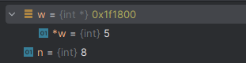

内存信息

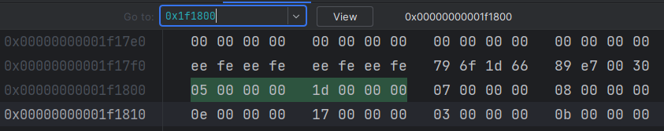

::: code-group

```c [HuffmanTree.c]
/*━━━━━━━━━━━━━━━━━━━━━━ 仅限内部使用的函数 ━━━━━━━━━━━━━━━━━━━━━━*/

// 初始化环境的内部实现
static Status Init(int** w, int* n, FILE* fp) {
    int i;

    if(fp == NULL) {
        printf("请输入赫夫曼树叶子结点数量：");
        scanf("%d", n);

        if(*n <= 0) {
            *w = NULL;
            return ERROR;
        }

        *w = (int*) malloc((*n) * sizeof(int));

        printf("请输入 %d 个权值信息：", *n);
        for(i = 0; i < *n; i++) {
            scanf("%d", *w + i);
        }
    } else {
        // 录入元素数量
        ReadData(fp, "%d", n);

        if(*n <= 0) {
            *w = NULL;
            return ERROR;
        }

        *w = (int*) malloc((*n) * sizeof(int));

        // 录入结点权值信息
        for(i = 0; i < *n; i++) {
            ReadData(fp, "%d", *w + i);
        }
    }

    return OK;
}

/*
 * 主要用来初始化权值信息。
 */
Status InitEnvironment(int** w, int* n, char* path) {
    FILE* fp;
    int readFromConsole;    // 是否从控制台读取数据

    // 如果没有文件路径信息，则从控制台读取输入
    readFromConsole = path == NULL || strcmp(path, "") == 0;

    if(readFromConsole) {
        printf("请输入赫夫曼树结点信息...\n");
        Init(w, n, NULL);
    } else {
        // 打开文件，准备读取测试数据
        fp = fopen(path, "r");
        if(fp == NULL) {
            return ERROR;
        }
        Init(w, n, fp);
        fclose(fp);
    }

    return OK;
}
```

```c [main.c]
#include <stdio.h>
#include "HuffmanTree.h"

int main() {

    int *w;
    int n;

    // 初始化环境，主要是初始化权值信息
    InitEnvironment(&w,&n,"TestData_HT.txt");

    return 0;
}
```

``` [TestData_HT.txt]
叶子结点数： 8
各叶子结点的权值：5, 29, 7, 8, 14, 23, 3, 11
```

:::

## 编码

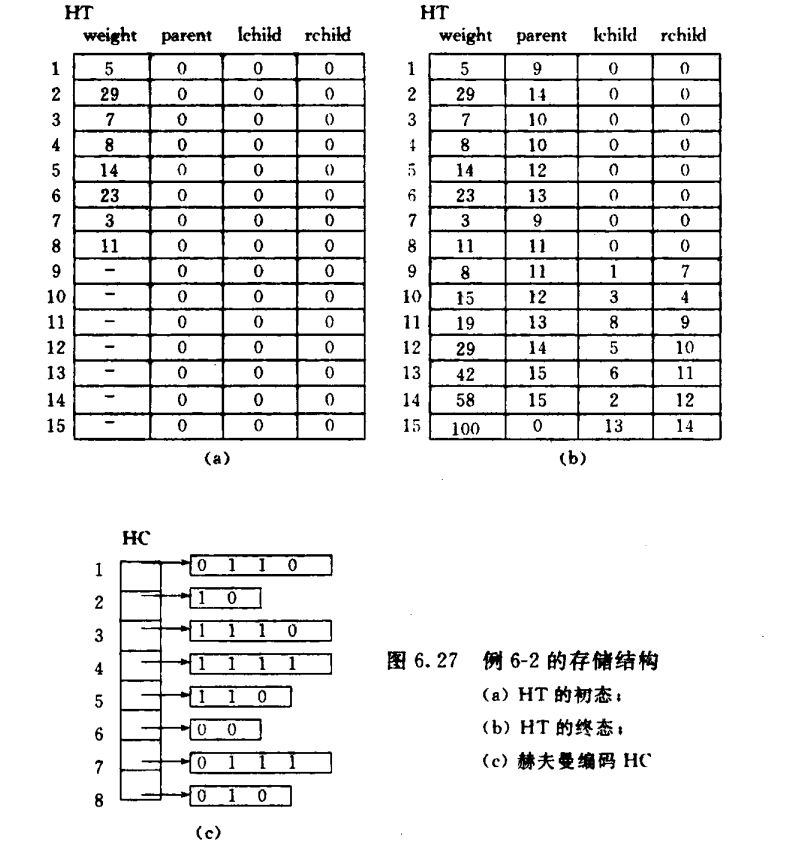

求赫夫曼编码

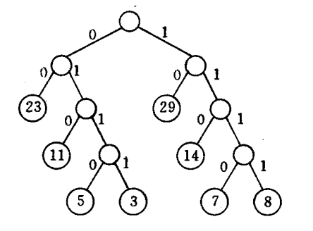

结点5的编码为0110

结点29的编码为10

::: tip

赫夫曼树结点数 2 * n - 1 = 2 * 8 - 1 = 15

初始化HT，图a

HT生成，每次都查找最小的两个数，如果有parent会被忽略。

HC生成，从叶子到根逆向求编码，如果当前是左孩子则为0，否则为1

:::

```c
// 在赫夫曼树结点[1...end]中依次选出权值最小且未编入树的两个结点的序号s1、s2。
static void Select(HuffmanTree HT, int end, int* s1, int* s2) {
    int i;
    int w1, w2;

    w1 =  w2 = INT_MAX;

    for(i = 1; i <= end; i++){
        // 忽略已经加入树的结点
        if(HT[i].parent != 0){
            continue;
        }

        if(HT[i].weight < w1){
            *s2 = *s1;
            w2 = w1;

            *s1 = i;
            w1 = HT[i].weight;
        }else if(HT[i].weight >= w1 && HT[i].weight < w2){
            *s2 = i;
            w2 = HT[i].weight;
        }
    }
}

/*
 * 编码
 * 1.根据指定的n个权值信息w来创建赫夫曼树HT。
 * 2.由赫夫曼树HT逆序计算赫夫曼编码值HC。
 *
 *【注】
 * 该算法与【算法6.13】作用一致。
 */
Status HuffmanCodeing_1(HuffmanTree* HT, HuffmanCode* HC, int* w, int n){
    int m, i;
    HuffmanTree p;
    int s1, s2;
    char* cd;
    int start, c;
    unsigned int f;

    if(n <= 1){
        return ERROR;
    }

    // 计算赫夫曼树结点数
    m = 2 * n - 1;

    *HT = (HuffmanTree) malloc((m + 1) * sizeof(HTNode)); // 0号单元未使用，但其他weight域记录了原始的权值数量
    (*HT)[0].weight = n;

    /*************图a,  HT的初态****************/
    // 记录权值信息（注意p应当指向索引1处，因为0单元弃用了）
    for(p = (*HT) + 1, i = 1; i <= n; ++i, ++p, ++w){
        p->weight = *w;
        p->parent = 0;
        p->lchild = 0;
        p->rchild = 0;
    }

    
    // 后面的部分需要计算
    for(;i <= m; ++i, ++p){
        p->weight = 0;
        p->parent = 0;
        p->lchild = 0;
        p->rchild = 0;
    }

    /*************图b,  HT的终态****************/
    // 建赫夫曼数
    for(i = n + 1; i <= m; ++i){
        // 在HT[1,i-1]中选择parent为0（未加入树），且weight最小的两个结点，其序号分别为s1和s2
        Select(*HT,i - 1, &s1,&s2);

        (*HT)[s1].parent = i;
        (*HT)[s2].parent = i;
        (*HT)[i].lchild = s1;
        (*HT)[i].rchild = s2;
        (*HT)[i].weight = (*HT)[s1].weight + (*HT)[s2].weight;
    }

    /*************图c,  HC****************/
    /* 从叶子到根逆向求每个字符的赫夫曼编码 */
    (*HC) = (HuffmanCode) malloc((n + 1) * sizeof(char*));  // 分配n个字符编码的头指针向量（0号单元弃用）
    cd = (char*) malloc(n * sizeof(char));  // 分配求编码的工作空间（每个编码长度最大为n-1）
    cd[n - 1] = '\0';   // 编码结束符

    // 逐个字符求赫夫曼编码
    for(i = 1; i <= n; ++i) {
        start = n - 1;    // 编码结束符位置

        // 从叶子到根逆向求编码
        for(c = i, f = (*HT)[i].parent; f != 0; c = f, f = (*HT)[f].parent) {
            if((*HT)[f].lchild == c) {
                cd[--start] = '0';
            } else {
                cd[--start] = '1';
            }
        }

        (*HC)[i] = (char*) malloc((n - start) * sizeof(char));  // 为第i个字符编码分配空间
        strcpy((*HC)[i], &cd[start]);   // 从cd复制编码（串）到HC
    }

    free(cd);   // 释放工作空间

    return OK;
}
```

## 解码

1.查找根结点位置 2 * n - 1 = 2 * 8 - 1 = 15

2.通过赫夫曼编码依次向左或向右找

```c
/*
 * 解码
 * 根据给定的n个赫夫曼编码HC，计算其代表的权值。
 */
Status HuffmanDecoding(HuffmanTree HT, HuffmanCode HC, int** w, int n){
    int i, j, k;
    int r;
    char* s;

    if(n <= 0){
        return ERROR;
    }

    (*w) = (int*) malloc(n * sizeof(int));

    // 根结点位置
    r = 2 * n - 1;

    for(i = 1; i <= n; i++){
        s = HC[i];

        k = r;

        // 从根结点往下找
        for(j = 0; j < strlen(s); j++){
            if(s[j] == '0'){
                k = HT[k].lchild;
            } else if(s[j] == '1'){
                k = HT[k].rchild;
            } else{
                return ERROR;
            }
        }

        (*w)[i - 1] = HT[k].weight;
    }

    return OK;
}
```

输出

```
+-------+-------------+--------+
| index | HuffmanCode | weight |
+-------+-------------+--------+
|    1  |        0001 |     5  |
|    2  |          10 |    29  |
|    3  |        1110 |     7  |
|    4  |        1111 |     8  |
|    5  |         110 |    14  |
|    6  |          01 |    23  |
|    7  |        0000 |     3  |
|    8  |         001 |    11  |
+-------+-------------+--------+
```


