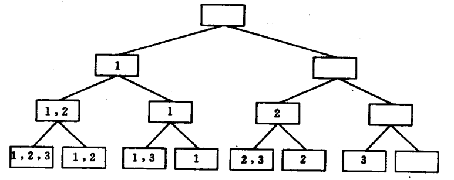
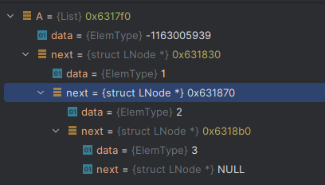
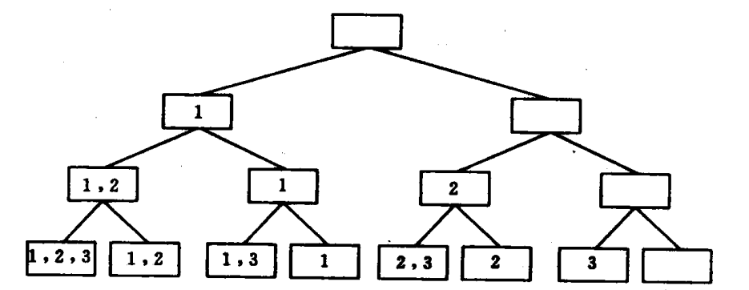
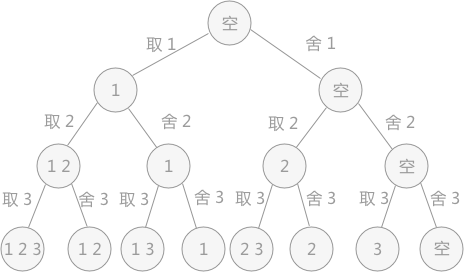

# 冪集

回溯算法，又称为“试探法”。解决问题时，每进行一步，都是抱着试试看的态度，如果发现当前选择并不是最好的，或者这么走下去肯定达不到目标，立刻做回退操作重新选择。这种走不通就回退再走的方法就是回溯算法。

**回溯VS递归**

在回溯法中可以看到有递归的身影，但是两者是有区别的。

回溯法从问题本身出发，寻找可能实现的所有情况。和穷举法的思想相近，不同在于穷举法是将所有的情况都列举出来以后再一一筛选，而回溯法在列举过程如果发现当前情况根本不可能存在，就停止后续的所有工作，返回上一步进行新的尝试。

递归是从问题的结果出发，例如求 n！，要想知道 n！的结果，就需要知道 n*(n-1)! 的结果，而要想知道 (n-1)! 结果，就需要提前知道 (n-1)*(n-2)!。这样不断地向自己提问，不断地调用自己的思想就是递归。

回溯和递归唯一的联系就是，回溯法可以用递归思想实现。



设集合A为{1,2,3},

那么集合A的幂集P(A)应为

最后一层即为幂集{1,2,3}，{1,2}，{1,3}，{1},  {2,3}, {2}， {3}，{空集};

## 结构定义

```c
/*
 * 冪集中的集合定义，这里使用了线性表。
 * 冪集元素类型也与线性表元素类型一致。
 */
typedef LinkList List;
```

## 创建集合A

集合A为一个链表



::: code-group

```c [PwerSet.c]
/*━━━━━━━━━━━━━━━━━━━━━━ 仅限内部使用的函数 ━━━━━━━━━━━━━━━━━━━━━━*/

// 创建集合的内部函数
static void Create(List* A, FILE* fp) {
    int n, i, e;

    InitList(A);

    if(fp == NULL) {
        printf("请输入集合元素数量：");
        scanf("%d", &n);

        for(i=1; i<=n; i++) {
            printf("请输入第 %2d 个元素：", i);
            scanf("%d", &e);
            ListInsert(*A, i, e);
        }
    } else {
        // 录入元素数量
        ReadData(fp, "%d", &n);

        // 录入元素
        for(i=1; i<=n; i++) {
            ReadData(fp, "%d", &e);
            ListInsert(*A, i, e);
        }
    }
}

/*
 * 创建集合A，集合元素类型与线性表元素类型一致。
 */
Status CreatePowerSet(List* A, char* path) {
    FILE* fp;
    int readFromConsole;    // 是否从控制台读取数据

    // 如果没有文件路径信息，则从控制台读取输入
    readFromConsole = path == NULL || strcmp(path, "") == 0;

    if(readFromConsole) {
        printf("请输入集合的元素信息...\n");
        Create(A, NULL);
    } else {
        // 打开文件，准备读取测试数据
        fp = fopen(path, "r");
        if(fp == NULL) {
            return ERROR;
        }
        Create(A, fp);
        fclose(fp);
    }

    return OK;
}
```

```c [main.c]
#include <stdio.h>
#include "PowerSet.h"

int main() {
    List A;

    // 创建集合 A
    CreatePowerSet(&A, "TestData_A.txt");

    return 0;
}
```

``` [TestData_A.txt]
集合元素个数：3
集合元素：1 2 3
```

:::

## 求取集合A的幂集



对集合A中前i - 1个元素进行取/舍处理的当前状态(左分支取，右分支舍)

最后一层为幂集



A集合为[x,1,2,3]

第二层 取A[1] = 1;  取1，B=[1]；然后舍1，B = []

第三层 左子树，取A[2] = 2; 取2为，B = [1,2]；然后舍2，B=[1]，右子树，取2为B[2]；然后舍2，B=[]

第四层 取A[3] = 3；[1,2] 树，取3，B=[1,2,3]；然后舍3，B=[1,2]。1树，取3，B=[1,3]，舍3=[1]。

2树，取3，B=[2,3]；然后舍3，B=[2]。空树，取3，B=[3]；然后舍3，B=[]

```c
/*
 * ████████ 6.14/6.15 ████████
 *
 * 求取集合A的幂集，集合B用来暂存每一次求出的幂集子集。
 */
void GetPowerSet(int i, List A, List B) {
    int k;
    ElemType e;

    // i用来追踪当前深入的层级
    if(i > ListLength(A)) {
        PrintPowerSet(B);
    } else {
        GetElem(A, i, &e);
        k = ListLength(B);

        // 取
        ListInsert(B, k + 1, e);    //+第i个元素
        GetPowerSet(i + 1, A, B);

        // 舍
        ListDelete(B, k + 1, &e);   //-第i个元素
        GetPowerSet(i + 1, A, B);
    }
}

/*
 * 输出当前集合。
 */
void PrintPowerSet(List A) {
    LinkList p;
    int len;

    if(A == NULL) {
        printf("\n");
        return;
    }

    len = ListLength(A);

    // 输出空集
    if(len == 0) {
        printf("⊙");
    } else {
        // 输出集合中的元素
        for(p = A->next; p; p = p->next) {
            printf("%-2d ", p->data);
        }
    }

    printf("\n");
}
```
